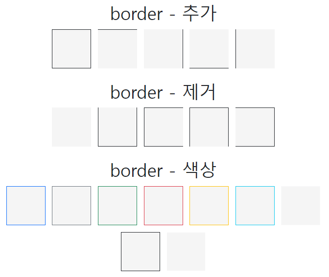

# Bootstrap

> 빠르고 쉬운 웹 개발을 위해 구조를 미리 만들어준 무료 FE 프레임 워크
> 
- 반응형 디자인을 쉽게 만들 수 있는 기능을 제공 → 휴대폰, 태블릿, PC 등

### 장점

1. 사용하기 쉬움
2. 반응형 기능
3. 모바일 우선 접근 방식
4. 브라우저 호환성

# Bootstrap 사용

> **jsDelivr**를 통한 CDN 즉, download가 아닌 bootstrap의 컴파일된 css와 js의 캐시 버전을 프로젝트에 전달한다.
> 

### CSS

```html
<link
  href="https://cdn.jsdelivr.net/npm/bootstrap@5.2.3/dist/css/bootstrap.min.css"
  rel="stylesheet"
  integrity="sha384-rbsA2VBKQhggwzxH7pPCaAqO46MgnOM80zW1RWuH61DGLwZJEdK2Kadq2F9CUG65"
  crossorigin="anonymous"
/>
```

### JS

```html
<script
  src="https://cdn.jsdelivr.net/npm/bootstrap@5.2.3/dist/js/bootstrap.bundle.min.js"
  integrity="sha384-kenU1KFdBIe4zVF0s0G1M5b4hcpxyD9F7jL+jjXkk+Q2h455rYXK/7HAuoJl+0I4"
  crossorigin="anonymous"
></script>
```

### npm을 통한 설치

```bash
$npm install bootstrap@5.3.2
```

### yarn을 통한 설치

```bash
$yarn add bootstrap@5.3.2
```

# Breakpoint

> 특정 viewport 또는 device 크기에서 layout을 조정할 수 있는 시기를 제어하는데 사용
> 
- 반응형 빌드를 위한 6개의 breakpoint 제공


- Small(sm) → 스마트폰
- Medium(lg) → 태블릿
- Large 이상(lg, xl, xxl) → PC

# Container

> 주어진 장피 또는 viewport 내에서 컨텐츠를 포함, 패딩 및 정렬하는 기본 블록
> 
- `.container` 클래스는 반응형 고정 너비 컨테이너를 제공
- `.container-fluid` 클래스는 viewport의 전체 너비에 걸쳐 있는 전체너비 컨테이너를 제공


# Grid System

> bootstrap의 그리드 시스템은 flexbox로 구축되어 페이지에 최대 12개의 열을 허용한다.
> 
- **12개 열**을 모두 개별적으로 사용하지 않으려면 열을 함께 그룹화하여 더 넓은 열을 만들 수 있다.


# Grid Class

> 클래스를 결합하여 보다 동적이고 유연한 Layout을 만들 수 있다.
> 


```html
<!-- Control the column width, and how they should appear on different devices -->
<div class="row">
  <div class="col-*-*"></div>
  <div class="col-*-*"></div>
</div>
<div class="row">
  <div class="col-*-*"></div>
  <div class="col-*-*"></div>
  <div class="col-*-*"></div>
</div>
```

위와 같은 형식으로 사용 가능

```html
<div class="row">
  <div class="col-sm-3">.col-sm-3</div>
  <div class="col-sm-3">.col-sm-3</div>
  <div class="col-sm-3">.col-sm-3</div>
  <div class="col-sm-3">.col-sm-3</div>
</div>
```

- `col-*-*`
    - 첫 번째 * := breakpoint
    - 두 번째 * := 12열 중 차지할 열 개수

### device에 따른 반응형

```html
<!DOCTYPE html>
<html lang="en">
  <head>
    <meta charset="utf-8" />
    <meta name="viewport" content="width=device-width, initial-scale=1" />
    <title>Bootstrap demo</title>
    <link
      href="https://cdn.jsdelivr.net/npm/bootstrap@5.2.3/dist/css/bootstrap.min.css"
      rel="stylesheet"
      integrity="sha384-rbsA2VBKQhggwzxH7pPCaAqO46MgnOM80zW1RWuH61DGLwZJEdK2Kadq2F9CUG65"
      crossorigin="anonymous"
    />
  </head>
  <body>
    <div class="container text-center">
      <h1 class="mt-3">반응형 열</h1>
      <div class="row">
        <div class="col-lg-4 bg-primary">SSAFY</div>
        <div class="col-lg-4 bg-danger">SSAFY</div>
        <div class="col-lg-4 bg-info">SSAFY</div>
      </div>
      <div class="row">
        <div class="col-md-4 bg-primary">SSAFY</div>
        <div class="col-md-4 bg-danger">SSAFY</div>
        <div class="col-md-4 bg-info">SSAFY</div>
      </div>
      <div class="row">
        <div class="col-sm-4 bg-primary">SSAFY</div>
        <div class="col-sm-4 bg-danger">SSAFY</div>
        <div class="col-sm-4 bg-info">SSAFY</div>
      </div>
      <h1 class="mt-3">클래스 조합</h1>
      <div class="row">
        <div class="col-lg-6 col-md-12 bg-primary">컬럼 1</div>
        <div class="col-lg-4 col-md-6 bg-danger">컬럼 2</div>
        <div class="col-lg-2 col-md-6 bg-info">컬럼 2</div>
      </div>
      <h1 class="mt-3">중첩 열</h1>
      <div class="row">
        <div class="col-lg-6 col-md-12 bg-primary">컬럼 1</div>
        <div class="col-lg-6">
          <div class="row">
            <div class="col-lg-6 col col-md-6 bg-danger">컬럼 2</div>
            <div class="col-lg-6 col bg-info">컬럼 2</div>
          </div>
        </div>
      </div>
    </div>

    <script
      src="https://cdn.jsdelivr.net/npm/bootstrap@5.2.3/dist/js/bootstrap.bundle.min.js"
      integrity="sha384-kenU1KFdBIe4zVF0s0G1M5b4hcpxyD9F7jL+jjXkk+Q2h455rYXK/7HAuoJl+0I4"
      crossorigin="anonymous"
    ></script>
  </body>
</html>

```

# Color

## background color

`bg-colorclassname` 으로 사용

```html
<div class="container text-center">
  <h1>background color</h1>
  <div class="p-3 mb-2 bg-primary text-white">.bg-primary</div>
  <div class="p-3 mb-2 bg-secondary text-white">.bg-secondary</div>
  <div class="p-3 mb-2 bg-success text-white">.bg-success</div>
  <div class="p-3 mb-2 bg-danger text-white">.bg-danger</div>
  <div class="p-3 mb-2 bg-warning text-dark">.bg-warning</div>
  <div class="p-3 mb-2 bg-info text-dark">.bg-info</div>
  <div class="p-3 mb-2 bg-light text-dark">.bg-light</div>
  <div class="p-3 mb-2 bg-dark text-white">.bg-dark</div>
  <div class="p-3 mb-2 bg-body text-dark">.bg-body</div>
  <div class="p-3 mb-2 bg-white text-dark">.bg-white</div>
  <div class="p-3 mb-2 bg-transparent text-dark">.bg-transparent</div>
</div>
```

## text color

`text-colorclassname` 으로 사용

```html
<div class="container text-center">
  <h1>text color</h1>
  <p class="text-primary">.text-primary</p>
  <p class="text-secondary">.text-secondary</p>
  <p class="text-success">.text-success</p>
  <p class="text-danger">.text-danger</p>
  <p class="text-warning bg-dark">.text-warning</p>
  <p class="text-info bg-dark">.text-info</p>
  <p class="text-light bg-dark">.text-light</p>
  <p class="text-dark">.text-dark</p>
  <p class="text-body">.text-body</p>
  <p class="text-muted">.text-muted</p>
  <p class="text-white bg-dark">.text-white</p>
  <p class="text-black-50">.text-black-50</p>
  <p class="text-white-50 bg-dark">.text-white-50</p>
</div>
```

## link color

`link-colorclassname` 으로 사용

```html
<div class="container text-center">
  <h1>link color</h1>
  <a href="#" class="link-primary">Primary link</a>
  <a href="#" class="link-secondary">Secondary link</a>
  <a href="#" class="link-success">Success link</a>
  <a href="#" class="link-danger">Danger link</a>
  <a href="#" class="link-warning">Warning link</a>
  <a href="#" class="link-info">Info link</a>
  <a href="#" class="link-light">Light link</a>
  <a href="#" class="link-dark">Dark link</a>
</div>
```

# Border

`border, border-{align}, border-{color}` 로 사용

```html
<div class="container text-center">
  <h1 class="mt-3">border - 추가</h1>
  <span class="border border-dark"></span>
  <span class="border-top border-dark"></span>
  <span class="border-end border-dark"></span>
  <span class="border-bottom border-dark"></span>
  <span class="border-start border-dark"></span>
  <h1 class="mt-3">border - 제거</h1>
  <span class="border border-0 border-dark"></span>
  <span class="border border-top-0 border-dark"></span>
  <span class="border border-end-0 border-dark"></span>
  <span class="border border-bottom-0 border-dark"></span>
  <span class="border border-start-0 border-dark"></span>
  <h1 class="mt-3">border - 색상</h1>
  <span class="border border-primary"></span>
  <span class="border border-secondary"></span>
  <span class="border border-success"></span>
  <span class="border border-danger"></span>
  <span class="border border-warning"></span>
  <span class="border border-info"></span>
  <span class="border border-light"></span>
  <span class="border border-dark"></span>
  <span class="border border-white"></span>
</div>
```



# Spacing

`{property}-{sides}-{size}` 로 사용


```html
<div class="container">
  <h1>spacing</h1>
  <div class="ps-5 mt-4 bg-primary text-white">ps-5 mt-4</div>
  <div class="pt-3 mb-5 bg-secondary text-white">pt-3 mb-5</div>
  <div class="pb-3 ms-2 bg-success text-white">pb-3 ms-2</div>
  <div class="p-3 mt-2 bg-danger text-white">p-3 mt-2</div>
  <div class="p-5 m-3 bg-warning text-dark">p-5 m-3g</div>
</div>
```


# Bootstrap 검색 자료

## w3school

[Bootstrap 5 Tutorial](https://www.w3schools.com/bootstrap5/index.php)

## Bootstrap Docs

[Bootstrap Docs](https://getbootstrap.kr/docs/5.0/getting-started/introduction/)
