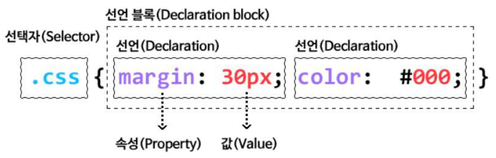

CSS ⇒ Cascading Style Sheets

> 웹 페이지를 표현하기 위한 스타일 규칙을 모아 놓은 문서

# CSS 구성

- **선택자(selector)** 와 **선언(declaration)** 으로 구성




## 선택자

> 규칙이 적용되는 엘리먼트(= 요소, Tag)

## 선언

> 선택자에 적용될 스타일

- **중괄호**로 감싼다.
- 속성(property)과 값(value)으로 이루어진다.
    - 속성 := 선택자에서 바꾸고 싶은 요소. color, font, width, height, border…
    - 값 := 속성에 적용할 값
- 여러 **선택자**에 동일한 스타일 적용 → **comma(,)** 로 구분하여 나열
- 각 **속성**은 **semi-colon(;)** 으로 구분

---

# 외부 스타일 시트 적용

> `<link>` 를 사용해 외부 스타일 시트를 적용

- `<link>`는 `<head>` 안에 작성하며 rel, type, href 3가지 속성을 주로 사용
    - **rel** := HTML 페이지와 링크된 파일 간의 관계
    - **href** := CSS file 경로
    - **type** := 링크된 외부 리소스의 미디어 타입 → href 속성이 설정되어 있어야만 사용 가능

```css
h2 {
  color: magenta;
}
h2.em {
  color: steelblue;
}
p {
  background-color: skyblue;
  color: purple;
}
```

```html
<head>
		<link rel="stylesheet" type="text/css" href="/examples/media/expand_style.css">
</head>
<body>
		<h2>외부 스타일시트</h2>
		<p>외부 CSS가 사용되었습니다.</p>
</body>
```

# @import

> 다른 스타일 시트에서 스타일 규칙을 가져올 때 사용

- `<style>` tag 안에 설정
- e.g.) default.css 파일을 외부 스타일 방식을 적용해 문서에 적용시킨 후, 해당 css 파일 안에 또 다른 css를 불러오는 방식

```html
<head>
  <meta charset="UTF-8" />
  <meta name="viewport" content="width=device-width, initial-scale=1.0" />
  <title>External Style Sheet</title>
  <style type="text/css" media="screen">
    @import url("../css/headers.css");
    /* @import "../css/header.css"; */
    h2 {
      background-color: orange;
    }
  </style>
</head>
```

## 외부 스타일 방식(link) vs @import

> 외부 스타일 방식이 더 효율적이다.
> 

@import 방식은 import 된 css들을 직렬 로딩 방식으로 불러오고, 외부 스타일 방식(`<link>`)의 경우 병렬 로딩 방식으로 css를 불러온다.

```html
<!-- @import 방식 -->
<style type="text/css" media="screen">
	@import "test1.css";  /* 1번째 */
	@import "test2.css";  /* 2번째 */
	@import "test3.css";  /* 3번째 */
</style>
```

위와 같은 @import 방식의 경우 test1.css를 불러온 뒤, test2.css, test3.css를 **차례로 불러**온다. 즉, css를 순차적으로 불러오기 때문에, css의 양이 방대해지면 페이지 로딩속도가 현저히 느려지게 된다. 

```html
<!-- 외부 스타일(link) 방식-->
<link rel="stylesheet" href="test1.css">
<link rel="stylesheet" href="test2.css">
<link rel="stylesheet" href="test3.css">
```

반면, `<link>` 방식은 3가지 css를 동시에 로딩하여 불러온다. 

따라서, 페이지 로딩 속도에서 외부 스타일 방식이 효율적이다. 

# 내부 스타일 시트 적용

> `<head>` tag 내부에 작성

- `<style>` 을 사용해 내부 스타일 시트를 적용
- `<style>` tag 내부에 CSS 규칙 작성
- 외부 스타일 시트보다 **우선 적용**

```html
<head>
  <meta charset="UTF-8" />
  <meta name="viewport" content="width=device-width, initial-scale=1.0" />
  <title>Embedded Style Sheet</title>
  <style type="text/css">
    h2 {
      color: magenta;
    }
    p {
      background-color: skyblue;
      color: purple;
    }
  </style>
</head>
<body>
  <h2>내부 스타일시트</h2>
  <p>내부 CSS가 사용되었습니다 !!!</p>
</body>
```

# 인라인 스타일 적용

> 개별 element(Tag) 마다 스타일을 지정

- 유지보수에 용이하지 않다.
- style 속성을 사용 + 속성값으로 CSS 규칙을 작성

```html
<body>
  <h2 style="color: magenta">인라인 스타일시트</h2>
  <p style="background-color: skyblue; color: purple">인라인 CSS가 사용되었습니다 !!!</p>
</body>
```

### 스타일 적용 우선 순위

인라인 → 내부 → 외부

---

# CSS 상속

> CSS는 상속을 통해 부모 요소의 속성을 자식 요소에게 상속 시킨다.

- **상속되는 속성**
    - **Text 관련** := font 계열, line-height, text-align …
    - opacity, visibiliy, **color**, list-style, white-space
- **상속되지 않는 속성**
    - **Box Model** 관련
    - **Position** 관련
    - **background**, vertical-align, text-decoration

## inherit

> 상속되지 않는 속성을 inherit를 사용해 상속 받을 수 있다.

e.g.) `margin: inherit`
