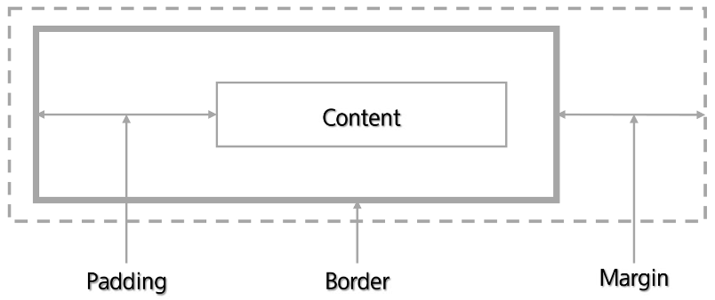
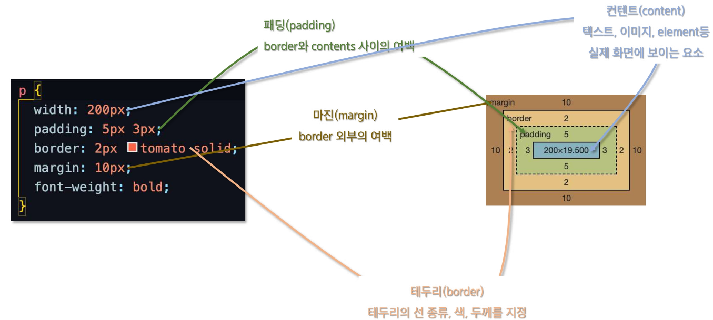
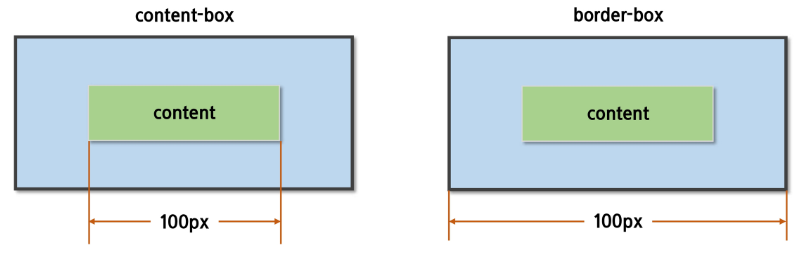
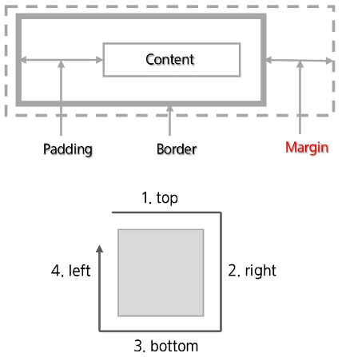
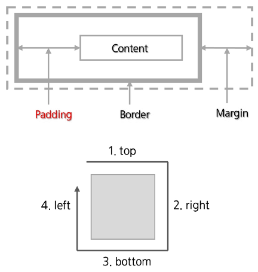
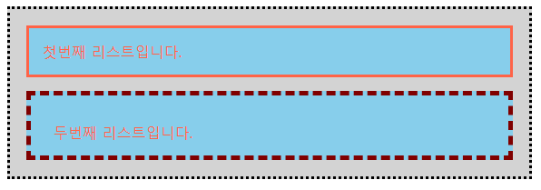
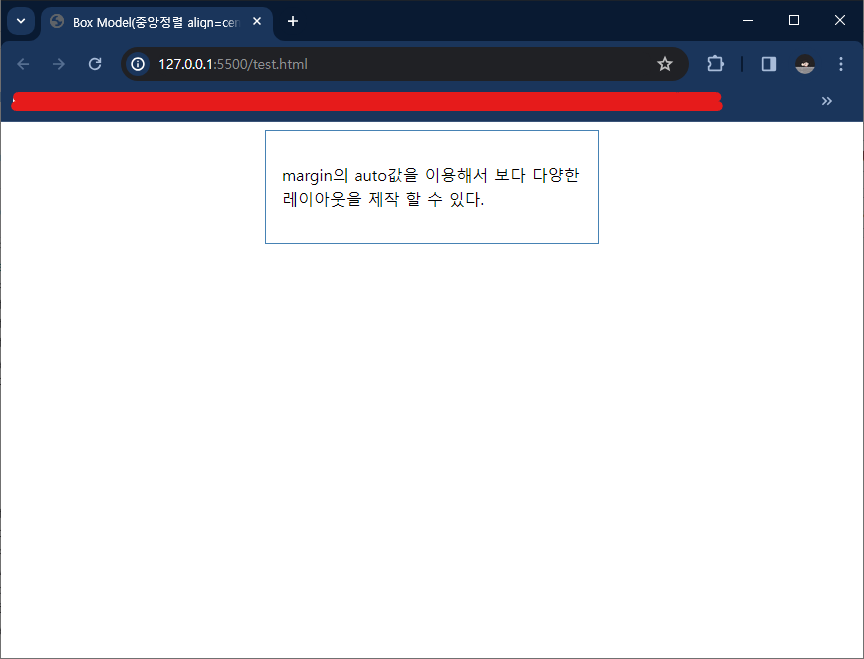
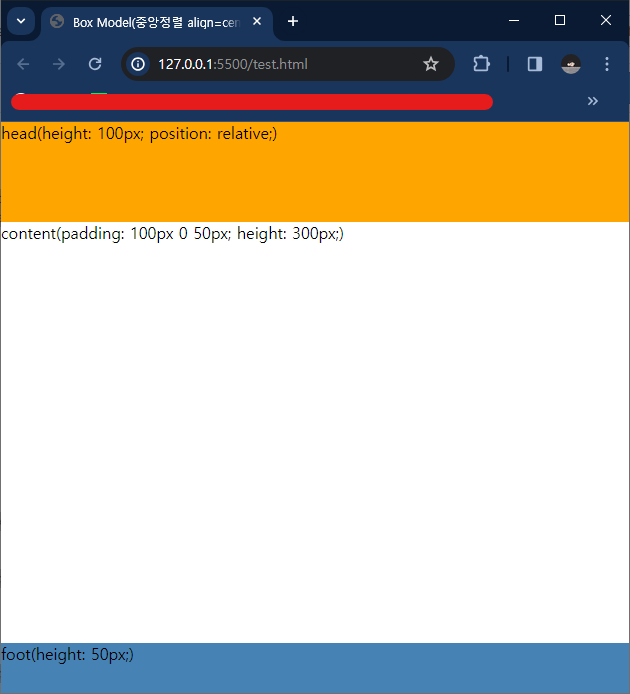
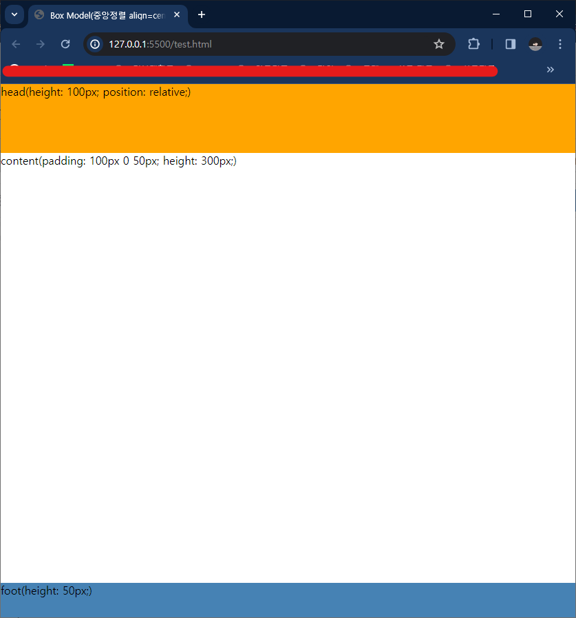

# Box Model

- CSS는 모든 엘리먼트는 **여러 겹의 상자**로 둘러 쌓여 있다고 가정
- 모든 HTML 요소는 **사각형 박스 모델**이고 **위에서 아래로(Block level)**, **왼쪽에서 오른쪽(Inline level)**으로 쌓임
- `컨텐트(Content)` , `패딩(Padding)` , `마진(Margin)` 으로 구분
- 컨텐트를 정렬 또는 위치를 지정하기 위해 Padding과 Margin 속성을 이용



### 구성



## box-sizing

> 모든 element의 box-sizing은 기본값이 `content-box` 이다.

- **padding과 border를 제외**한 content 영역만을 box로 지정

→ border 까지의 영역을 box로 지정할 경우, box-sizing을 `border-box`로 설정



## Margin

마진(Margin) 속성은

> Box의 마진 영역(margin area) 너비를 지정

- 값 1개 := 모든 면에 적용
- 값 2개 :=
  - 1번 째 → {top, bottom}
  - 2번 째 → {right, left}
- 값 3개 :=
  - 1번 째 → {top}
  - 2번 째 → {right, left}
  - 3번 째 → {bottom}
- 값 4개 := {top, right, bottom, left}



```html
<head>
  ...
  <style type="text/css">
    /* 모든 margin을 2em으로 설정. */
    body {
      margin: 2em;
    }
    /* top & bottom margin을 1em, right & left margin을 2em으로 설정. */
    body {
      margin: 1em 2em;
    }
    /* margin을 top = 1em, right = 2em, bottom = 3em, left = 2em으로 설정. */
    body {
      margin: 1em 2em 3em;
    }
    body {
      margin-top: 1em;
      margin-right: 2em;
      margin-bottom: 3em;
      margin-left: 2em;
    }
  </style>
</head>
```

## Padding

패딩(padding) 속성은

> Box의 패딩 영역(padding area) 너비를

- 값 1개 := 모든 면에 적용
- 값 2개 :=
  - 1번 째 → {top, bottom}
  - 2번 째 → {right, left}
- 값 3개 :=
  - 1번 째 → {top}
  - 2번 째 → {right, left}
  - 3번 째 → {bottom}
- 값 4개 := {top, right, bottom, left}



```html
<head>
  ...
  <style type="text/css">
    ul {
      background: lightgray;
      margin: 15px;
      border-style: dotted;
      border-width: medium;
      border-color: black;
      padding: 3px;
    }
    li {
      color: tomato;
      background: skyblue;
      border-style: solid;
      margin: 15px;
      padding: 15px; /* 모든 패딩들을 15px로 설정. */
      list-style: none;
    }
    li.withborder {
      padding-top: 30px;
      padding-right: 25px;
      padding-bottom: 15px;
      padding-left: 25px;
      border-style: dashed;
      border-width: thick;
      border-color: maroon;
    }
  </style>
</head>
<body>
  <ul>
    <li>첫번째 리스트입니다.</li>
    <li class="withborder">두번째 리스트입니다.</li>
  </ul>
</body>
```



## 가운데 정렬

**margin 속성**을 이용해 컨텐츠 브라우저 화면의 가운데에 정렬되도록 설정 가능

- `E { margin : 0 auto }`
  - 첫 번째 값 := 상, 하, 여백
  - 두 번째 값 := 좌, 우, 여백
- `auto` := 현재 엘리먼트를 중심으로 상, 하 또는 좌, 우의 여백을 균등하게 분배 → 가운데 정렬 효과

```html
<head>
  ...
  <style type="text/css">
    #content {
      width: 300px;
      padding: 1em;
      border: 1px solid steelblue;
      margin: 0 auto;
      line-height: 1.5em;
    }
  </style>
</head>
<body>
  <div id="content">
    <p>margin의 auto값을 이용해서 보다 다양한 레이아웃을 제작 할 수 있다.</p>
  </div>
</body>
```



## 100% 높이를 유지하는 레이아웃

엘리먼트의 최소 높이를 보장하기 위해 `min-height` 속성 사용

→ `height` 와 `min-height` 속성을 같이 사용해 레이아웃의 높이를 100%로 유지 가능

- `<body>` 하위에 100% 높이를 유지하는 `<div>` tag 사용
- 브라우저 화면 크기를 늘리더라도 컨텐츠는 항상 브라우저의 100% 높이를 유지

```html
<head>
  ...
  <style type="text/css">
    html,
    body {
      height: 100%;
      margin: 0;
      padding: 0;
    }
    #head {
      height: 100px;
      background: orange;
      position: relative;
    }
    #body {
      min-height: 100%;
      margin: -100px 0 -50px;
    }
    #content-area {
      padding: 100px 0 50px;
      height: 300px;
    }
    #foot {
      height: 50px;
      background: steelblue;
    }
  </style>
</head>
<body>
  <div id="head">head(height: 100px; position: relative;)</div>
  <div id="body">
    <div id="content-area">content(padding: 100px 0 50px; height: 300px;)</div>
  </div>
  <div id="foot">foot(height: 50px;)</div>
</body>
```

| 작은 창                | 큰 창                  |
| ---------------------- | ---------------------- |
|  |  |
