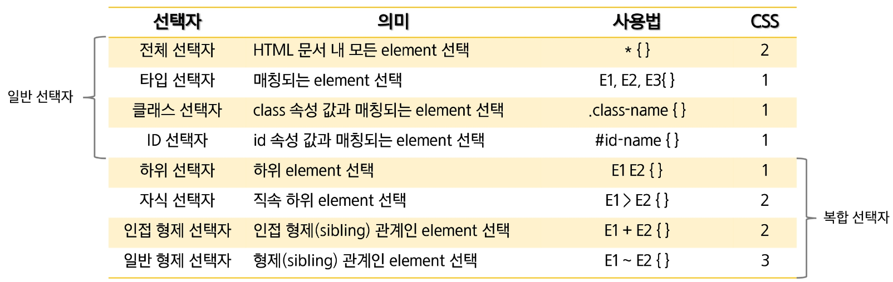
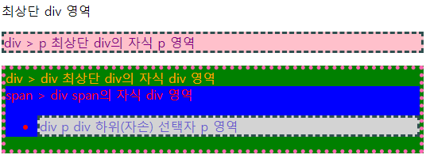
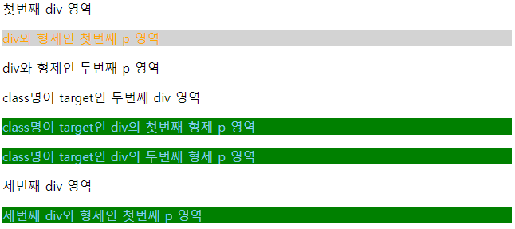
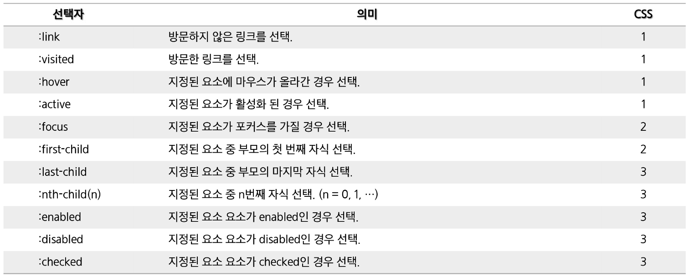
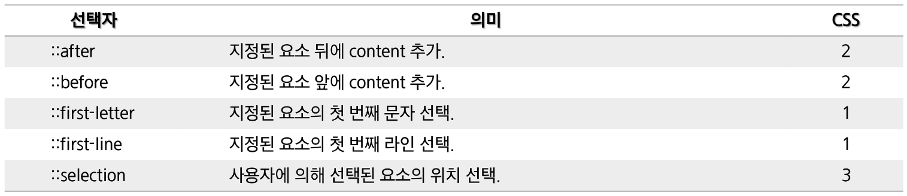
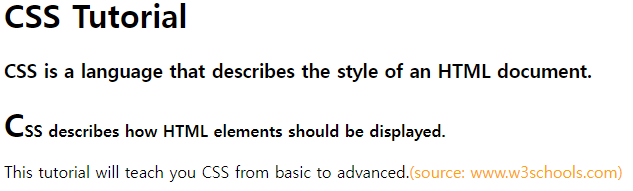
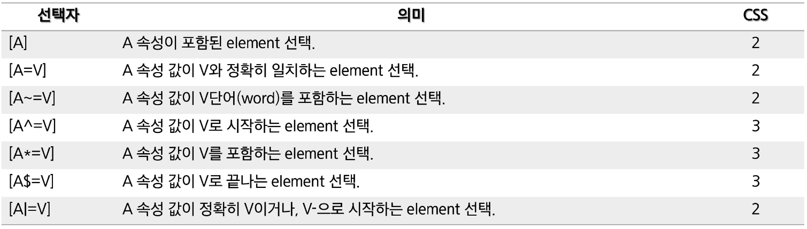

# 선택자(Selector)

> HTML 문서에서 **CSS 규칙 적용 타겟**이 되는 다양한 종류의 CSS 선택자가 존재한다.



## 일반 선택자

### 전체 선택자(Universal Selector)

> HTML 문서 내 모든 요소를 선택

- `* { }`
- 우선 순위가 가장 낮다.

```html
<head>
	...
  <style type="text/css">
    * {
      background: skyblue;
      color: magenta;
      font-weight: bold;
    }
  </style>
</head>
<body>
  <h2>h2 전체 선택자 h2</h2>
  <div>div 전체 선택자 div</div>
  <p>p 전체 선택자 p</p>
</body>
```

### 타입 선택자(Type Selector)

> 태그명을 이용해서 스타일을 적용할 태그를 선택

- `elementName { }`
- 1개 이상의 HTML 요소(tag)를 사용할 수 있다.
- 여러 요소를 선택할 때는 **comma(,)** 로 구분

```html
<head>
	...
  <style type="text/css">
    div, p {
      padding: 10px;
      margin: 10px;
      font-weight: bold;
    }
    div {
      background: skyblue;
      color: magenta;
    }
    p {
      background: lightgray;
      color: orange;
    }
  </style>
</head>
<body>
  <h2>h2 타입 선택자 h2</h2>
  <div>div 타입 선택자 div</div>
  <p>p 타입 선택자 p</p>
</body>
```

### 클래스 선택자(Class Selector)

> 태그의 클래스 명을 이용해서 스타일을 적용할 태그를 선택

- `.class-name { }`
- 클래스 명 ⇒ 공백 없이 대소문자 or Hypen(-), UnderScore(_)로 시작. 기호 or 숫자로 시작할 수 없다.
- HTML 문서에서 동일한 클래스 명을 중복해서 사용 가능
- class 속성 값에 하나 이상의 클래스 적용 가능 → 공백으로 구분

```html
<head>
	...
  <style type="text/css">
    .target1 {
      background: skyblue;
      color: magenta;
    }
    .target2 {
      background: lightgray;
      color: orange;
    }
    p.target1 {
      font-weight: bold;
      font-size: 20px;
    }
  </style>
</head>
<body>
  <h2>h2 클래스 선택자 h2</h2>
  <div class="target1">div 클래스 선택자 div</div>
  <p class="target2">p 클래스 선택자 p</p>
  <p class="target1">p 클래스 선택자 p</p>
</body>
```

### ID 선택자(ID Selector)

> 태그의 ID를 이용해서 스타일을 적용할 태그를 선택

- `#id-name { }`
- HTML 문서에서 동일한 ID를 중복으로 사용할 수 없다 → class와 다르게 ID는 유일.
- id 속성값에는 1개의 id만 사용 가능
- 일반 선택자 중 **우선순위가 가장 높다.**

```html
<head>
	...
  <style type="text/css">
    #target1 {
      background: skyblue;
      color: magenta;
    }
    #target2 {
      background: lightgray;
      color: orange;
    }
  </style>
</head>
<body>
  <h2>h2 아이디 선택자 h2</h2>
  <div>div 아이디 선택자 div</div>
  <p id="target1">p 아이디 선택자 p</p>
  <p id="target2">p 아이디 선택자 p</p>
</body>
```

### 일반 선택자 우선 순위

전체 선택자 < 타입 선택자 < 클래스 선택자 < ID 선택자

## 복합 선택자

### 하위 선택자(Descendant Selector) & 자식 선택자(Child Selector)

> **하위 선택자** := 1단계 하위 요소(child)와 2단계 이상 하위 요소(descendant)에 **모두** 적용
> **자식 선택자** := 1단계 하위 요소(chlid)**에만** 적용

- 하위 선택자 ⇒ `element element { }`
- 자식 선택자 ⇒ `element > element { }`

```html
<head>
	...
  <style type="text/css">
		<!-- 하위 선택자 -->
    div div {
      background: blue;
      color: red;
    }
    div p {
      border: 3px dashed darkslategrey;
      background: lightgray;
      color: slateblue;
    }
		<!-- 자식 선택자 -->
    div > div {
      border: 5px dotted hotpink;
      background: green;
      color: orange;
    }
    div > p {
      background: pink;
      color: purple;
    }
  </style>
</head>
<body>
  <div>
    최상단 div 영역
    <p>div > p 최상단 div의 자식 p 영역</p>
    <div>
      div > div 최상단 div의 자식 div 영역
      <span>
        <div>
          span > div span의 자식 div 영역
          <ul>
            <li><p>div p div 하위(자손) 선택자 p 영역</p></li>
          </ul>
        </div>
      </span>
    </div>
  </div>
</body>
```



### 인접 형제 선택자(Adjacent Sibling Selector) & 일반 형제 선택자(General  Sibling Selector)

> **인접 형제 선택자** := 형제 관계인 요소가 여러 개 존재할 경우, **첫 번째 요소만 선택**
> **일반 형제 선택자** := 형제 관계인 요소가 여러 개 존재할 경우, **모든 요소를 선택**

- HTML에서 형제란, **같은 depth에 존재**하는Tag
- 인접 형제 선택자 ⇒ `element + element { }`
- 일반 형제 선택자 ⇒ `element ~ element { }`

```html
<head>
	...
  <style type="text/css">
    div + p {
      background: lightgray;
      color: orange;
    }
    div.target ~ p {
      background: green;
      color: skyblue;
    }
  </style>
</head>
<body>
  <div>첫번째 div 영역</div>
  <p>div와 형제인 첫번째 p 영역</p>
  <p>div와 형제인 두번째 p 영역</p>
  <div class="target">class명이 target인 두번째 div 영역</div>
  <p>class명이 target인 div의 첫번째 형제 p 영역</p>
  <p>class명이 target인 div의 두번째 형제 p 영역</p>
  <div>세번째 div 영역</div>
  <p>세번째 div와 형제인 첫번째 p 영역</p>
</body>
```



## 가상 클래스 선택자

가상 클래스 선택자(Pseudo-Classes Selector)는

> User Agent가 제공하는 **가상의 클래스**를 지정
> 
- `element : 가상 클래스 { }`



- `:nth-child(n)` → n은 0부터 시작. **자식 순번은 1부터 시작**

```html
<head>
  <meta charset="UTF-8" />
  <meta name="viewport" content="width=device-width, initial-scale=1.0" />
  <title>Pseudo-classes Selector(가상클래스선택자)</title>
  <style type="text/css">
    a:link {
      color: gray;
      text-decoration: none;
    }
    a:visited {
      color: red;
      text-decoration: none;
    }
    a:hover {
      color: green;
      font-weight: bold;
      text-decoration: underline;
    }
    a:active {
      color: blue;
      text-decoration: none;
    }
		li:nth-child(5) {
      color: magenta;
    }
    li:nth-child(3n + 1) {
      color: skyblue;
    }
    li:last-child {
      color: orange;
    }
  </style>
</head>
<body>
  <a href="http://www.google.com">Google</a>
  <a href="http://www.naver.com">Naver</a>
  <a href="http://www.kakao.com">Kakao</a>
	<ul>
    <li>첫 번째 li</li>
    <li>두 번째 li</li>
    <li>세 번째 li</li>
    <li>네 번째 li</li>
    <li>다섯 번째 li</li>
    <li>여섯 번째 li</li>
    <li>일곱 번째 li</li>
    <li>여덟 번째 li</li>
  </ul>
</body>
```

## 가상 엘리먼트 선택자

가상 엘리먼트 선택자(Psuedo-Element Selector)는

> 보이지 않는 가상의 요소를 선택
> 
- `:: 가상 엘리먼트 { }`
- CSS3에서 가상 클래스와의 구별을 위해 **double colon(::)** 을 사용



- `::selection { }` ⇒ 마우스로 텍스트를 드래그 시, 스타일이 적용

```html
<head>
  <meta charset="UTF-8" />
  <meta name="viewport" content="width=device-width, initial-scale=1.0" />
  <title>Pseudo-classes Selector(가상클래스선택자)</title>
  <style type="text/css">
    p.intro:first-letter {
      font-size: 200%;
    }
    p.intro:first-line {
      font-weight: bold;
    }
    p:last-child::after {
      content: "(source: www.w3schools.com)";
      color: orange;
    }
    ::selection {
      color: steelblue;
    }
  </style>
</head>
<body>
  <h1>CSS Tutorial</h1>
  <h3>CSS is a language that describes the style of an HTML document.</h3>
  <p class="intro">CSS describes how HTML elements should be displayed.</p>
  <p>This tutorial will teach you CSS from basic to advanced.</p>
</body>
```



## 속성 선택자

> 특정한 속성을 가지거나 속성 값을 갖는 요소를 선택
> 
- 이를 사용하기 위해 HTML 문서를 작성할 때 name, title 등의 속성값을 규칙적으로 정의
- 화면에 같은 분류의 많은 항목들을 일괄적으로 선택할 때 유용
    - e.g.) 특정 이름을 갖는 체크박스



- `[A ~= V]` ⇒ 속성 값이 **V단어(space로 구분)를 포함**하는 요소 선택
- `[A *= V]` ⇒ 속성 값이 **V를 포함**하는 요소 선택. 단어가 아니어도 됨

```html
<head>
	...
  <style type="text/css">
    [title] {
      color: steelblue;
      font-weight: bold;
    }
    [title="two"] {
      border: 2px solid pink;
    }
    p[title="two"] {
      color: orange;
    }
    p[title~="second"] {
      background: silver;
    }
    p[class^="second"] {
      background: cyan;
    }
    p[class$="wrap"] {
      color: deeppink;
      font-weight: bold;
    }
    [class*="three"] {
      background: green;
    }
    [class|="second"] {
      border: 2px dotted darkgray;
    }
  </style>
</head>
<body>
  <div title="one">title이 "one"인 div 영역</div>
  <div title="two">title이 "two"인 div 영역</div>
  <p title="two">title이 "two"인 p 영역</p>
  <p title="first second third">title이 "first second third"인 p 영역</p>
  <p class="second-container">class가 "second-container"인 p 영역</p>
  <p class="second-wrap">class가 "second-wrap"인 p 영역</p>
  <div class="one-two-three">class가 "one-two-three"인 div 영역</div>
</body>
```

## CSS 규칙 적용 우선 순위

- 같은 엘리먼트(tag)에 두 개 이상의 CSS 규칙이 적용된 경우
    - 마지막 규칙, 구체적인 규칙, `!important` 가 우선 적용
    - CSS 규칙들 중 하단에 작성한 규칙이 마지막 규칙

```html
<head>
	...
  <style type="text/css">
    i {
      color: orange;
    }
    i {
      color: pink;
    }
    p b {
      color: deeppink !important;
    }
    p b {
      color: green;
    }
    p#intro {
      font-size: 100%;
    }
    p {
      font-size: 200%;
    }
  </style>
```

- `p { }` 보다 `p b { }` 가 더 구체적이기 때문에 `p b { }`가 적용된다.
- 속성 값 뒤에 `!important` 를 작성하면, 같은 요소에 대해 보다 우선적으로 스타일 적용
