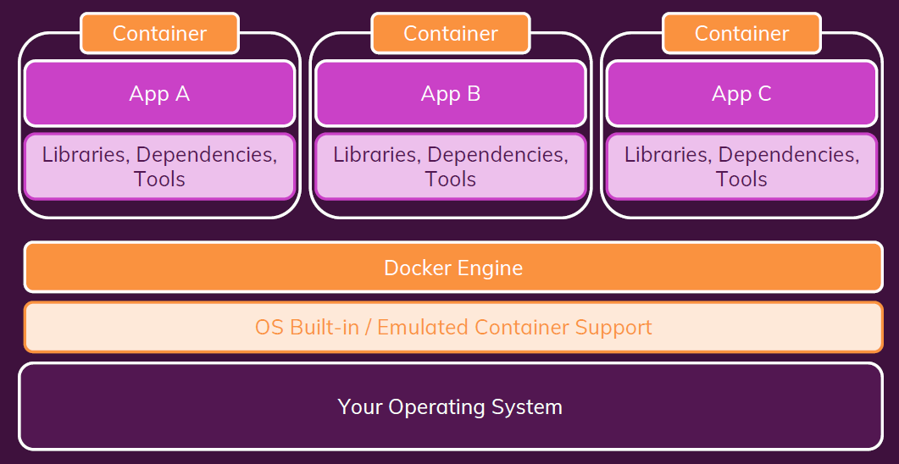

# What is Docker?

> Docker는 ***“컨테이너 기술”***이다.
> 
- 컨테이너를 생성하고 관리하기 위한 도구

### 컨테이너(Container)?

SW 개발에서 컨테이너란, 

> 표준화된 소프트웨어 유닛이다.
> 

⇒ 기본적으로, 코드 패키지이며 해당 코드를 실행하는데 필요한 종속성과 도구가 포함되어 있다.

그렇기 때문에, 어디서 누구에 의해 실행되던 **같은 컨테이너는 항상 같은 실행 결과**를 가진다.

결국, Docker는

> 이러한 컨테이너의 생성 및 관리 프로세스를 단순화하는 도구이다.
> 

# 왜 도커를 사용해야 할까?

애플리케이션 개발에 있어, 각 개발자들은 종종 다른 개발 환경을 가지게 된다. 예를 들어서, 개발자 A는 NodeJS의 14.3 버전으로 개발했지만, 개발자 B는 NodeJS의 버전이 12.xx 버전인 경우를 생각해보자. 이렇게 되면, A에서 동작하는 코드가 B에서는 제대로 동작하지 않을 것이다. 

따라서, **동일한 개발 환경을 가지고 있다는 것은 매우 중요**하다. 
⇒ 이것이 도커와 컨테이너가 중요한 가장 큰 이유이다. 

위의 예시에서는 특정 NodeJS의 버전을 도커 컨테이너에 고정할 수 있기 때문에 코드가 항상 일정한 버전으로 실행될 수 있도록 할 수 있다.

# 가상 머신 vs 도커 컨테이너

## 가상 머신

### 장점

- 분리된 환경을 생성할 수 있다.
- 그 분리된 환경 안에 환경별 구성을 가질 수 있다.
- 모든 것을 안정적으로 공유하고 재생산할 수 있다.

### 단점

- 중복 복제, 즉 낭비되는 공간이 발생하게 된다.
- Host 시스템 위에 추가 시스템이 실행되고 있기 때문에 성능이 나빠질 수 있다.
- 재생산 및 공유가 가능하더라도 원하는 모든 시스템에 가상 머신을 설정해야 하고 정확히 동일한 방식으로 구성해야 하기 때문에 매우 까다롭다. 
⇒ 즉, 공유할 수 있는 단일 구성 파일이 존재하지 않는다.
- 위와 같은 이유로, 개발 단계를 거쳐 애플리케이션을 배포하기 위해서는 가상 머신과 동일한 방식으로 프로덕션 머신을 구성해야 한다.

## 도커 컨테이너

가상 머신과 다르게 하나의 머신에 몇 대의 머신을 설치하지 않는다.

> 대신, OS가 기본적으로 내재하고 있거나 컨테이너 에뮬레이트를 지원하는 내장 컨테이너를 사용한다.
> 
- Docker는 이것이 작동하도록 처리하기 위한 도구이다.

그리고, 그 위에 Docker Engine이라는 도구를 실행한다. 그런 다음, 현재 시스템에서 실행되는 도커 엔진을 기반으로 하여 컨테이너를 가동할 수 있다. 여기서 여러 개의 컨테이너로 분리할 수 있다. 

### 장점

- OS와 시스템에 미치는 영향이 적다.
- 매우 빠르다.
- 최소한의 디스크 공간을 사용하며 이미지와 구성 파일이 있기 때문에 공유, 재구축 및 배포하는 것이 매우 쉽다.