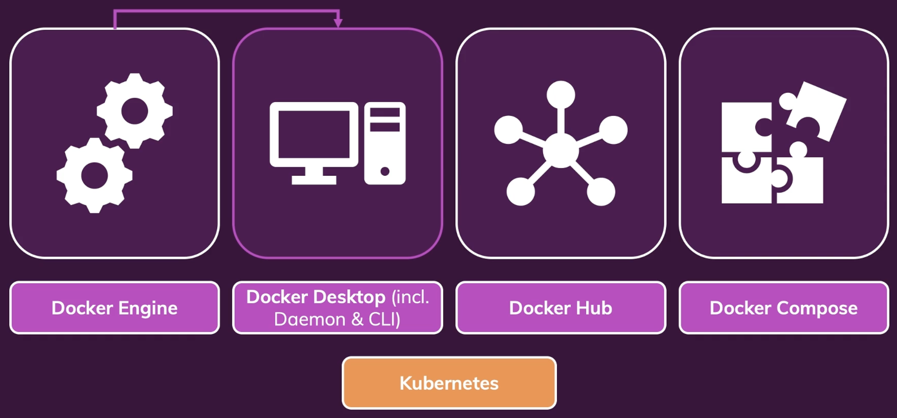

# Docker 설치

각각의 OS 환경에 맞는 도커를 설치하기 위해서 아래 사이트를 방문해 자신에게 맞는 OS 버전의 도커를 설치한다. 

[Get Docker](https://docs.docker.com/get-docker/)

## Mac OS

Mac 버전의 Docker Desktop을 설치한다.

[Install Docker Desktop on Mac](https://docs.docker.com/desktop/install/mac-install/)

# Docker Tools

Docker Desktop을 설치했든, Linux에 직섭 설치했든, Docker Toolbox를 사용했든 **Docker Engine**이 설치되었을 것이다.

이 Docker Engine은 단순히 도커를 실행하는데 필요한 Linux를 호스팅하는 가상 머신이 설정되었다. 가상 머신이 필요한 이유는 OS가 기본적으로 도커를 지원하지 않기 때문이다. 그런 다음 그 가상 머신에서 컨테이너가 실행된다.

