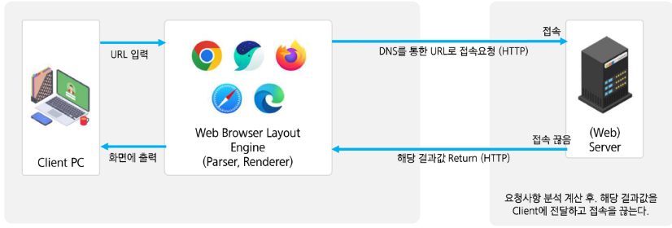
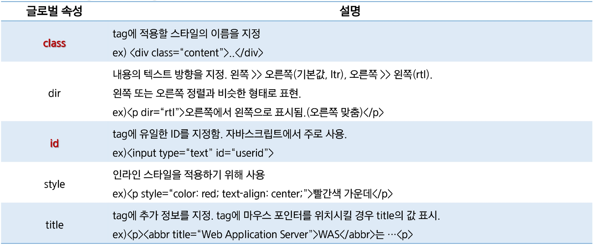
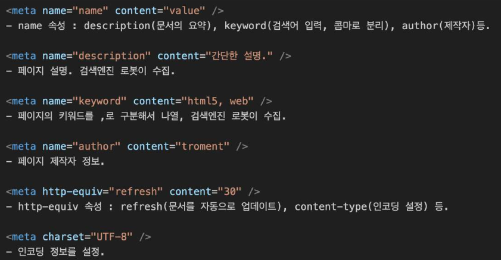
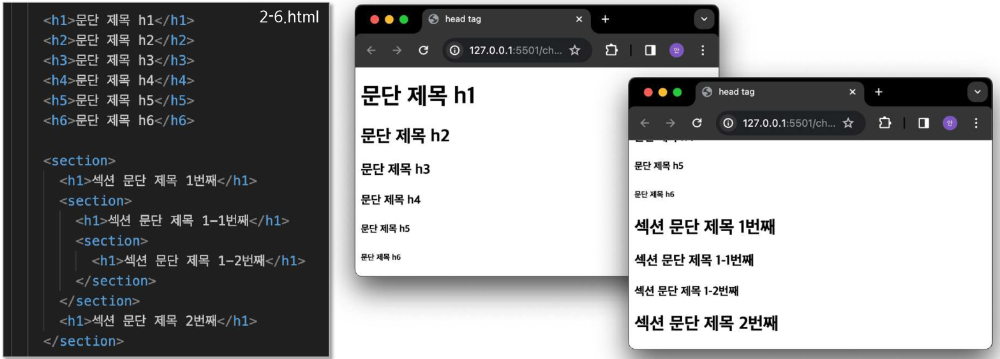
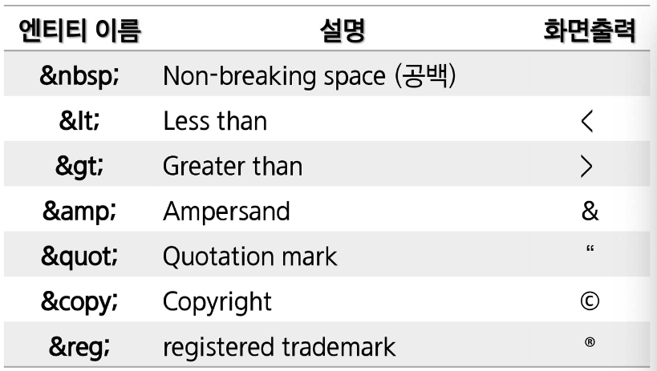

# Web & HTML 작동 원리



1. 서버는 클라이언트의 요청 내용을 분석하여 결과값을 HTML로 전송
2. 서버는 결과값을 전송한 후 클라이언트와 연결 종료
3. 클라이언트는 서버로부터 전달받은 HTML을 Web Browser에 표시
4. 각 Web Browser는 브라우저 엔진이 내장되어 있고, 이 엔진이 tag를 해석하여 화면에 표현

<br>

# Web 문서를 구성하는 3가지 요소

### HTML

> 웹 페이지 문서 담당 → 구조

### CSS

> 웹 페이지 디자인 담당 → 표현

### JS

> 웹 페이지 이벤트 담당 → 동작

# 튜토리얼 홈페이지

[W3Schools Online Web Tutorials](https://www.w3schools.com/)

<br>

# HTML

> 웹에서 사용하는 문서 양식

- 문서에 하이퍼텍스트, 표, 목록, 비디오 등을 포함할 수 있는 **tag**를 사용
- 문서를 Web Browser에 표현할 때 **tag**를 사용

# 문서 구조

- `<!DOCTYPE html>` tag는 현재 문서가 HTML 문서임을 정의
- 시작 tag과 종료 tag가 있고, tag 사이에 문서 내용을 정의

# tag와 속성

- tag는 시작 tag와 종료 tag로 쌍을 이루거나 시작 tag만 존재하는 tag도 있다.
- 시작 tag(`<tagName>`)와 종료 tag(`</tagName>`)는 ‘/’로 구분
  - `<body> ... </body>` ⇒ 시작과 종료 tag
  - `<br/>` , `<hr/>` , `` ⇒ 시작 tag만
- 각각의 tag는 **속성**과 **속성의 값**이 존재한다.

### 글로벌 속성

> 어느 tag에나 넣어서 사용할 수 있는 속성



- `class` ⇒ 공통
- `id` ⇒ 단독

# HTML 문서의 구성 요소

> `<html>` tag는 HTML 문서 전체를 정의

- Head와 Body로 구성

# Head 요소

> `<head>` tag는 브라우저에게 HTML 문서의 머리 부분임을 인식

- `<title>`, `<meta>`, `<style>`, `<script>`, `<link>` tag를 포함 가능
- `<title>` 이외의 다른 tag로 표현한 정보는 화면에 출력되지 않는다.

## 메타 데이터(meta)

> 문서의 작성자, 날짜, 키워드 등 브라우저의 본문에 나타나지 않는 일반 정보를 나타낸다.



# Body 요소

> Web Browser에 **보여질 문서의 내용**을 작성

- `<head>` tag 다음에 위치.
- `<head>` 내부에 위치하는 tag와 `<html>` 을 제외한 모든 tag
- **id 속성** → 문서 내에서 **tag를 유일하게 식별** 가능(id 속성은 **중복 X**)
- **class 속성** → **여러 tag에 공통적인 특성(CSS)** 을 부여(class 속성은 **중복 O**)

## heading

> 문단의 제목을 지정할 때 사용

- `<h1>` 부터 `<h6>` 까지 구분 ⇒ 숫자가 커질수록 글자는 작아진다.
- `<section>` tag를 이용하면 같은 tag를 서로 다르게 표현



## 특수문자



```html
<body>
	<p>안녕하세요 &quot;교수님&qout;입니다.</p>
	<p>이번 과정의 &apos;교재&apos;는 &lt;HTML5 &amp; CSS3&gt;입니다.</p>
</body>
```
