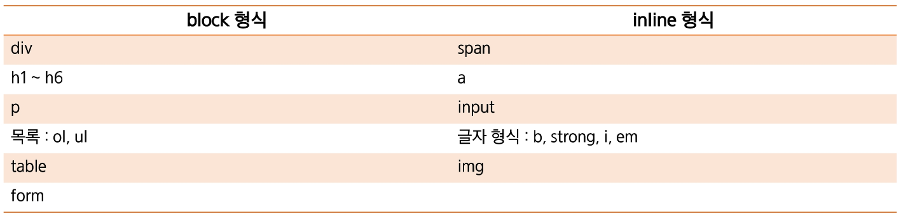

# block vs inline Element

> HTML Elements는 크게 block 형식 inline 형식으로 나뉜다.

- block 형식 := 사용하는 element가 한 줄을 모두 사용
- inline 형식 := contents의 크기만큼만 공간 사용

# block & inline 형식 태그

## div & span

### div

> block 형식으로 공간을 분할

- 웹 사이트의 레이아웃(전체 틀)을 만들 때 사용
- `div` 태그를 사용해 각각의 블록(공간)을 알맞게 배치하고 CSS를 활용해 스타일을 적용

### span

> inline 형식으로 공간을 분할

- `
` 와 `
` 태그와 함께 웹페이지의 일부분에 스타일을 적용시키기 위해 사용

### 차이점

- div와 span을 여러 개 만들어 나란히 나열한 경우
  - div := 자동 줄 바꿈이 일어나며 세로로 나열
  - span := 줄 바꿈이 일어나지 않고 가로로 나열
- 동일한 문장을 감싼 경우,
  - div := 박스 형태로 영역이 설정되고 그 안에 정렬
  - span := 줄 단위로 영역이 설정되고 박스 형태가 아닌 텍스트가 노출되는 영역만 포함
- div의 margin ⇒ 4방향 모두 적용
- span의 margin ⇒ 양옆(2방향)만 적용
