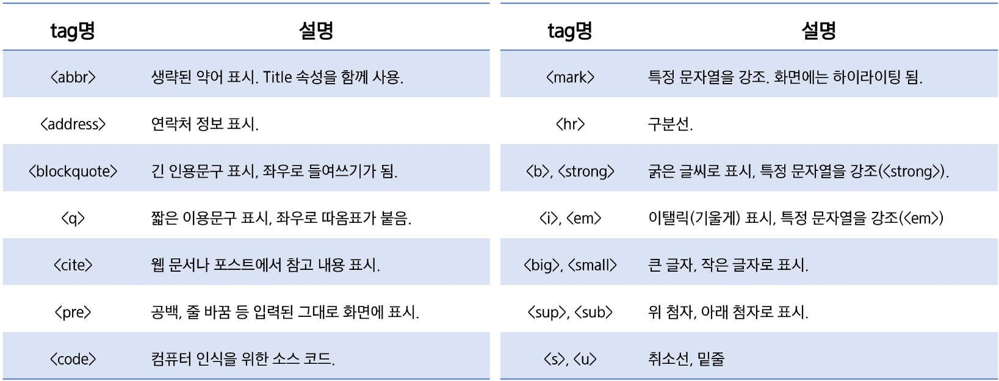
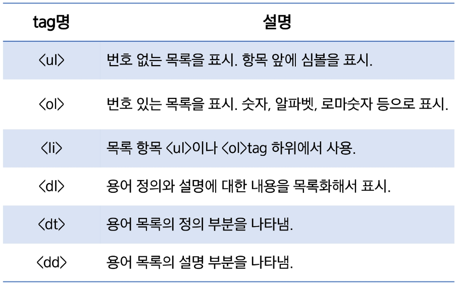
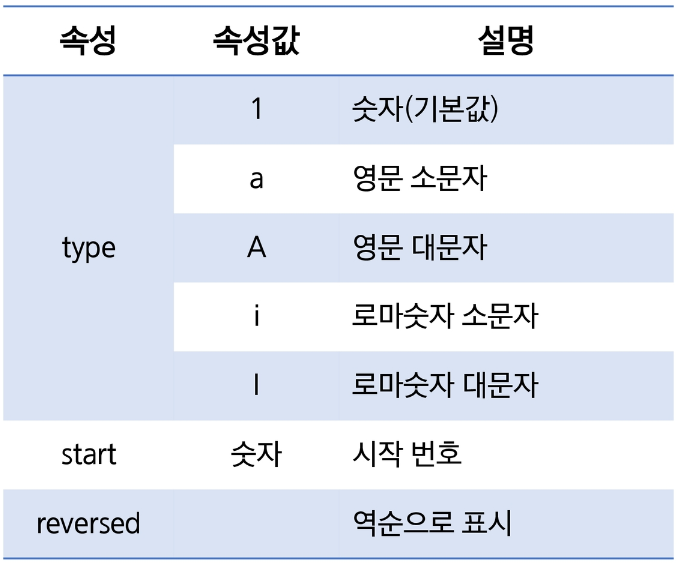
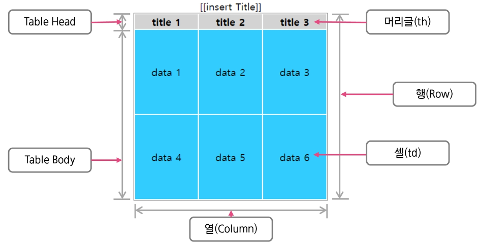
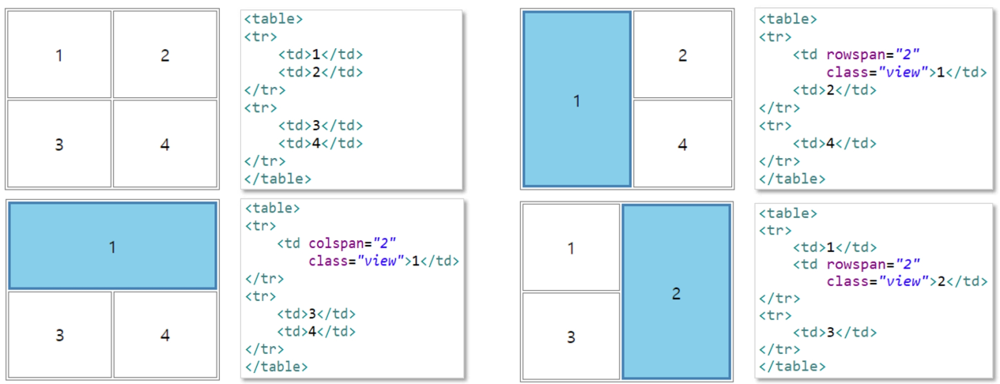
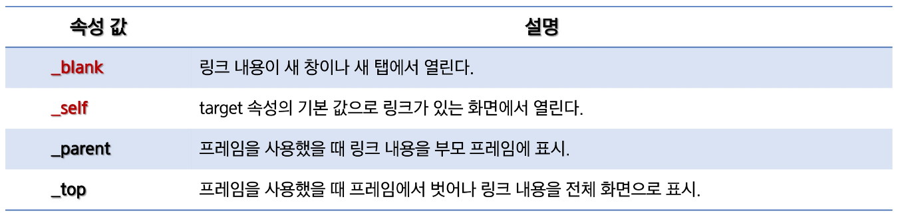

# HTML Markup Elements: 기본태그

## 포맷팅 요소

> 화면에는 동일하게 출력되지만 각 요소가 가진 의미가 다른 것

- e.g.) `<b>`와 `<strong>`은 모두 텍스트를 굵게 표현하지만, `<strong>` 요소는 텍스트를 강조

## 목록형 요소

- **목록 tag**는 하나 이상의 하위 tag를 포함
- **목록 tag**는 각 항목을 들여쓰기로 표현
- 번호 또는 심볼을 이용해서 목록을 표현

### `<ol>` 태그 속성

# Table

## HTML table 모델

> 데이터를 행(row)과 열(column)의 셀(cell)에 표시

- 행 그룹 요소 ⇒ `<thead>` , `<tbody>` , `<tfoot>` 요소를 사용하여 **행들을 그룹화**
- `<colgroup>` , `<col>` ⇒ **열 그룹을 위한 추가적 구조정보** 제공
- table의 셀(cell)은 머리글(`<th>`)이나 데이터(`<td>`)를 가질 수 있다.
- **table**은 데이터가 모두 로드되어야지만, 화면에 표시된다.
  → 공간 분할(`
`)과 `<table>`을 잘 구분해서 사용해야 한다.

## table - 셀 병합

> HTML table의 `<td>` 요소에는 셀(Cell)을 병합하기 위한 두 개의 속성이 있다.

- `colspan` := 두 개 이상의 열을 하나로 합치기 위해 사용
- `rowspan` := 두 개 이상의 행을 하나로 합치기 위해 사용

# Anchor - 링크 요소

> 하나의 문서에서 다른 문서로 연결하기 위해 사용

- tag를 서로 중첩해서 사용할 수 없다.
- `href` := 하이퍼링크를 클릭했을 때 이동할 문서의 URL이나 문서의 책갈피
- `target` := 하이퍼링크를 클릭했을 때 현재 윈도우 또는 새로운 윈도우에서 이동할지를 지정
  

# iframe - 프레임 요소

> 화면의 일부분에 다른 문서를 포함

- `src` := 포함시킬 외부 문서의 경로를 지정(상대 경로 or URL)
- `height`, `width` := 프레임 사이즈 지정
- `name` := 프레임의 이름 지정
