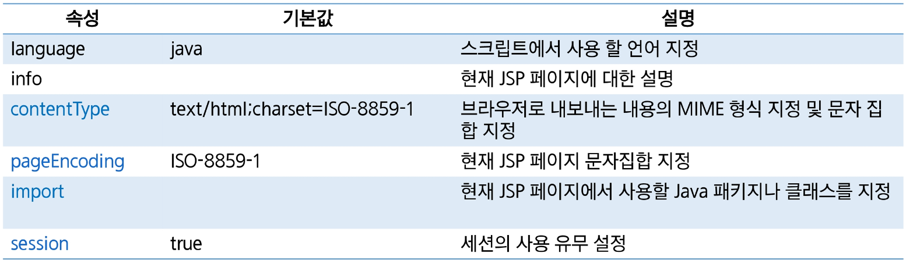

# JSP

> HTML 내에 **자바** 코드를 삽입하여 **웹 서버**에서 **동적으로** 웹 페이지를 생성하여 웹 브라우저에 돌려주는 **서버 사이드 스크립트** 언어


JSP 파일이 내부적으로 WAS가 servlet으로 변환 작업을 수행한다. JSP를 실행하는 것이 아니라 Servlet을 수행하는 느낌

# JSP Scriptlet

HTML 코드 중간에 자바 코드임을 알려주는 역할

## 선언문 - Declaration

> 맴버변수 선언이나 메소드를 선언하는 영역

- 형식 := `<%! 맴버변수와 method 작성 %>`

```java
<%!
String name;

public void init() {
	name = "홍길동";
}
%>
```

## 스크립트릿 - Scriptlet

> **Client 요청 시 매번 호출** 영역으로, Servlet으로 변환 시 **_service() method에 해당_**되는 영역

- **request**, **response**에 관련된 코드 구현
- 형식 := `<% java code %>`

```java
<%
for(int dan = 2; dan < 10; dan++) {
	out.println("<tr>");
	String classname = dan % 2 == 0 ? "color1" : "color2";
	for(int i = 1; i < 10; i++) {
		out.println("<td class=\"" + classname + "\">" + dan + " * " + i + " = "
			+ dan * i + "<\td>");
		out.println("<\tr>");
	}
}
%>
```

## 표현식 - Expression

> 데이터를 브라우저에 출력할 때 사용

- 잦은 out.println() 사용을 대체하기 위함.
- 형식 := `<%= 문자열 %>`

```java
안녕 <%= name %>!!!
```

주의) _<%= 문자열; %> ⇒ 문자열 뒤에 세미콜론(;)을 작성하면 안된다!_

`<%= 문자열 %>` == `<% out.print(문자열); %>` ⇒ 같은 표현

## 주석 - Comment

> 코드 상에서 부가 설명을 작성

- 형식 := `<%-- 주석 할 코드  --%>`
- JSP에서 자바 코드를 주석처리 하기 위해서는 위의 주석 형식을 이용! → HTML 주석을 사용하면 안된다.

```java
<!-- HTML 주석 -->
<%-- JSP 주석 -->
<%
/*
Java 주석
*/
%>
```

# JSP Directives

## page Directive

> 컨테이너에게 현재 JSP 페이지를 어떻게 처리할 것인가에 대한 정보를 제공한다.

- 형식 := `<%@ page attr1="val1" attr2-"val2" ... %>`




## include Directive

> 특정 jsp file을 페이지에 포함

- 여러 jsp 페이지에서 **반복적으로 사용되는 부분**을 jsp file로 만든 후, 반복 영역에 include시켜 반복되는 코드를 줄일 수 있다.
- 형식 := `<%@ include file="/template/header.jsp" %>`

## tag library Directive

> JSTL 또는 사용자에 의해서 만든 커스텀 태그(custom tag)를 이용할 때 사용

- JSP 페이지 내에 불필요한 자바 코드를 줄일 수 있다.
- 형식 := `<%@ taglib prefix=”c” url=”http://java.sun.com/jsp/jstl/core” %>`

# JSP 기본(내장) 객체

## JSP 기본 객체


## JSP 기본객체의 영역


⇒ 아래로 갈수록 범위가 넓어진다.

### scope의 공통 method

> **servlet**과 **jsp 페이지** 간에 **특정 정보를 주고 받거나 공유하기 위한 메소드**를 지원한다.


