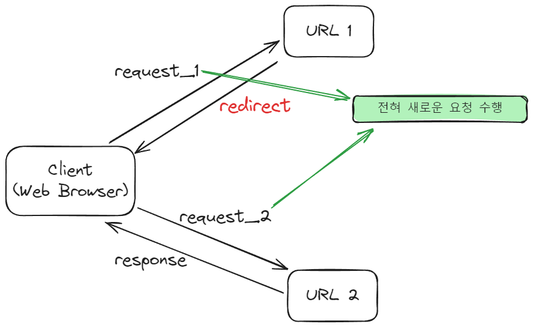

# Web Page 이동

> JSP 환경에서 현재 작업 중인 페이지에서 **다른 페이지로 이동**하는 두 가지 방식의 페이지 전환 기능이 존재

사례)

- 고객 := 클라이언트
- 123번 := URL
- 상담원 := 서버

## Redirect

1. 고객(클라이언트)이 고객센터로 상담원(서버)에게 123번(URL)으로 전화를 건다.
2. 상담원은 고객에게 다음과 같이 얘기한다. “고객님 해당 문의사항은 124번으로 다시 문의해주시겠어요?”
3. 고객은 다시 124번으로 문의해서 일을 처리한다.

위를 다시 설명해보면 다음과 같다.

1. Web Container는 redirect 명령이 들어오면 웹 브라우저에게 다른 페이지로 이동하라는 명령을 내린다.
2. 웹 브라우저는 **URL을 지시된 주소로 바꾸고** 그 주소로 이동한다.
3. 다른 Web Container에 있는 주소로 이동이 가능하다(위의 예시에서는 123 → 124)

> 새로운 페이지에서는 request, response 객체가 새롭게 생성된다.

⇒ 최초 요청을 받은 URL1에서 클라이언트에 redirect할 URL2를 리턴하고, 클라이언트에게 전혀 새로운 요청을 생성하여 URL2에 다시 요청을 보낸다. 따라서, **처음 보냈던 최초의 요청 정보는 더이상유효하지 않게된다**.

## forward

1. 고객(클라이언트)이 고객센터로 상담원(서버)에게 123번(URL)으로 전화를 건다.
2. 상담원은 해당 문의사항에 대해 잘 알지 못해 옆의 다른 상담원에게 해당 문의사항의 답을 얻는다.
3. 상담원은 고객에게 문의사항을 처리해준다.

위를 다시 설명해보면 다음과 같다.

1. Web Container 차원에서의 페이지 이동, 실제로 웹 브라우저는 다른 페이지로 이동했는지 알 수 없다(위의 사례에서는 고객은 상담원이 누구한테 물어봤는지 알 수 없다).
2. 웹 브라우저에는 **최초 호출한 URL만 표시**되고, 이동한 페이지의 URL 정보는 볼 수가 없다(위의 사례에서, 고객은 123번으로만 전화했기 때문에 알 수 없다).
3. 동일한 Web Container에 있는 페이지로만 이동이 가능하다.

> 현재 실행 중인 페이지와 forward에 의해 호출될 페이지는 **request와 response 객체를 공유**한다.

⇒ 다음 이동한 URL로 **요청 정보를 그래로 전달**한다. 따라서, 사용자가 **최초로 요청한 요청 정보는 다음 URL에서도 유효**하다.
