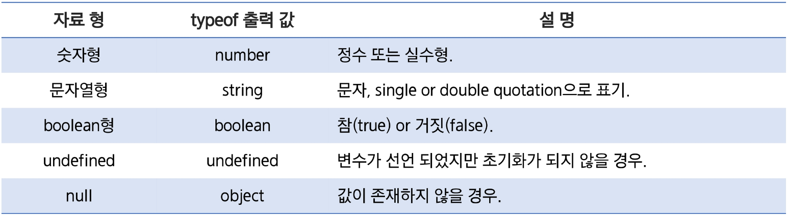

# 변수

> 변수를 선언할 때 타입을 명시하지 않고 `var` keyword를 사용하여 선언
> 
- JS ⇒ 동적타입(Dynamic/Weak Type) 언어.
- **변수의 타입 지정없이** 값이 할당되는 과정에서 자동으로 변수의 타입이 결정 → 같은 변수에 여러 타입의 값을 할당 가능

```jsx
// 변수
var myName;
var myVariable;

// 적절
var listCount = 10;
var userName = "Jake";
var selected = false;

// 부적절 - 변수인지 함수인지 구별이 어렵다.
var getListCount = 10;
var isSelected = false;
```

# 자료형

> 프로그램은 정적인 데이터 값을 동적으로 변환해가며 원하는 정보를 얻는다.
> 
- JS ⇒ **원시 타입(Primitive Type)** + **객체 타입(Object Type)**

## Primitive Type

원시 타입에는 **숫자**, **문자열**, **boolean**, **undefined**, **null** 5가지가 존재



### 숫자

> JavaScript는 숫자를 정수와 실수로 **나누어 구분하지 않는다.**
> 
- 모든 숫자를 **8byte의 실수 형태**로 처리 → 정수만을 표현하기 위한 데이터 타입은 없다.
- 편의를 위해 정수 리터럴과 실수 리터럴 제공
- 특정 소수점을 정확하게 표현하지 못함 → Floationg Point
- 기본 연산 기호는 Java와 동일

> “Underflow”, “Overflow”, “0으로 나누는 연산”에 대해 **예외를 발생시키지 않는다.**
> 
- `Infinity` := 무한대를 나타내는 상수. 어떠한 수를 0으로 나누거나 Infinity를 어떠한 수로 사칙연산한 결과
- `NaN` := 계산식의 결과가 숫자가 아님을 나타내는 상수

```jsx
// 언더플로우
console.log(0 / 100); // 0
console.log(-0 / 100); // -0

// 오버플로우
console.log(100 / 0); // Infinity
console.log(-100 / 0); // -Infinity
console.log(Infinity / 0); // Infinity
console.log(-Infinity / 0); // -Infinity

console.log(0 / 0); // NaN
console.log(parseInt("3A")); // 1
console.log(parseInt("A1")); // NaN

console.log(new Number("1")); // 1
console.log(new Number("1A")); // NaN
```

### 문자열

> 16bit의 Unicode 문자를 사용한다.
> 
- 문자 하나를 표현하는 char와 같은 문자형은 제공하지 않는다. ⇒ ‘a’와 같은 한 글자도 문자열로 표현
- ‘와 “ 둘 다 사용 가능
- 이스케이프 시퀀스(\) 사용 가능

#### 백틱( ` )
> 문자열을 표현할 수 있다. 

```jsx
var str = "Jake";
console.log(`당신의 이름은 ${str}입니다.`);
```

- 백틱을 사용하면 백틱 안에 문자열이 그대로 출력된다.
- `$ { 변수명 }` 형식 사용 가능

### boolean

> 비교 연산의 결과값으로 true or false 중 하나의 값을 갖는다.
> 
- **비어 있는 문자열**, **null**, **undefined**, **숫자 0** ⇒ false

### null

> 값이 없거나 비어 있음을 뜻한다.
> 

### undefined

> 값이 **초기화 되지 않았음**(정의되지 않음)을 의미한다.
> 
- 값을 할당하지 않은 변수 := `undefined` 할당(시스템 레벨)
- 코드에서 명시적으로 값이 없음을 나타냄 := `null` (프로그램 레벨)

```jsx
var name;
var id = null;

var n1 = 10;
var n2 = 20;

console.log(n1 == n2); // false
console.log(name); // undefined
console.log(id); // null

var a;
var b = null;
var c = 0;

if (!a) {
console.log("a");
}
if (!b) {
console.log("b");
}
if (!c) {
console.log("c");
}
```

## 자동 형 변환(동적 타이핑, Dynamic Typing)

> JS는 Java나 C++ 등과 달리 자료 형에 대해 매우 느슨한 규칙이 적용
> 
> 
> 어떤 자료 형이든 전달할 수 있고, 그 값을 필요에 따라 변환 가능
> 
- 서로 다른 자료 형의 연산 가능

```jsx
var msg = 40;

console.log("message : " + msg); // message 40
msg = "hello javascript";
console.log(msg); // hello javascript

console.log("The message is " + 40); // The message is 40
console.log(40 + " is The message"); // 40 is The message

console.log("40" - 5); // 35
console.log("40" + 5); // 405

console.log(parseInt("123.45") + 1); // 124
console.log(parseFloat("123.45") + 1); // 124.45

console.log("1.1" + "1.1"); // 1.11.1
console.log(+"1.1" + +"1.1"); // 2.2
```

---

# 변수 호이스팅(Variable Hoisting)

> `var` 선언문이나 `function` 선언문 등 모든 선언문이 해당 Scope의 처음으로 옮겨진 것처럼 동작하는 특성
> 

⇒ Javascript는 모든 선언문이 **선언되기 이전에 참조 가능**

- `var` 키워드를 사용한 변수는 중복해서 선언이 가능
- 변수의 생성
    1. 선언 단계 := 변수 객체에 변수를 등록
    2. 초기화 단계 := 변수 객체에 등록된 변수를 메모리에 할당. `undefined` 로 초기화 됨.
    3. 할당 단계 := `undefined` 로 초기화된 변수에 실제 값을 할당
    
    ⇒ **1번 단계와 2번 단계는 한 번에 이루어진다.** 
    

```jsx
console.log(num); // undefined
var num = 123;
console.log(num); // 123
{
	var num = 456;
}
console.log(num); // 456
```

num이 선언되지 않았기 때문에 ERROR가 발생할 것 같지만, 콘솔에는 undefined가 출력된다. 모든 선언문은 **Hoisting**되기 때문이다. 

> JavaScript는 블록 레벨 스코프를 가지지 않고 함수 레벨 스코프만 갖는다.
> 

## let & const

> ECMAScript6부터 `let` 과 `const` 키워드 추가
> 


- `var` := **함수 단위**에서만 지역변수로 사용 가능
- `let` , `const` := 블럭 스코프 유효 범위

# 연산자

비교 연산자 → ==과 ===

- `==` := **자료형과 값 모두**를 비교
- `===` := 자료형은 비교하지 않고 **값만** 비교

# 반복문

## forEach 반복문

> 오직 Array 객체에서만 사용 가능한 메서드
> 
> 
> 배열의 요소들을 반복하여 작업을 실행
> 
- `forEash()` 구문의 인자로 **callback 함수 등록** 가능
    - 배열의각 **요소들이 반복될 때** 이 callback  함수가 호출된다.
    - callback 함수에서 배열 요소의 인덱스와 값에 접근할 수 있다.

```jsx
var items = ['item1', 'item2', 'item3'];

items.forEach(function(item) {
	console.log(item);
});
// 출력 결과 : item1, item2, item3
```

## for … in 반복문

> **객체의 속성들**을 반복하여 작업을 수행
> 
- 모든 객체에서 사용 가능
- 객체의 key 값에 접근할 수 있지만, value 값에 접근할 수 없다.

```jsx
var obj = {
	a: 1.
	b: 2,
	c: 3
};

for (var prop in obj) {
	console.log(prop, obj[prop]);
}
// 출력 결과 : a 1, b 2, c 3
```

## for … of 반복문

> 컬렉션 전용 반복 구문
> 
- `for of` 구문을 사용하기 위해서는 컬렉션 객체가 `[Symbol.iterator]` 속성을 가지고 있어야 한다. → 직접 명시 가능

```jsx
var iterable = [10, 20, 30];

for (var value of iterable) {
	console.log(value);
}
// 출력 결과 : 10, 20, 30
```

## `for in` vs `for of`

- `for in` 반복문 := 객체의 **모든 열겨 가능한 속성에 대해** 반복
- `for of` 반복문 := `[Symbol.iterator]` 속성을 가지는 컬렉션 전용

```jsx
Object.prototype.objCustom = function () {};
Array.prototype.arrCustom = function () {};

var iterable = [3, 5, 7];
iterable.foo = "hello";

for (var key in iterable) {
  console.log(key); // 0, 1, 2, "foo", "arrCustom", "objCustom"
}

for (var value of iterable) {
  console.log(value); // 3, 5, 7
}
```
