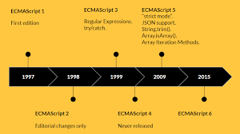

# JavaScript

웹 브라우저가 HTML 문서를 읽어 들이는 시점에 JS Engine이 실행된다. 

대부분의 JavaScript Engine은 ECMAScript 표준을 지원한다.

# ECMAScript

> ECMA International이 ECMA-262 기술 규격에 따라 정의하고 있는 표준화된 스크립트 프로그래밍 언어
> 



# JavaScript의 특징

- HTML, CSS와 함께 웹을 구성하는 요소 중 하나 ⇒ 웹 브라우저에서 동작하는 유일한 프로그래밍 언어
- JavaScript는 개발자가 별도의 컴파일 작업을 수행하지 않는 **인터프리터 언어**
- 명령형(imperative), 함수형(functional), 프로토타입 기반(prototype-based) 객체지향 프로그래밍을 지원하는 **멀티 패러다임 프로그래밍 언어**

# HTML에서 JS 선언

> HTML에서 JS를 사용하려면 `<script>` 태그를 사용
> 
- `<script>` := src와 type 속성을 사용해 JavaScript를 선언
    - src := 외부의 JS 파일을 HTML 문서에 포함할 때 사용. 생략 가능
    - type := 미디어 타입을 지정할 때 사용. JS 코드는 `text/javascript` 로 지정. ⇒ HTML5부터 생략 가능

### JS 코드를 HTML 문서에 포함하는 방법

```html
<head>
  <meta charset="UTF-8" />
  <title>JavaScript 선언</title>
  <script type="text/javascript">
    function hello(message) {
      alert("Hello " + message);
    }

    hello("JavaScript !!!");
  </script>
</head>
```

### 외부 JS 파일을 HTML문서에 포함하는 방법

```html
<head>
  <meta charset="UTF-8" />
  <title>JavaScript 선언</title>
  <script src="hello.js" type="text/javascript"></script>
</head>
```

```jsx
// hello.js
function hello(message) {
  alert("Hello " + message);
}

hello("JavaScript !!!");
```

→ JS 파일을 여러 HTML 파일에서 공통적으로(e.g. 모듈화) 사용할 때 외부 JS 파일을 이용하는 방식이 편리하다. 

## `<sript>` 의 위치

`<script>` tag는 HTML 파일 내부의 `<head>` 나 `<body>` 안 어느 곳에서나 선언 가능

> 하지만, **`<body>` 안의 끝부분** 에 `<script>` tag를 둘 것을 권장
> 
- `<head>` 안에 위치한 JS는 브라우저의 각종 입/출력 발생 이전에 초기화되므로 브라우저가 먼저 점검함.
- `<body>` 안에 위치하면 브라우저가 HTML로부터 해석하여 화면에 그리기 때문에 사용자가 빠르다고 느낄 수 있다.

```jsx
<!DOCTYPE html>
<html>
  <head>
    <meta charset="UTF-8" />
    <title>script tag의 위치</title>

    <script type="text/javascript">
      document.write("안녕하세요 자바스크립트입니다.");
    </script>

  </head>
  <body>
    아름다운 날이네요.

    <script type="text/javascript">
      document.write("날씨가 참 좋네요.");
    </script>
  </body>

</html>
```

⇒ 결국, 웹 브라우저가 HTML 문서를 순차적으로 해성(parsing)하므로, script 위치에 따라 로드와 실행 시점이 달라진다.
