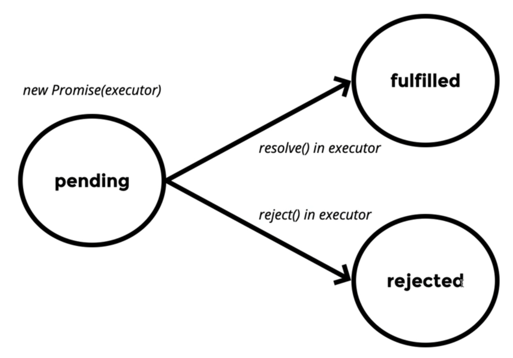
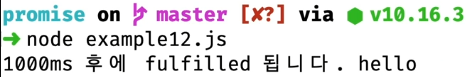
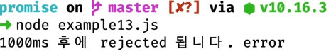
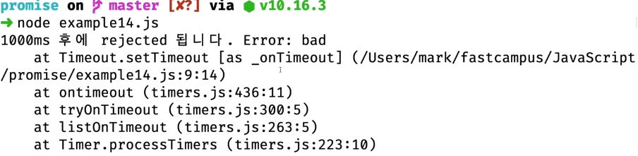
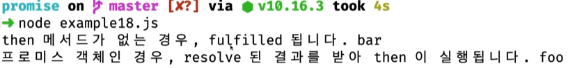
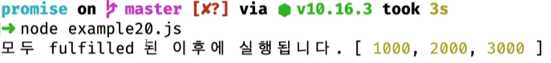

# Promise

> `Promise` 객체는 비동기 작업이 맞이할 미래의 완료 또는 실패와 그 결과 값을 나타낸다.
> 
- 생성자를 통해 `Promise` 객체를 만들 수 있다.
- 생성자의 인자로 `executor` 라는 함수를 이용

```jsx
new Promise(/* executor */);
```

# executor 함수

> `executor` 함수는 `resolve` 와 `reject` 를 인자로 가진다.
> 

```jsx
(resolve, reject) => { ... }

// 다음과 같이 사용
new Promise((resolve, reject) => { ... });
```

- 여기서 `resolve` 와 `reject` 는 함수이다.
    - `resolve( )`, `reject( )`

# Promise 상태

1. 생성자를 통해서 Promise 객체를 만드는 순간, **pending(대기) 상태**가 된다. 
    1. 객체를 생성하고, 비동기적인 상황이 일어나는 동안까지 계속 Pending 상태
2. `resolve` 함수를 실행하면, **fulfilled(이행) 상태**가 된다. 
    1. 비동기 상황이 성공적으로 끝난 경우
3. `reject` 함수를 실행하면, **rejected(거부) 상태**가 된다. 
    1. 비동기 상황에서 에러 상황이 발생한 경우

```jsx
new Promise((resolve, reject) => { // Pending 상태
	...
	resolve(); // Fulfilled 상태
	reject();  // Rejected 상태
});
```



# `.then()`

> `Promise` 가 이행되거나 거부될 때 실행될 콜백 함수를 설정
> 

```jsx
p.then(onFulfilled, onRejected);

p.then(function(value) {
	// 이행
}, function(reason) {
	// 거부
});
```

- `onFulfilled` :=
    - `Promise` 가 수행될 때 호출되는 함수
    - 이행 값(fulfillment value) 하나를 인수로 받는다.
- `onRejected` :=
    - `Promise` 가 거부될 때 호출되는 함수
    - 거부 이유(rejection reason) 하나를 인수로 받는다.

아래 코드는 Promise 객체를 만들고 Pending 상태가 된 후, 1초 후에 정상적으로 Fulfilled 상태로 가는 코드이다. 

```jsx
const p = new Promise((resolve, reject) => {
    /* pending */
    setTimeout(() => {
        resolve(); /* fulfilled */
    }, 1000);
});

p.then(/* callback function */ () => {
	console.log("1000ms 후에 fulfilled 됩니다.");
});
```

⇒ `Promise` 객체인 p가 fulfilled 되는 시점에, `p.then` 안에 설정한 callback 함수가 실행된다.  

> `then` 을 설정하는 시점을 정확히하고, 함수의 실행과 동시에 프로미스 객체를 만들면서 pending 이 시작하도록 하기 위해 프로미스 객체를 생성하면서 리턴하는 함수(p)를 만들어 함수(p) 실행과 동시에 `then` 을 설정한다.
> 

```jsx
function p() {
    return new Promise((resolve, reject) => {
        /* pending */
        setTimeout(() => {
            resolve(); /* fulfilled */
        }, 1000);
    });
}

p().then(() => {
	console.log("1000ms 후에 fulfilled 됩니다.");
});
```

⇒ p 함수가 호출될 때, `Promise` 객체가 만들어 지면서 리턴된다. 

# `.catch()`

> `Promise` 객체가 Rejected 되는 시점에 실행될 콜백 함수를 설정
> 
- 메서드 체이닝 형태 가능

```jsx
function p() {
    return new Promise((resolve, reject) => {
        /* pending */
        setTimeout(() => {
            reject(); /* rejected */
        }, 1000);
    });
}

p().then(() => {
	console.log("1000ms 후에 fulfilled 됩니다.");
}).catch(() => {
	console.log("1000ms 후에 rejected 됩니다.");
});
```

# resolve 함수

> `executor` 의 resolve 함수를  실행할 때 인자를 넣어 실행하면, `then`의 콜백 함수의 인자로 받을 수 있다.
> 

```jsx
function p() {
    return new Promise((resolve, reject) => {
        /* pending */
        setTimeout(() => {
            resolve(`hello`); /* fulfilled */
        }, 1000);
    });
}

p().then((message) => {
	console.log("1000ms 후에 fulfilled 됩니다.", message);
}).catch(() => {
	console.log("1000ms 후에 rejected 됩니다.");
});
```



⇒ 보통 비동기 작업은 원격에 있는 데이터를 가져올 때 많이 사용하는데, 이 정상적으로 받아온 데이터를 resolve의 인자로 넘겨 **then에서 처리**하는 방식.

# reject 함수

> `executor` 의 reject 함수를  실행할 때 인자를 넣어 실행하면, `catch`의 콜백 함수의 인자로 받을 수 있다.
> 

```jsx
function p() {
    return new Promise((resolve, reject) => {
        /* pending */
        setTimeout(() => {
            reject(`error`); /* Rejected*/
        }, 1000);
    });
}

p().then(() => {
	console.log("1000ms 후에 fulfilled 됩니다.");
}).catch((reason) => {
	console.log("1000ms 후에 rejected 됩니다.", reason);
});
```



⇒ 매개변수로 **JavaScript에서 사용하는 에러 객체**를 만들어 넘기는게 일반적이다.

## 에러 객체 넘기기

```jsx
function p() {
    return new Promise((resolve, reject) => {
        /* pending */
        setTimeout(() => {
            reject(new Error('bad'); /* Rejected*/
        }, 1000);
    });
}

p().then(() => {
	console.log("1000ms 후에 fulfilled 됩니다.");
}).catch((error) => {
	console.log("1000ms 후에 rejected 됩니다.", error);
});
```



⇒ 에러 객체에 에러 상태나 에러 코드를 함께 넘겨 에러를 처리하는게 일반적이다

# `.finally()`

> fulfilled 되거나 rejected 된 후에 **최종적으로 실행할 것**이 있는 경우, 함수를 인자로 넣고 사용;
> 

```jsx
function p() {
    return new Promise((resolve, reject) => {
        /* pending */
        setTimeout(() => {
            reject(new Error('bad'); /* Rejected*/
        }, 1000);
    });
}

p().then((message) => {
	console.log("1000ms 후에 fulfilled 됩니다.", message);
}).catch((error) => {
	console.log("1000ms 후에 rejected 됩니다.", error);
}).finally(() => {
	console.log("end");
});
```

---

`then` 함수에서 다시 Promise 객체를 리턴하는 방법을 통해 체이닝하면, 비동기 작업을 순차적으로 아래로 표현할 수 있다. 

```jsx
function p() {
	return new Promise((resolve, reject) => {
		setTimeout(() => {
			resolve();
		}, 1000);
	});
}

p().then(() => {  // 1초 후
	return p();
}
.then(() => p())  // 2초 후
.then(p);         // 3초 후
.then(() => {     // 4초 후
	console.log('4000ms 후에 fulfilled 됩니다.');
});
```

# Promise.resolve()

> `Promise` 전역 객체의 메서드인 `resolve()` 를 실행하며 객체를 만들어내는 방식
> 

```jsx
Promise.resolve(/* value */);
```

- value에는 크게 2가지를 넣을 수 있다
    1. `Promise` 객체
    
    ```jsx
    Promise.resolve(new Promise((resolve, reject) => {
    	setTimeout(() => {
    		resolve('foo');
    	}, 1000);
    })).then((data) => { // resolve 후 바로 실행된다. 
    	console.log('프로미스 객체인 경우, resolve 된 결과를 받아 then이 실행됩니다.', data);
    });
    ```
    
    2. `Promise` 객체가 아닌 일반 값
    
    ```jsx
    Promise.resolve('bar').then(data => {
    	console.log('then 메서드가 없는 경우, fulfilled 됩니다.', data);
    });
    ```
    
    
    

# Promise.reject()

> `catch`로 연결된 rejected 상태로 변경된다.
> 

```jsx
Promise.reject(new Error('reason'))
	.then(error => { ... })
	.catch(error => {
		console.log(error);
	});
```

# Promise.all()

> Promise 객체 여러 개를 생성해 배열로 만들어 인자로 넣고 `Promisel.all()`을 실행하면, 배열의 모든 Promise 객체들이 fulfilled 되었을 때, `then` 의 함수가 실행된다.
> 
- `then`의 함수의 인자로 Promise 객체들의 resolve 인자값을 **배열**로 돌려준다.

```jsx
function p(ms) {
	return new Promise((resolve, reject) => {
		setTimeout(() => {
			resolve(ms);
		}, ms);
	})
}

Promise.all([p(1000), p(2000), p(3000)]).then((messages) => {
	console.log('모두 fulfilled 된 이후에 실행됩니다.', messages);
});
```



⇒ 3초 뒤에 결과 값이 나온다. 

# Promise.race()

> Promise.all() 과 매우 유사하지만, 배열의 모든 Promise 객체들 중 가장 먼저 fulfilled 된 것으로, `then`의 함수가 실행된다. 
`then`의 함수의 인자로 가장 먼저 fulfilled 된 Promise 객체의 resolve 인자값을 돌려준다.
>
