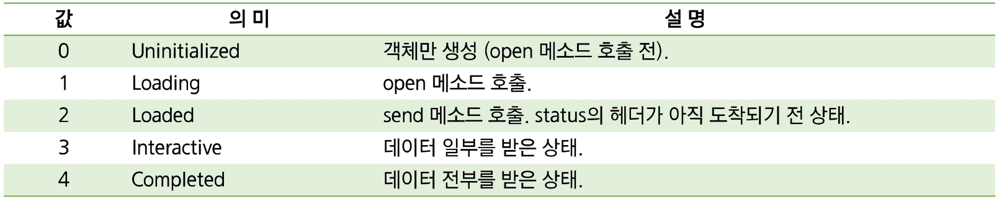
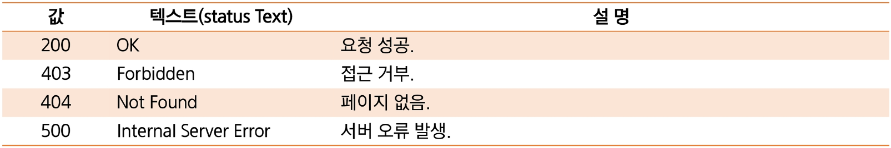

# XMLHttpRequest

> JavaScript가 Ajax 방식으로 통신할 때 사용하는 **객체**
> 
- Ajax 통신 시 전송 방식, 경로, 서버로 전송할 data 등 **전송 정보를 담는 역할**
- 실제 서버와의 통신은 브라우저의 Ajax 엔진에서 수행
- 직접 JS로 Ajax를 프로그래밍할 경우 브라우저 별로 통신 방식이 달라 코드가 복잡해진다.

### XMLHttpRequest 객체 생성

```jsx
var xhr = new XMLHttpRequest();
```

# 서버에 요청하기

> Ajax에서는 XMLHttpRequest 객체를 사용해 서버와 데이터를 교환
> 

## open()

> `open()` 메소드는 서버로 보낼 Ajax 요청의 형식을 설정 → **요청 초기화**
> 

```jsx
open(전달 방식, URL 주소, 동기 여부);
```

- 전달 방식 := GET, POST 방식 중 하나 선택
- URL 주소 := 요청을 처리할 서버의 파일 주소
- 동기 여부 := 요청을 동기식으로 전달할지 비동기식으로 전달할지를 전달

## send()

> 작성된 Ajax 요청을 서버로 전달 → Web Server에 **요청 전송**
> 

```jsx
send();      // GET 방식
send(문자열); // POST 방식
```

## GET 방식과 POST 방식

### GET 방식

- 주소에 데이터(data)를 추가하여 전달하는 방식
- GET 방식의 HTTP요청은 **브라우저에 의해 캐시**되어(cached) 저장
- 보통 쿼리 문자열에 포함되어 전송되기 때문에, **길이의 제한**이 있다.
- 보안상 취약점이 존재

### POST 방식

- 데이터(data)를 별도로 첨부하여 전달하는 방식
- 브라우저에 의해 캐시되지 않아, 브라우저 히스토리에 남지 않는다.
- 데이터의 길이에 대한 제한이 없다.
- GET 방식보다 보안성이 높다.

⇒ Ajax에서는 주로 POST 방식을 사용해 요청을 전송한다. 

# 서버로부터의 응답

Ajax에서 서버로부터의 응답을 확인하기 위해 사용하는 XMLHttpRequest 객체의 프로퍼티는 다음과 같다.

- **readyState** 프로퍼티
- **status** 프로퍼티
- **onreadystatechange** 프로퍼티

## `readyState` 프로퍼티

> XMLHttpRequest 객체의 현재 상태를 나타낸다.
> 



## `Status` 프로퍼티

> 서버의 상태를 나타낸다.
> 



## `onreadystatechange` 프로퍼티

> XMLHttpRequest 객체의 readyState 프로퍼티 값이 변할 때마다 **자동으로 호출되는 함수**를 설정
> 

```jsx
const xhr = new XMLHttpRequest();
const method = "GET";
const url = "https://developer.mozilla.org/";

xhr.open(method, url, true);
xhr.onreadystatechange = () => {
  // In local files, status is 0 upon success in Mozilla Firefox
  if (xhr.readyState === XMLHttpRequest.DONE) {
    const status = xhr.status;
    if (status === 0 || (status >= 200 && status < 400)) {
      // The request has been completed successfully
      console.log(xhr.responseText);
    } else {
      // Oh no! There has been an error with the request!
    }
  }
};
xhr.send();
```
