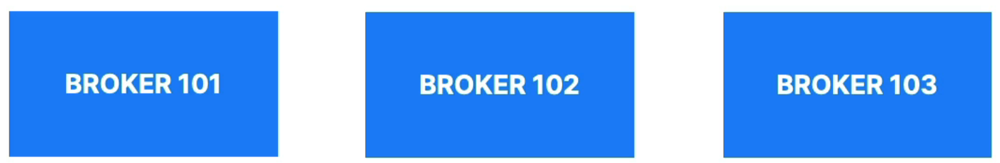
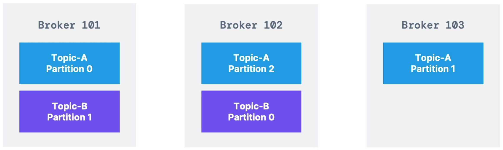
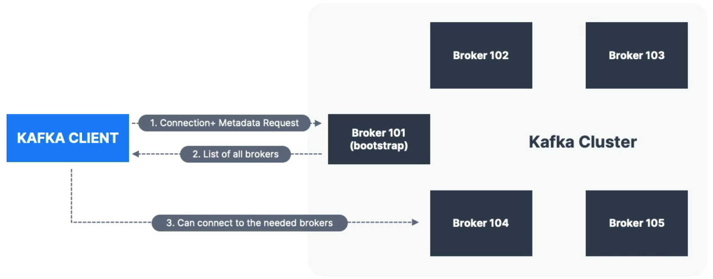

**Kafka Cluster**는 **다수의 Kafka Broker들로 구성**되어 있다.

⇒ 여기서 Kafka Broker는 서버라고 생각하면 된다. 데이터를 받고 보내기 떄문에 Broker라고 칭하는 것이다. 

# Broker

> Kafka 클러스터에서 메시지를 저장하고, 프로듀서로부터 메시지를 받아들이며, 컨슈머에게 메시지를 전달하는 역할을 하는 서버
> 
- 브로커는 ID로 식별된다.
    - ID는 정수(Integer)이다.

예를 들어, 위와 같이 하나의 클러스터 안에 정수로 이루어진 ID를 가진 브로커가 존재할 수 있다. 

- 브로커 안에는 **특정한 토픽 파티션만 담기게 된다.**
    - 즉, 데이터가 ***모든 브로커에 걸쳐 분산***되는 것이다.
- 어떤 kafka 브로커에 접속한 뒤에 즉, bootstrap broker에 연결하면 그 다음에 클라이언트, 프로듀서, 컨슈머는 전체 kafka 클러스터에 연결되고, 연결하는 방법을 안다. 따라서, 한 브로커에 연결하는 방법만 알면 클라이언트가 자동으로 나머지에 연결된다.

# Brokers & Topics

3개의 파티션을 가지고 있는 Topic A와 2개의 파티션을 가지고 있는 Topic B를 예시로 살펴보자.

위 예시처럼, 토픽 파티션은 순서에 상관없이 모든 브로커에 걸쳐 분산된다. 

⇒ 이를 ***수평적 스케일링***이라고 한다.

- 브로커가 모든 데이터를 갖는 것이 아니고, 가져야 할 데이터만 갖는 것이다.

# Kafka Broker Discovery

> Kafka 클러스터 내에서 **브로커가 서로를 발견하고 통신**할 수 있도록 하는 메커니즘
> 
- 클러스터에 있는 각각의 Kafka 브로커를 ***Bootstrap Server(부트스트랩 서버)***라고 한다.

⇒ 실제로 모든 브로커가 부트스트랩 서버이다. 

이 클러스터에서 브로커 하나에만 연결하면 클라이언트는 전체 클러스터에 연결하는 방법을 안다. 

1. Kafka 클라이언트가 Broker 101에 대한 연결을 시작하고 메타데이터를 요청한다. 
2. 성공하면 Broker 101은 클러스터 안에 있는 모든 브로커의 리스트를 반환한다. 
3. Kafka 클라이언트는 이 리스트를 통해 필요한 브로커에 연결할 수 있게 된다.