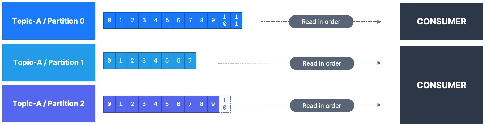
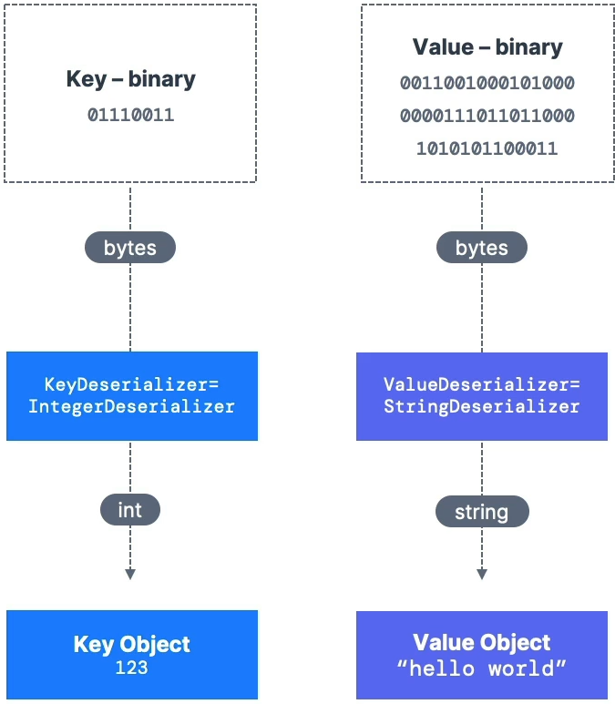

# Consumer

> Consumer는 **pull 모델**을 구현해 토픽에서 데이터를 읽어 들인다.
> 
- Kafka 브로커(서버)에 데이터를 요청하고 되돌아 오는 응답을 받는다.
- 데이터를 Consumer에게 pushing 하는 것은 Kafka 브로커가 아닌 Pull Model이다.
- 파티션에서 데이터를 읽어야 하는 Consumer들은 자동으로 어떤 Kafka 브로커에서 읽을지 알게 된다.
- 브로커에 오류가 발생해 동작하지 않더라도, Consumer는 복구할 방법을 알고 있다.
- 모든 파티션에서 읽히는 데이터는 순서대로 읽히게 된다.
    - 낮은 오프셋 → 높은 오프셋
    - 각 파티션에서 0 → 1 → 2 → 3 → …
- 하지만, 파티션을 읽는 순서는 보장되지 않는다.
    - 순서는 각각의 파티션 안에만 존재한다.

# Consumer Deserializer

> Kafka로부터 받은 바이트를 객체나 데이터로 변환하는 과정
> 
- Consumer는 메시지의 형식이 무엇인지 미리 알고 있어야 한다.
    - 따라서, 토픽이 생성되면 Producer가 전송하는 데이터의 타입을 절대로 변경해서는 안된다.

