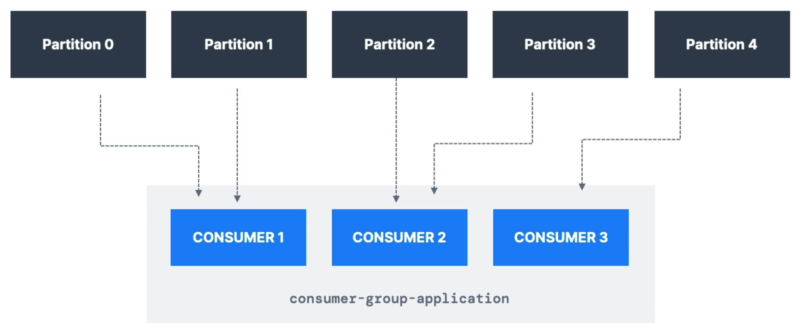
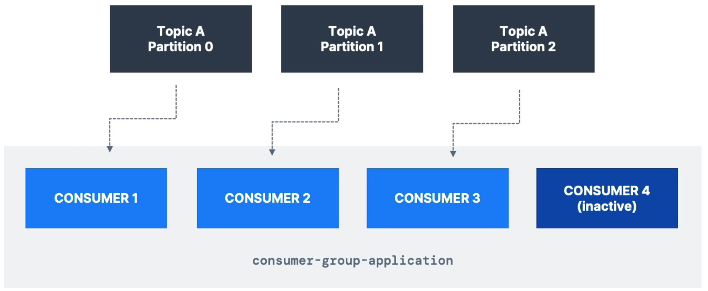
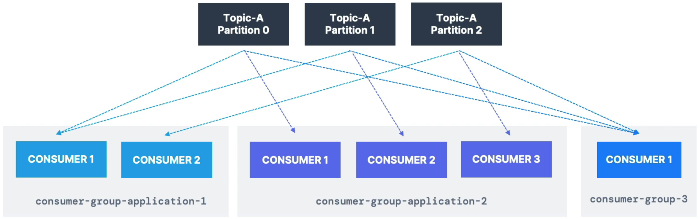
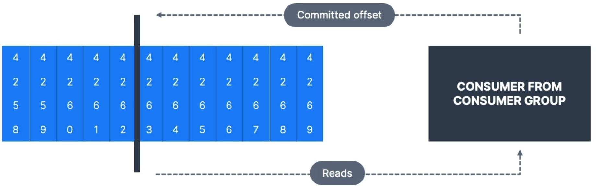

# Consumer Group

> 메시지를 효율적으로 처리하기 위해 여러 개의 컨슈머(Consumer)를 묶어 관리하는 논리적인 단위
> 

아래 예시 상황을 살펴보자.

한 개의 토픽 안에 5개의 파티션이 존재하고 , 3개의 Consumer로 구성된 Consumer Group이 존재한다. 이때, 각각의 컨슈머는 각각 다른 파티션에서 데이터를 읽게 된다. Consumer1은 Partition 0과 1, Consumer2는 Partition 2와 3 Consumer3는 Partition 4의 데이터를 각각 읽는다. 이렇게 같은 Consumer Group 안의 모든 Consumer는 **읽기를 공유**한다.

⇒ 이와 같은 방식으로 그룹이 Kafka 토픽 전체를 읽게 된다.

### 컨슈머 그룹 안의 컨슈머가 파티션의 개수보다 많은 경우

A. 파티션 수를 넘어가는 컨슈머들은 **비활성화**된다. 즉, **대기(stand by) 컨슈머**가 된다.

### 하나의 토픽에 다수의 컨슈머 그룹이 존재하는 경우

각각의 컨슈머 그룹을 사용하기 위해 `group.id`라는 **컨슈머 프로퍼티**를 사용해 컨슈머 그룹에 이름을 정할 수 있다. 이를 통해 컨슈머는 자신이 속한 그룹을 알 수 있다. 

# Consumer Offset

> 컨슈머가 토픽의 파티션에서 읽은 마지막 메시지의 위치를 나타내는 값
> 
- Consumer Offset은 Kafka 내부의 `__consumer_offsets`라는 특별한 **토픽**에 저장된다.

컨슈머 그룹 안에 컨슈머가 존재하고, 오프셋(Offset)을 커밋(Commit)할 것이다. 오프셋이 커밋되면 그 컨슈머는 해당 오프셋부터 계속 데이터를 읽을 수 있게 된다. 

## 중요성

1. 오프셋을 통해 컨슈머는 메시지를 순서대로 처리할 수 있다.
2. 컨슈머가 재실행되거나 장애가 발생하더라도, 마지막으로 읽은 오프셋부터 다시 읽기를 시작할 수 있다.
3. 메시지를 중복 처리하거나 누락하는 것을 방지할 수 있다.
