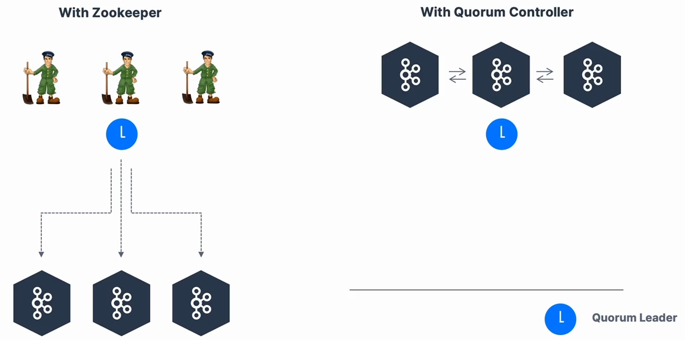

2020년에 주키퍼에 대한 의존성을 제거하는 프로젝트를 진행했고 이를 `KIP-500`이라 부른다. 왜냐하면, 주키퍼를 사용하면 파티션이 100,000개를 넘었을 때 Kafka 클러스터에 스케일링 문제가 있기 때문이다. 이 주키퍼를 제거함으로써 Kafka는 수백만 개의 파티션으로 확장할 수 있고, 유지보수와 설정이 쉬워진다. 안정성 또한 개선되고 모니터링, 지원, 관리가 용이해진다.

# Zookeeper vs KRaft

주키퍼에는 Kafka 브로커를 관리하는 리더가 있는 주키퍼 Quorum이 있다. 하지만, Quorum Controller가 있는 경우에는 Kafka 브로커들만 있고 그것들 중에 하나가 Quorum 리더가 된다. 아키텍처가 단순해지는 것이다.
