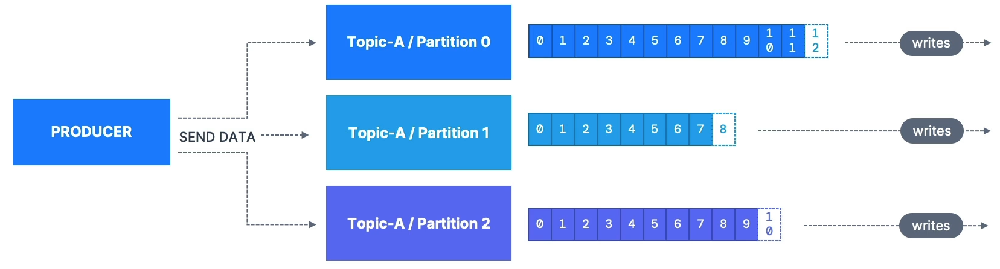
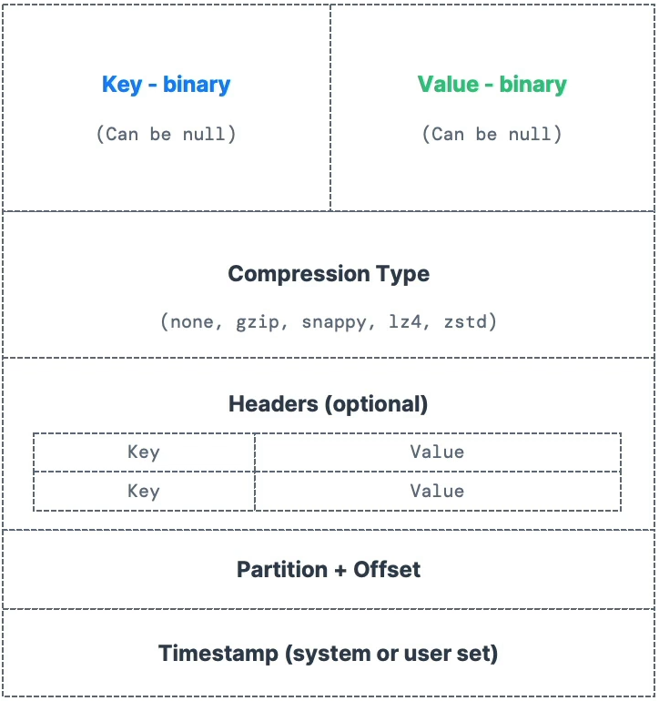
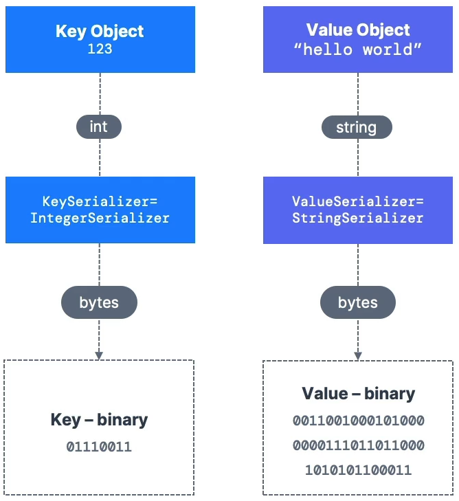

# Producer

> Kafka 토픽과 파티션에 **데이터를 작성**하는 주체
> 

⇒ 프로듀서는 자신이 어떤 파티션에 기록하는지 미리 알고 있다. 그리고 Kafka Broker(Kafka Server)가 그것을 갖게 된다. 

즉, 기록할 파티션을 미리 결정하는 것은 Kafka 서버가 아닌, **프로듀서**이다. 

# Message Key

> 프로듀서는 메시지 안에 메시지 키를 가지고 있는데, 파티션을 구분할 때 사용된다.
> 
- Key는 메시지 안에 포함되며 문자열, 숫자, 바이너리 … 등 다양한 형태가 될 수 있다.
- Key를 추가하는 것은 선택사항이다.
- **데이터의 처리 순서**와 밀접한 관련이 있다.
    - 특정 파티션에 메시지를 고정해, 해당 파티션 내에서 메시지가 순서대로 처리되도록 보장할 수 있다.

### Key가 NULL인 경우

> 데이터가 RR(Round-Robin) 방식으로 전송된다.
> 
- 2개의 파티션이 있는 경우, 데이터는 파티션0, 파티션1, 파티션0 … 순서로 전송된다.

### Key가 NULL이 아닌 경우

> **동일한 Key를 공유**하는 모든 메시지들은 ***Hashing 전략***으로 인해 **동일한 파티션에 전송**된다.
> 

따라서, Key를 지정할 때, 특정 필드에 대한 메시지 순서를 설정해야 한다. 

# Producer가 생성하는 Message

### Key

> 메시지 키
> 
- NULL 가능

### Value

> 메시지 컨텐츠(내용)
> 
- NULL 가능하지만, 보통 그렇지 않다.

### Compression Type

> 메시지에 압축을 적용할 수 있다.
> 

### Header

> 메시지에 헤더를 추가할 수 있다.
> 
- Key-Value 쌍의 리스트

### Partition + Offset

> 메시지를 전송할 대상인 파티션과 오프셋
> 

### Timestamp

> 시스템 또는 사용자가 설정하는 시간
> 

⇒ 위 내용들을 담은 메시지가 Kafka로 전송되어 저장된다. 

# Kafka Message Serializer

> Kafka 프로듀서가 메시지를 Kafka 브로커로 전송하기 전에 메시지를 **직렬화(Serialization)하는 과정에서 사용**되는 컴포넌트
> 

⇒ Kafka는 네트워크를 통해 데이터를 주고받기 때문에 **메시지를 직렬화**하여 바이트 배열로 변환해야 한다. 이러한 바이트 배열은 Kafka 클러스터로 전송되어 **Consumer가 다시 역직렬화(Deserialization)**하여 메시지를 읽을 수 있습니다.

- 직렬화는 키(Key)와 값(Value)에만 사용된다.

