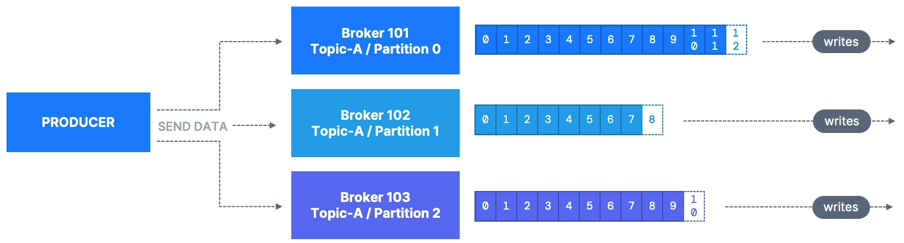
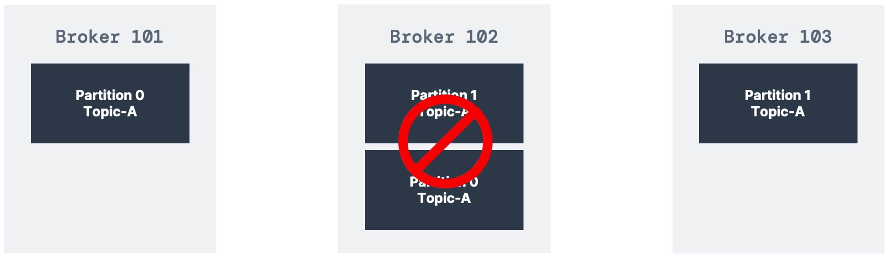

# Producer Acknowledgements : Acks

위 그림을 보면 브로커들로 데이터를 전송하는 프로듀서가 있다. 이 브로커들에는 당연히 토픽과 파티션이 존재한다. 이때,

> **프로듀서**는 **데이터 쓰기 확인(acknowledgement of data write)을 받을지 선택**할 수 있다.
> 

즉, 쓰기(Write)가 성공적으로 이루어졌다는 확인을 Kafka 브로커로부터 받을 수 있다.

여기에는 다음과 같은 3가지 설정이 존재한다.

### 1. acks = 0

> 프로듀서가 확인을 기다리거나 요청하지 않는다.
> 
- 데이터가 유실될 수도 있다.

### 2. acks = 1

> 프로듀서가 파티션의 리더를 기다리게 된다.
> 
- 리더 브로커가 확인하기를 기다리게 된다.
- 데이터 유실이 제한된다.

### 3. acks = all

> 모든 레플리카, 즉 모든 ISR 뿐만 아니라 리더가 쓰기를 확인하라고 요구하게 된다.
> 
- 어떤 상황에서도 데이터가 전혀 유실되지 않는 것을 보장할 수 있다.

# Kafka Topic Durability : 카프카 토픽 내구성

복제 계수(Replication factor)가 3인 Kafka 토픽이 있고, 토픽이 브로커 2개의 손실을 견딜 수 있는 상황을 가정해보자.

위와 같은 상황을 보면, 남은 브로커가 3개가 아니고 2개이지만, 복제 계수가 2이고 브로커가 3개라면 Broker 102을 잃더라도 여전히 토픽 데이터가 제공된다. 왜냐하면, 다른 브로커에 있기 때문이다.

⇒ 따라서, 일반적으로 N이라는 숫자의 복제 계수를 선택하면 영구적으로 최대 N - 1개의 브로커를 잃어도 된다. 이런 상황이 되더라도 데이터의 사본이 클러스터 안의 어딘가에 있기 때문이다.
