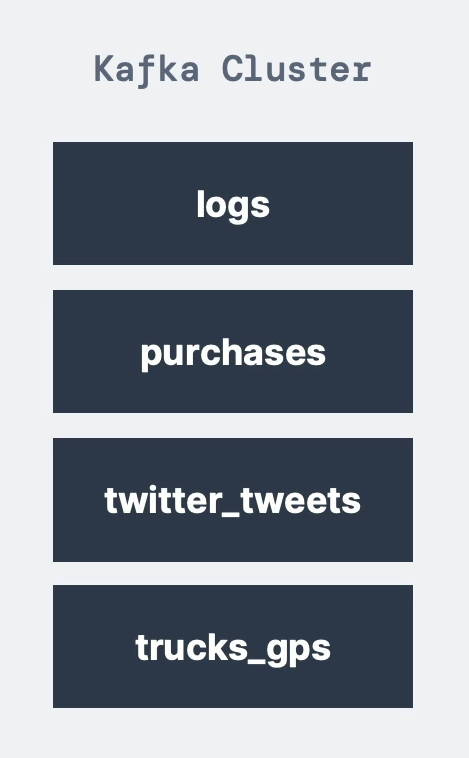
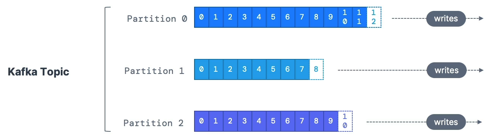
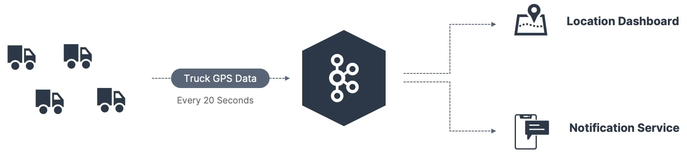

# Topic

Kafka topic은

> kafka 클러스터 안에 있는 **데이터 스트림**
> 
- kafka 클러스터에는 많은 토픽이 존재할 수 있다.
- 원하는 건 모두 Kafka 토픽에 전송할 수 있다. ⇒ **모든 종류의 메시지 형식을 지원**(e.g. JSON, Avro, Text, Binary …)
- Kafka 클러스터 안에서 **이름을 이용**해 *토픽을 식별*한다.
- **토픽 안에 있는 메시지들의 순서** := **데이터 스트림**

예를 들어, DB에 테이블을 만들려고 한다면 Topic은 DB의 그 테이블과 비슷할 것이다. 하지만, 토픽을 쿼리할 수 없다. 대신 Kafka 토픽에 **데이터를 추가**할 수 있다.

### Kafka Producer

> 토픽에 데이터 추가
> 

### Kafka Consumer

> 토픽에서 데이터 읽기
> 

# Partition

> 토픽은 **파티션으로 분할**할 수 있다.
> 

⇒ Kafka 토픽으로 전송된 메시지들은 이 파티션에 들어가게 된다. 이때, 각 파티션 안의 메시지들을 순서가 정해진다. 

- 예를 들어, 하나의 토픽은 100개의 파티션으로 분할될 수 있다.
- 데이터를 파티션에 기록하면 *삭제하거나, 변경할 수 없다.*

# Offset

> 파티션 안의 메시지들은 각각의 **0부터 증가되는 ID**를 갖게 되는데, 이때 이 ID가 Kafka 파티션의 Offset이다.
> 

⇒ 각 파티션에는 다른 오프셋이 있다. 

# 예시

위 상황은 트럭의 GPS 데이터를 Kafka를 통해 처리하는 예시이다.

트럭들의 GPS 데이터는 매 20초마다 “trucks_gps”라는 이름을 가진 Kafka 토픽에 전송될 것이다. 그 토픽에는 모든 트럭의 위치가 포함되어 있을 것이고, 토픽은 파티션들로 구성된다. 위치 대시보드와 알림 서비스라는 컨슈머에게 데이터를 전달할 수 있다. 

동일한 데이터 스트림을 다수의 서비스가 읽을 수 있게 때문에 위와 같은 상황에서 매우 유리하다.

# 중요 사항

- 일단 어떤 데이터가 파티션에 기록되면 그 **데이터는 변경되지 않는다.**
- Kafka의 데이터는 **일정한 시간 동안만 유지**된다.
    - 기본값 := 1주일
    - 설정할 수 있다.
- 오프셋은 특정한 파티션에 대해서만 의미가 있다.
    - 파티션 0의 오프셋 3과 파티션 1의 오프셋 3은 다른 데이터이다.
    - 앞의 메시지가 삭제되었어도 오프셋을 **재사용할 수 없다.**
    - 오프셋은 **1씩 증가**한다.
- 데이터가 토픽으로 전송할 때, Key를 제공하지 않으면 그 데이터는 임의의 파티션에 할당된다.
- Kafka 토픽 안에는 원하는 만큼의 파티션을 가질 수 있다.