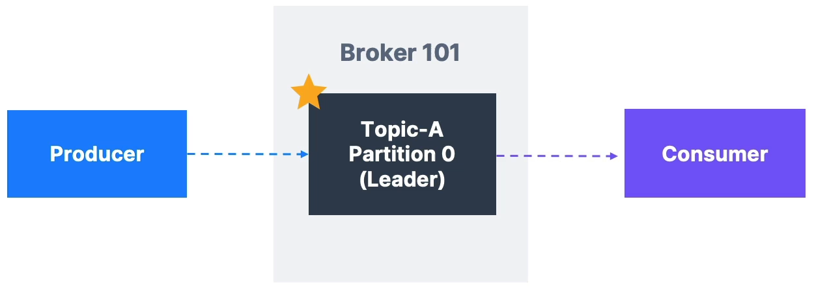

# Topic replication factor

실제 Kafka 클러스터가 있을 때, 카프카 복제 계수(Kafka Replication Factor)는 1보다 큰 숫자로 설정해야 한다. ⇒ 보통 2와 3 사이에 설정하고, 3에 설정하는 경우가 대다수다. 

이렇게 설정하면, 브로커(Broker)가 다운되었을 때 즉, 유지보수나 기술적 문제로 Kafka 서버가 중단되었을 때, 또 다른 Kafka 브로커에 데이터 사본이 있어 데이터를 주고 받을 수 있게 된다. 

### 예시

파티션이 2개 있고, 복제 계수가 2인 토픽 A를 예로 들어보자. 이렇게 되면 3개의 Kafka 브로커가 있고 복제 메커니즘에 의해 다음과 같이 설정될 것이다.  

위 그림에서 볼 수 있는 것처럼, 브로커들이 다른 브로커의 데이터를 복제하고 있다.

만약 위 상황에서 Broker 102가 고장난다면, Broker 101과 103이 동작 중이기 때문에, 여전히 데이터를 제공할 수 있다. 

# 파티션 리더(Concept of Leader for a Partition)

이처럼, 복제를 하면 **파티션의 리더**가 있게 된다.

> 언제나 **오직 1개의 브로커**만 어떤 파티션의 리더가 될 수 있다. 또한, 프로듀서(Producer)는 파티션의 **리더인 브로커에게만 데이터를 전송**할 수 있다.
> 

데이터가 충분히 빠르게 복제되면 각각의 복제본(레플리카)을 ***ISR***(In-Sync-Replica)라고 부른다. 이렇게 되면 데이터 복제의 동기화가 이루어진다. 

# 특징

리더의 기본적인 동작 방식에 따르면 

> 프로듀서는 어떤 파티션의 리더 브로커에만 기록하게 된다.
> 

즉, 리더와 ISR이 있다면 프로듀서는 그 파티션의 리더인 브로커에게만 데이터를 전송해야 한다는 것을 알고 있다. 

또한, 컨슈머는 어떤 파티션의 리더로부터만 데이터를 읽게 된다. 

만일, Broker 101이 다운된다면, Broker 102가 리더가 되어 프로듀서와 컨슈머에게 데이터를 제공할 수 있다. 

# +추가

Kafka v2.4 이상부터 컨슈머가 가장 가까운 레플리카에서 읽게 해주는 기능이 새롭게 추가되었다.

이 기능을 통해 latency를 개선하는 데 도움을 받을 수 있다.