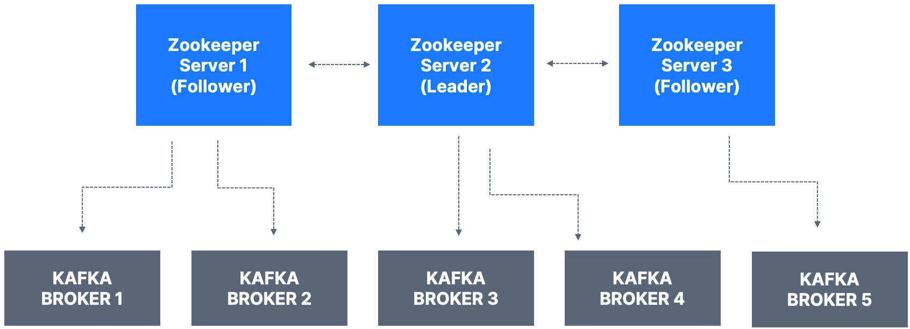

💡 Kafka 2.x 버전까지는 주키퍼 없이 사용할 수 없었다. 하지만, Kafka 3.x 버전부터는 주키퍼 없이 독립적으로 실행 가능하고 이를 **Kafka Raft(KRaft)** 메커니즘이라 부른다. 그리고, Kafka 4.x 버전부터는 주키퍼가 사용되지 않을 것이다.  
⇒ 결국 지금은 사용해야 한다.

# Zookeeper

주키퍼는 소프트웨어로, 

> Kafka의 브로커를 관리하며 브로커들의 리스트를 유지한다.
> 
- 브로커가 다운될 때마다 파티션의 새로운 리더를 선택하는 리더를 선출해야 하는데, 주키퍼가 그 과정에서 도움을 준다.
- 변경사항이 있는 경우에 주키퍼가 Kafka 브로커들에게 알림을 전송한다.
    - 예를 들어, 새 토픽이 생성, 삭제 되었거나 Kafka 브로커가 다운되었거나 새로 생겼긴 경우 등에서 알림을 전송한다.

따라서, 주키퍼에는 Kafka 메타데이터가 많이 있다.

- 주키퍼는 홀수 개수의 서버와 함께 작동하도록 설계되어 있다.
    - 주키퍼 1개, 주키퍼 3개, 주키퍼 5개 …와 같이 갖게 된다.
    - 일반적으로 7개를 넘지 않는다.
- 주키퍼에도 “리더”라는 개념이 있고, 나머지는 팔로워가 된다.
    - **리더인 1개는 쓰기**, **나머지인 팔로워는 읽기**에 사용된다.

위의 예시를 보면, 3개의 주키퍼 서버가 있는데, 두 번째 주키퍼가 리더인 상태이고 브로커들이 주키퍼에 연결되어 있다. 이렇게 해서 메타데이터를 받는다. 

# 주키퍼를 사용해야 할까?

그렇다면, 주키퍼를 꼭 사용해야 할까?

만일 **Kafka 브로커를 관리**한다면 **사용**해야 한다. Kafka 4.0이 출시되기 전까지는 프로덕션에서 주키퍼 없이는 Kafka를 사용할 수 없다.

또한, Kafka 클라이언트는 시간이 흐르면서 주키퍼를 대신하는 유일한 연결 End Point로서 브로커를 활용하도록 이전해왔다. 하지만, 최신 Kafka를 사용한다면 더 이상 주키퍼를 사용하지 말아야 한다. 모든 Kafka 클라이언트와 CLI 툴들은 오로지 **Kafka 브로커**를 **연결 EndPoint로 활용**하도록 이전되었다.

⇒ 심지어, 컨슈머도 주키퍼에 연결해서는 안된다. Kafka 2.2부터는 [`kafka-topics.sh`](http://kafka-topic.sh) 명령 또한 주키퍼가 아닌 Kafka 브로커를 참조한다.

결과적으로 주키퍼가 사라지는 이유는 

> 주키퍼가 Kafka에 비해 안전하지 않기 때문이다.
>