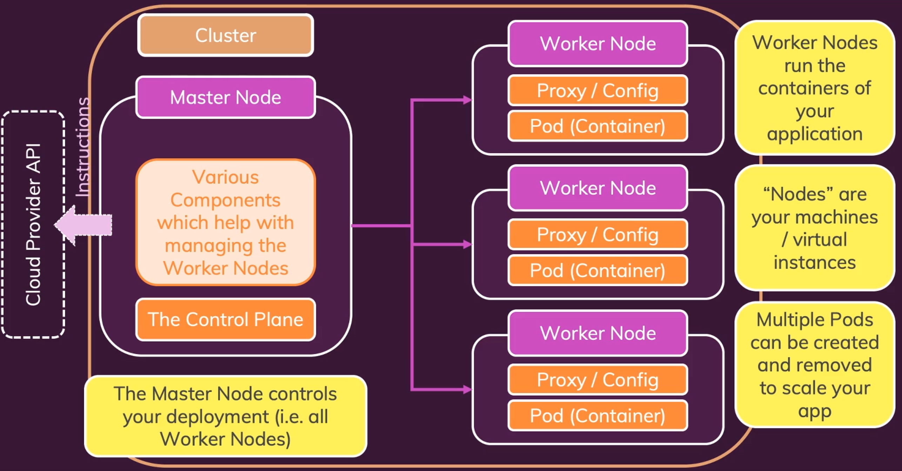

# Kubernetes

쿠버네티스는

> 오픈 소스 시스템으로, **컨테이너 배포를 관리하고 컨테이너를 오케스트레이션**하기 위한 표준이다.
> 
- 자동 배포, 스케일링, 로드 밸런싱, 일반적인 배포와 컨테이너 관리와 같은 테스크를 수행하는데 도움이 된다.
- 컨테이너를 모니터링하고 컨테이너가 다운되면 자동으로 교체하는 것에 도움을 준다.

# Kubernetes 아키텍처

## Pod

모든 것은 우리가 배포하고자 하는 컨테이너로 시작한다. 쿠버네티스에서는 **Pod**라는 것에 의해 관리되는데, Pod는

> **쿠버네티스의 가장 작은 단위**라고 할 수 있으며 이를 쿠버네티스를 위한 구성 파일에서 정의할 수 있다.
> 
- Pod는 단순히 컨테이너를 보유한다.

## Worker

Worker Node는

> 특정 양의 CPU와 메모리가 있는 머신이며, 그 머신에서 Pod를 실행할 수 있다.
> 
- 애플리케이션의 컨테이너를 실행한다. 또한, 가상 인스턴스라고 생각할 수 있다.
- 내부에 컨테이너가 있는 Pod는 Worker 노드에서 자신을 실행한다.
- 둘 이상의 Pod를 실행할 수 있다.
- EC2 인스턴스와 같은 역할을 하는 것이다.

## Proxy

Proxy는

> 쿠버네티스가 Worker Node에서 Worker Node의 **Pod 네트워크 트래픽의 제어를 설정하는 도구**이다.
> 
- Pod가 인터넷에 연결할 수 있는지의 여부, Pod를 외부에서 어떻게 접근할 수 있는지를 제어

예를 들어, Pod 컨테이너에서 애플리케이션을 실행하는 경우, 사용자의 외부 트래픽이 이 컨테이너에 도달할 수 있도록 Proxy를 구성해야 한다. 

## Master Node

쿠버네티스로 작업할 때, 일반적으로 하나 이상의 Worker Node가 필요하다. k8s를 사용하여 컨테이너 및 Pod를 동적으로 추가 및 제거하는 경우, 트래픽이 들어오고 감소함에 따라 이러한 Pod는 k8s에 의해, 사용 가능한 모든 Worker Node로 자동으로 배포된다.

이러한 모든 Worker Node와 그 노드에서 **실행되는 Pod 및 컨테이너를 제어**해야 한다. 누군가는 이러한 컨테이너와 Pod를 만들고 시작해야 하며, 실패하거나 더 이상 필요하지 않는 경우, 이를 교체하거나 종료해야 한다. 

이러한 제어가 Master Node에 의해 특별히 호출되는 **컨트롤 플레인(Control Plane)에 의해 수행**된다. 

**Control Plane**은

> Worker Node와 상호 작용하여 제어하는 컨트롤 센터이다.
> 
- Master Node는 Worker Node와 Pod의 상호작용하는 책임을 가진다.

위의 모든 것들이 클러스터(Cluster)를 형성한다. 모든 부분이 연결된 하나의 네트워크를 형성한다. 그런 다음, Master Node는 Cloud Provider API에 명령을 보내, 특정 리소스를 생성하고 이 상태를 Cloud Provider에 복제하도록 지시한다.