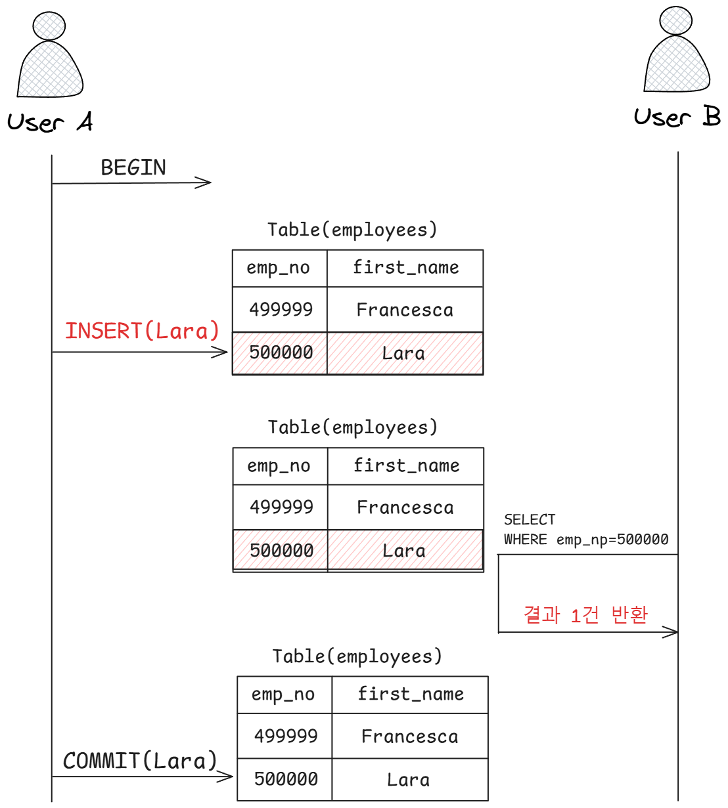
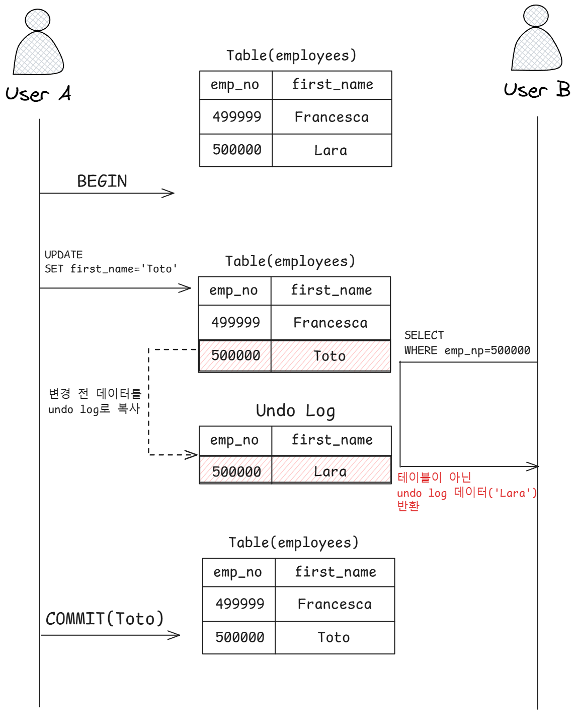
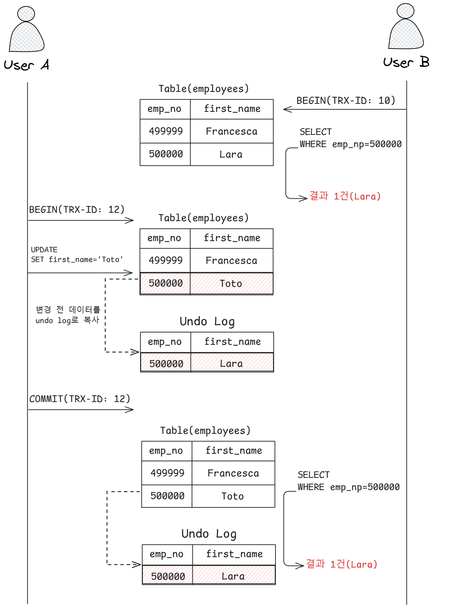

트랜잭션의 격리 수준이란,

> 여러 트랜잭션이 동시에 처리될 때, 특정 트랜잭션이 **다른 트랜잭션에서 변경하거나 조회하는 데이터를 볼 수 있게 허용할지 말지를 결정하는 것**
> 

입니다.

격리 수준은 크게 아래의 4가지로 나뉩니다.

1. **READ UNCOMMITTED**
2. **READ COMMITTED**
3. **REPEATABLE READ**
4. **SERIALIZABLE**
- 아래로 갈수록 각 트랜잭션 간의 **데이터 격리(고립) 정도가 높아**지며, **동시 처리 성능도 떨어**집니다.
- 일반적인 서비스 용도의 데이터베이스는 **READ COMMITTED**와 **REPEATABLE READ** 중 하나를 사용합니다.
    - 오라클 : 주로 **READ COMMITTED**
    - MySQL : 주로 **REPEATABLE READ**

### 4-1. READ UNCOMMITTED

READ UNCOMMITTED 격리 수준에서는

> 각 트랜잭션에서의 변경 내용이 `COMMIT`이나 `ROLLBACK` 여부에 **상관없이** 다른 트랜잭션에서 보입니다.
> 

위 그림을 단계적으로 살펴봅시다.

1. 사용자 A가 emp_no이 500000이고 first_name이 Lara인 새로운 사원을 `INSERT` 합니다.
2. 사용자 B는 변경된 내용을 COMMIT 하기 전에 emp_no=500000인 사원을 검색하고 있습니다.
3. 하지만, 사용자 B는 사용자 A가 `INSERT`한 사원의 정보를 **`COMMIT`되지 않은 상태에서도 조회할 수 있습니다.**

### 문제점

위 상황에서 볼 수 있듯, READ UNCOMMITTED의 문제점은 

- 처리 도중 알 수 없는 문제로 인해 INSERT된 내용을 ROLLBACK한다 하더라도 여전히 다른 사용자는 해당 데이터를 정상적인 데이터라고 생각하고 처리할 수 있습니다.

### 더티 리드 : Dirty Read

> 어떤 트랜잭션에서 처리한 작업이 완료되지 않았는데도 다른 트랜잭션에서 볼 수 있는 현상
> 

을 말합니다.

- 더티 리드가 허용되는 격리 수준 := READ UNCOMMITTED
- 결국, **정합성에 문제가 많은 격리 수준**입니다.

### 4-2. READ COMMITTED

> 어떤 트랜잭션에서 데이터를 변경했더라도 **`COMMIT`이 완료된 데이터만 다른 트랜잭션에서 조회**할 수 있는 격리 수준
> 
- 오라클 DBMS에서 기본적으로 사용되는 격리 수준
- 온라인 서비스에서 가장 많이 선택되는 격리 수준
- 더티 리드 같은 현상이 발생하지 않습니다.

위 그림을 단계적으로 살펴봅시다.

1. 사용자 A가 emp_no=500000인 사원의 first_name을 변경했습니다.
2. 이때, 새로운 값인 “Toto”는 employees 테이블에 즉시 기록되고 **이전 값**이 “Lara”는 **Undo 영역으로 백업**됩니다.
3. 사용자 A가 `COMMIT`을 수행하기 전에 사용자 B가 emp_no=500000인 사원을 `SELECT`하면 조회된 결과를 **Undo 영역**에서 가져와 Lara가 됩니다.
4. 이후, 최종 내역을 `COMMIT`하면 다른 트랜잭션에서도 백업된 데이터가 아닌 새롭게 변경된 데이터를 참조할 수 있게 됩니다.

### 부정합 문제 : NON-REPEATABLE READ

READ COMMITTED 격리 수준의 경우, 다음과 같은 상황에서 부정합 문제가 발생할 수 있습니다.

1. 처음 사용자 B가 `BEGIN` 명령으로 트랜잭션을 시작하고 first_name이 “Toto”인 사용자를 검색했는데, 일치하는 결과가 없었습니다.
2. 하지만, 사용자 A가 emp_no=500000인 사원의 이름을 “Toto”로 변경하고 커밋을 실행합니다.
3. 이후 사용자 B가 똑같은 `SELECT` 쿼리를 통해 다시 조회하면 이번에는 결과가 1건이 조회됩니다.

⇒ 사용자 B가 하나의 트랜잭션 내에서 똑같은 쿼리를 실행했을 때 항상 같은 결과를 가져와야 한다는 **REPEATABLE READ 정합성**에 어긋나게 됩니다.

- 이러한 부정합 문제는 금전적인 처리와 연결되면 큰 문제가 발생할 수 있습니다.
- **READ COMMITTED** 격리 수준 := 트랜잭션 내에서 실행되는 SELECT 문장과 트랜잭션 외부에서 실행되는 SELECT 문장의 차이가 별로 없습니다.
- **REPEATABLE READ** 격리 수준 := SELECT 쿼리 문장도 **트랜잭션 범위 내에서만 작동**합니다.

### 4-3. REPEATABLE READ

- MySQL의 InnoDB 스토리지 엔진에서 기본으로 사용되는 격리 수준
- 바이너리 로그를 가진 MySQL 서버의 경우 최소 해당 격리 수준 이상을 사용해야 합니다.
- **NON-REPEATABLE READ 부정합**이 발생하지 않습니다.
- InnoDB 스토리지 엔진은 **MVCC 방식**을 사용합니다.

### MVCC(Multi Version Concurrency Control)

> 트랜잭션이 ROLLBACK될 가능성에 대비해 변경되기 전 레코드를 Undo 공간에 백업해두고 실제 레코드 값을 변경하는 방식
> 

⇒ 이를 이용해 동일 트랜잭션 내에서는 동일한 결과를 보여줄 수 있게 됩니다.

- 모든 Inno DB의 트랜잭션은 **고유한 트랜잭션 번호**를 가지고 있습니다.
- Undo 영역에 백업된 모든 레코드는 **변경을 발생시킨 트랜잭션의 번호**가 포함

### MVCC 보장 방법

REPEATABLE READ 격리 수준에서 MVCC를 보장하기 위해

> 실행 중인 트랜잭션 중 가장 오래된 트랜잭션 번호보다 트랜잭션 번호가 앞선 Undo 영역의 데이터는 삭제할 수 없습니다.
> 

위 그림을 살펴봅시다.

1. 시나리오가 실행되기 전, employees 테이블은 번호가 6인 트랜잭션에서 INSERT 됐다고 가정합니다.
2. 위 그림에서 사용자 A의 트랜잭션 번호는 12였고, 사용자 B의 트랜잭션 번호는 10이었습니다.
3. 이때, 사용자 A가 사원 이름을 변경하고 COMMIT을 수행합니다.
4. 사용자 B는 10번 트랜잭션 안에서 실행되는 모든 SELECT 쿼리는 트랜잭션 번호가 10보다 작은 트랜잭션 번호에서 변경된 것만 보이게 되어 Lara라는 동일한 결과를 얻게 됩니다.

### 부정합 문제 : PHANTOM READ(ROW)

> 다른 트랜잭션에서 수행한 변경 작업에 의해 레코드가 보였다 안 보였다 하는 현상
> 
- Undo 레코드에는 잠금을 걸 수 없어 발생하는 문제
- InnoDB 스토리지 엔진에서는 Gap Lock과 Next Key Lock 덕분에 해당 **부정합 문제가 발생하지 않습니다**.

### 4-4. SERIALIZABLE

> 한 트랜잭션에서 읽고 쓰는 레코드를 다른 트랜잭션에서 절대 접근할 수 없는 격리 수준
> 
- 가장 단순한 격리 수준이면서 가장 엄격한 격리 수준
- 동시 처리 성능이 제일 낮은 격리 수준
- InnoDB의 경우, 순수한 SELECT 작업은 아무런 레코드 잠금도 설정하지 않고 실행되지만, **SERIALIZABLE**로 설정되면 읽기 작업도 공유 잠금을 획득해야 합니다.
- PHANTOM READ 부정합 문제가 발생하지 않습니다.