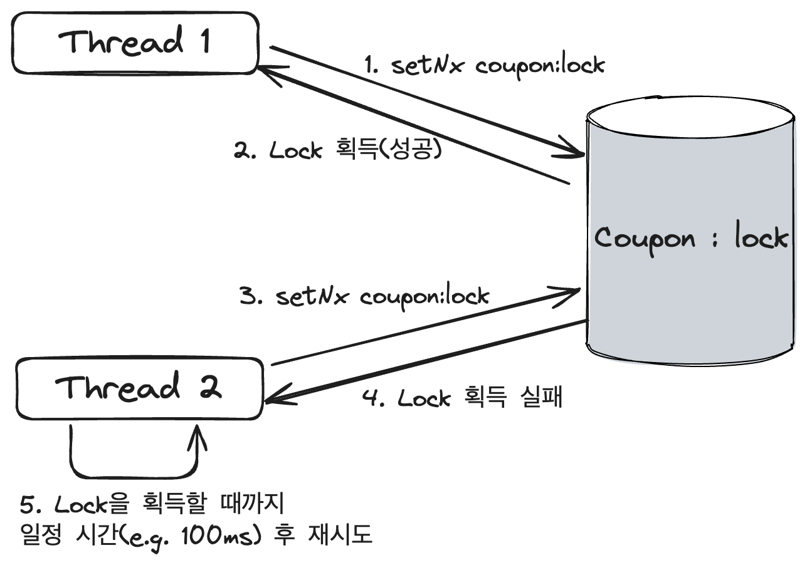
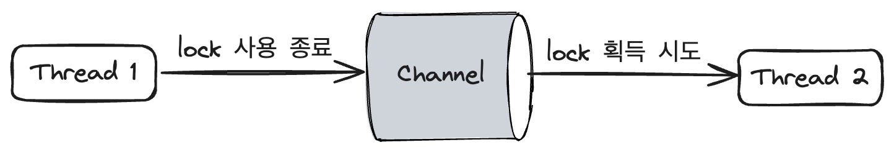

멀티 스레드 환경에서 동일한 데이터에 대해 동기화된 처리가 필요하며, 여러 스레드에 **공통된 락(Lock)을 적용**해야 한다. 

이를 위해 **분산락(Distributed Lock)**을 활용할 수 있다.

분산락이란,

> 여러 프로세스 또는 스레드가 공유 자원에 접근할 때, 데이터의 정합성을 보장하기 위해 사용하는 기술이다.
> 

Redis의 구조 특성상 명령을 처리할 때 **단일 스레드(Single thread)로 작동해 한번에 하나의 명령만 실행**하므로 **원자성(Atomic)을 유지**한다. 이를 통해 Redis를 활용한 분산락을 구현해 동시성 이슈를 해결 할 수 있다. 

# Lettuce와 Redisson의 Lock 획득 방식 차이

## Lettuce : Spin Lock 방식

- `setNx` 메소드를 활용해 **사용자가 직접 분산락을 구현**해야 한다.
- Lock의 timeout이 지정되어 있지 않아, lock을 획득하지 못하면 무한 루프를 돌게될 risk가 크다.
    - 따라서, 일정 시간이 지나면 lock이 만료되도록 구현해야 한다.
    - Lock을 획득하는 최대 허용시간 또는 횟수를 정해주는 방법이 있다.
    - 만약 lock을 획득하는데 실패하면 연산을 수행할 수 없는 상태이므로 예외(Exception)를 던진다.
- Lock의 획득에 실패했을 경우 계속 lock을 점유하려고 시도하기 때문에, 요청이 많을수록 redis가 받는 부하가 커지게 된다.



## Redisson : Pub/Sub 방식

- `redisson-spring-boot-starter` 라이브러리 추가
- **Lock 구현체**의 형태로 분산락을 제공한다.
- **pub/sub 방식**을 사용하며, 스핀락 방식을 사용하지 않는다.
    - 대기 없이 **`tryLock` 메소드**를 사용해 **Lock 획득에 성공**하면 `true`를 반환한다.
    - Lock이 해제되면 lock을 subscribe하는 클라이언트는 **해제되었다는 신호**를 받고 lock 획득을 시도한다.
    - pub/sub 방식을 사용하기 때문에, 스핀락 방식에 비해 redis에 지속적으로 lock 획득 요청을 보내는 과정이 사라지고, redis에 부하를 덜 준다는 장점이 있다.



결과적으로 Redisson의 분산락은 pub/sub 구조를 사용함으로써 Redis에 발생하는 트래픽을 많이 줄였다. 

Lock을 획득하기 위해 `tryLock`을 시도하는 클라이언트들은 Lock 메시지를 subscribe하고, Lock이 해제되길 대기 중인 클라이언트들에게 Lock 획득을 시도하라는 알림을 주는 방식이며, Lock에 대해 timeout과 같은 설정을 지원하므로 Lock을 안전하게 사용할 수 있다. 

# Redisson 사용법

- `RLock` := Lock을 사용하기 위한 interface
- `tryLock` := Lock 획득을 위한 메서드

## tryLock 메서드

```java
boolean tryLock(long waitTime, long leaseTime, TimeUnit unit) throws InterruptedException
```

- `waitTime` := Lock 획득을 위해 대기할 timeout
    - 만약, 이 시간만큼 지나면 `false`가 반환되어 **lock 획득에 실패**한다.
- `leaseTime` := Lock이 만료되는 시간
    - 이 시간만큼 지나면 **lock이 만료되어 사라지**기 때문에, lock을 별도로 해제하지 않아도 다른 스레드 또는 애플리케이션에서 lock을 획득할 수 있다.
- `unit` := 시간 단위

## 구현 로직

1. 획득하고자 하는 이름의 락을 정의하고 유효 시간까지 락 획득을 시도하게 된다.
2. 만약 유효 시간이 지나면 락 획득은 실패하게 된다.
3. 단 여기서 주의할 점은 unlock할 경우에, 해당 세션에서 잠금을 생성한 락인지 확인해야 한다. 그렇지 않으면 다른 세션에서 수행중인 잠금이 해제될수도 있다.
    - isLocked() : 잠금이 되었는지 확인
    - isHeldByCurrentThread() : 해당 세션에서 잠금을 생성했는지 확인

```java
// 특정 이름으로 락 정의 
RLock lock = redissonClient.getLock(key.toString());

try {
    // 락 획득을 시도한다(20초동안 시도를 할 예정이며 획득할 경우 1초안에 해제할 예정이다)
    boolean available = lock.tryLock(20, 1, TimeUnit.SECONDS);

    if (!available) {
        System.out.println("lock 획득 실패");
        return;
    }
    
    // 트랜잭션 로직(ex. orderService.createOrder(), stockService.increase())

} catch (InterruptedException e) {
    throw new RuntimeException(e);
} finally {
    if (lock.isLocked() && lock.isHeldByCurrentThread()) {
        lock.unlock();
    }
}
```
