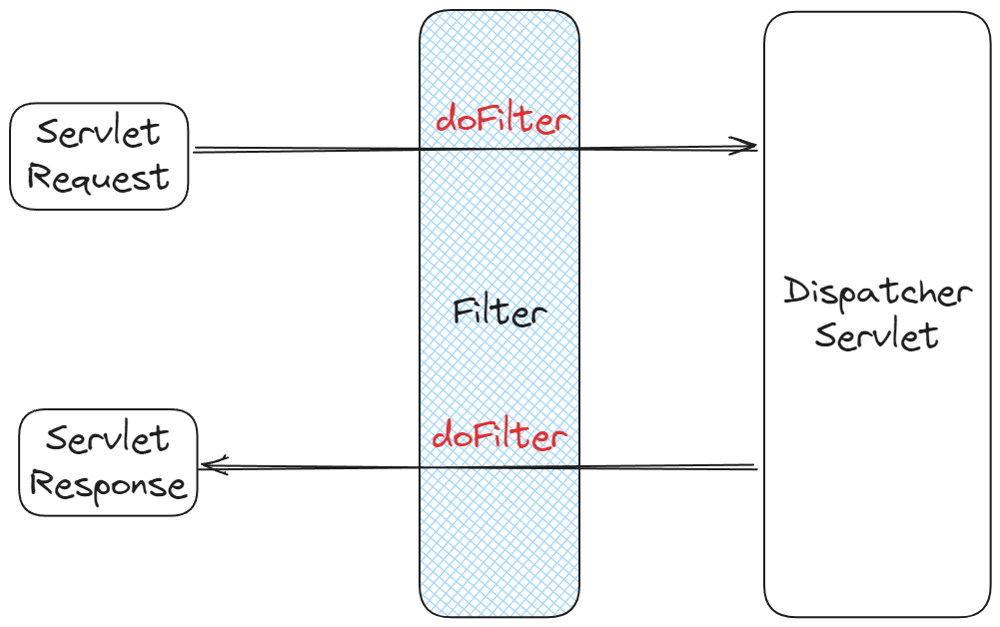
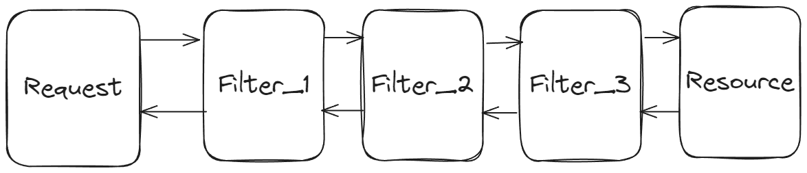

# Filter란?

> Dispatcher Servlet에 Request(요청)가 전달되기 전/후에 URL 패턴에 맞는 모든 요청에 대해 부가작업을 처리할 수 있는 기능을 제공하는 것

- J2EE 표준 스펙 기능 ⇒ Java Servlet에서 제공



또한, Filter는 FilterChain을 통해 여러 Filter가 연쇄적으로 동작하게 할 수 있습니다.



# Filter의 메서드

필터를 추가하기 위해서는 `javax.servlet`의 `Filter` 인터페이스를 구현해야 합니다. `Filter` 인터페이스는 다음의 3가지 메서드를 가지고 있습니다.

1. `init()`
2. `doFilter`
3. `destroy`

```java
public interface Filter {

    public default void init(FilterConfig filterConfig) throws ServletException {}

    public void doFilter(ServletRequest request, ServletResponse response,
            FilterChain chain) throws IOException, ServletException;

    public default void destroy() {}
}
```

## init 메서드

> 필터 객체를 초기화하고 서비스에 추가하기 위한 메서드

⇒ 필터가 생성될 때 1번 호출되며, 객체를 초기화하면 이후의 요청들은 `doFilter`를 통해 처리된다.

## doFilter 메서드

> URL-Pattern에 맞는 모든 HTTP 요청이 Dispatcher Servlet으로 전달되기 전에 웹 컨테이너에 의해 실행되는 메서드

⇒ Request, Response가 Filter를 거칠 때 수행되는 메서드

- `doFilter`의 파라미터로 `FilterChain`이 있는데, `FilterChain` 의 `doFilter`를 통해 다음 대상으로 요청을 전달
- `chain.doFilter()` 전/후에 개발자가 필요한 처리 과정을 넣어줌으로써 원하는 처리를 진행할 수 있습니다.

## destroy 메서드

> 필터 객체를 서비스에서 제거하고 사용하는 자원을 반환하기 위한 메서드

⇒ 필터가 소멸될 때 수행되며, 웹 컨테이너에 의해 1번 호출되어 이후에는 `doFilter`에 의해 처리되지 않습니다.

# Filter 등록

> Filter 클래스를 만들면 해당 Filter를 Spring Bean으로 등록해야 합니다.

크게 3가지 방법이 있습니다.

우선 아래와 같은 Filter를 만들었다고 가정합시다.

### Filter 클래스

```java
@Slf4j
public class CustomFilter implements Filter {

	@Override
	public void init(FilterConfig filterConfig) throws ServletException {
		log.info("init MyFilter");
	}

	@Override
	public void doFilter(ServletRequest servletRequest, ServletResponse servletResponse, FilterChain filterChain)
		throws IOException, ServletException {
		log.info("doFilter MyFilter, uri : {}", ((HttpServletRequest)servletRequest).getRequestURI());
		filterChain.doFilter(servletRequest, servletResponse);
	}

	@Override
	public void destroy() {
		log.info("destroy MyFilter");
	}
}
```

## 1. @Bean 등록 + FilterRegistrationBean 등록

```java
@Configuration
public class WebConfig {

	@Bean
	public FilterRegistrationBean<CustomFilter> customFilterRegistrationBean() {
		FilterRegistrationBean<CustomFilter> registrationBean = new FilterRegistrationBean<>(new CustomFilter());
		registrationBean.setOrder(1);
		registrationBean.setUrlPatterns(List.of("/api/v1/members"));
		registrationBean.addUrlPatterns("/filtered/*");

		return registrationBean;
	}
}
```

`FilterRegistrationBean` 을 통해 Bean으로 등록하고 사용하는 방법입니다.

### setOrder()

> 여러 개의 Filter를 등록 할 경우, Filter의 순서를 정할 수 있습니다.

- 매개변수 타입 := int
- `doFilter()`의 호출이 `setOrder()`에서 설정한 대로 호출됩니다.

### setUrlPatterns()

> Filter를 적용할 URL 패턴을 List<String> 타입으로 받습니다.

### addUrlPatterns()

> Filter를 적용할 URL 패턴을 String 타입으로 받습니다.

⇒ String 여러 개를 가변인자로 받습니다. → addUrlPatterns 체이닝

## 2. @WebFilter + @ServletComponentScan

우선, `@SpringBootApplication` 이 붙은 main 클래스에 `@ServletComponentScan`을 선언해줍니다.

```java
@SpringBootApplication
@ServletComponentScan
public class DemoApplication {
	public static void main(String[] args) {
		SpringApplication.run(DemoApplication.class, args);
	}
}
```

그리고, 작성한 Filter 클래스에 `@WebFilter`를 설정해줍니다.

```java
@Slf4j
@WebFilter(urlPatterns = "/filtered/*")
@Order(1)
public class CustomFilter implements Filter {
	// 내용 동일
}
```

`@WebFilter`의 **urlPatterns** 옵션에는 필터를 적용할 URL이 들어갑니다.

`@Order`를 통해 Filter의 우선순위를 설정할 수 있습니다.

Spring의 **ComponentScan** 원리와 같은 원리로 동작합니다. `@ServletComponentScan`이 `@WebFilter`를 선언한 클래스를 읽어들여 Filter를 등록하는 것입니다.

## 3. @Component로 등록

```java
@Slf4j
@Component
public class CustomFilter implements Filter {
	// 내용 동일
}
```

위와 같이 `@Component`를 이용해 Filter를 등록하면, Filter의 적용 범위는 **전체 URL**이 된다.

### 참고

https://taetaetae.github.io/2020/04/06/spring-boot-filter/

https://mangkyu.tistory.com/173

https://codingcho.tistory.com/207

https://livenow14.tistory.com/60
