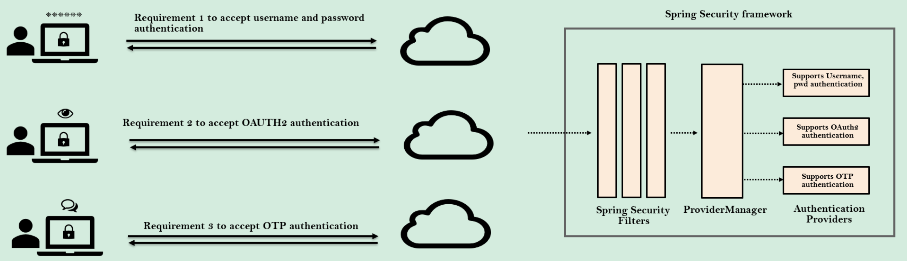
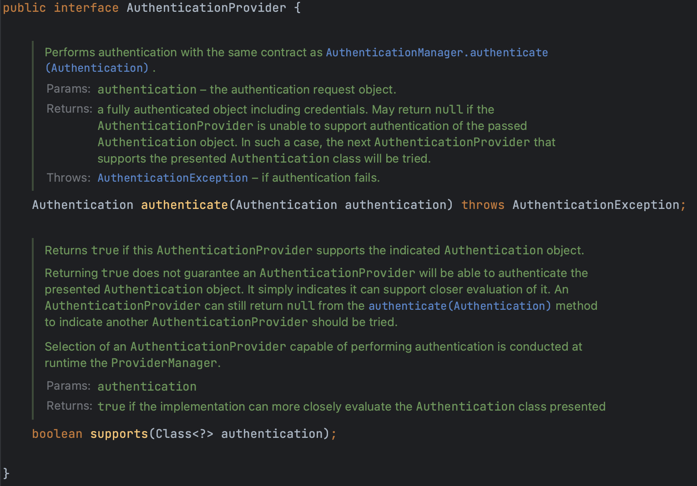
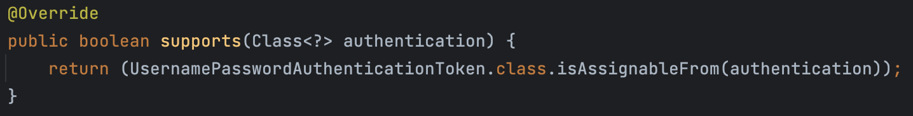
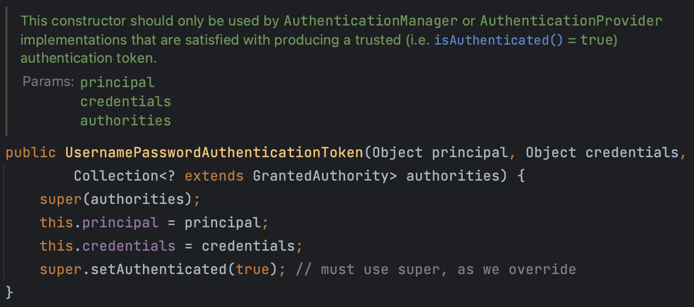

# Authentication Provider를 재정의해야 하는 이유

 현재까지는 Spring Security에서 제공하는 `DaoAuthenticationProvider`라는 기본 Authentication Provider를 사용해왔다. 이것이 사용자 인증, 로그인 여부, 만료 여부 등을 확인하는 역할을 수행했다. 즉, 사용자 인증 중에 고려하고 싶은 대부분의 시나리오를 제공해 왔다.  

 하지만, 실제 애플리케이션을 개발할 때는 훨씬 복잡한 요구사항들을 마주할 것이다. 이러한 경우, 사용자의 세부 정보를 DB에서 불러오는 것과 별개로 우리만의 인증 방식(논리)를 실행할 필요가 있다. 예를 들어, 20세 이상인 사람들만 접근을 허용하거나, 허용 국가 목록에 있는 사용자만 접근을 가능하게 하는 상황 등이 있다. 

위와 같은 경우, 반드시 시스템만의 자체적인 Authentication Provider의 구현이 필수적이다. 



위 그림과 같이 username과 password를 사용하는 경우, OAUTH를 이용하는 경우, OTP를 이용하는 경우 등 다양한 방법을 통해 인증을 원하는 요구사항이 존재할 수 있다. 

이런 경우, 여러 개의 Authentication Provider를 작성할 수 있다. 

# Authentication Provider 인터페이스

먼저, `AuthenticationProvider` 인터페이스에 대해 알아보자.



### Authenticate 메서드

> Spring Security 필터들에 의해 발생한 **username과 credential로 이루어진** **`authentication` 객체**를 파라미터로 받아 인증을 수행하는 메서드
> 
- **인증 논리를 작성**할 때 필요한 중요한 부분
- 인증이 성공적이었는지에 대한 정보를 가지고 있어야 `ProviderManager`가 다른 `AuthenticationProvider`를 불러올지 판단할 수 있다.
    - 인증에 실패한 경우, `ProviderManager`는 다른 `AuthenticationProvider`를 시도하게 된다.

### supports 메서드

> 사용하고자하는 인증 방식을 알려주는 메서드
> 
- 어떤 인증 종류에 우리의 AuthenticationProvider가 호출되어야하는지 알려주는 것

`AbstractUserDetailsAuthenticationProvider` 를 구현한 `DaoAuthenticationProvider`를 확인해보면 다음과 같이 `supports` 메서드가 구현되어 있는 것을 확인할 수 있다.



⇒ UsernamePasswordAuthenticationToken 형태의 모든 인증을 다룬다는 의미를 가지고 있다.  

## ProviderManager

`ProviderManager` 클래스를 확인해보면 `authenticate` 메서드를 확인해 볼 수 있다. 

```java
@Override
public Authentication authenticate(Authentication authentication) throws AuthenticationException {
	Class<? extends Authentication> toTest = authentication.getClass();
	AuthenticationException lastException = null;
	AuthenticationException parentException = null;
	Authentication result = null;
	Authentication parentResult = null;
	int currentPosition = 0;
	int size = this.providers.size();
	for (AuthenticationProvider provider : getProviders()) {
		if (!provider.supports(toTest)) {
			continue;
		}
		if (logger.isTraceEnabled()) {
			logger.trace(LogMessage.format("Authenticating request with %s (%d/%d)",
					provider.getClass().getSimpleName(), ++currentPosition, size));
		}
		try {
			result = provider.authenticate(authentication);
			if (result != null) {
				copyDetails(authentication, result);
				break;
			}
		}
		catch (AccountStatusException | InternalAuthenticationServiceException ex) {
			prepareException(ex, authentication);
			// SEC-546: Avoid polling additional providers if auth failure is due to
			// invalid account status
			throw ex;
		}
		catch (AuthenticationException ex) {
			lastException = ex;
		}
	}
	if (result == null && this.parent != null) {
		// Allow the parent to try.
		try {
			parentResult = this.parent.authenticate(authentication);
			result = parentResult;
		}
		catch (ProviderNotFoundException ex) {
			// ignore as we will throw below if no other exception occurred prior to
			// calling parent and the parent
			// may throw ProviderNotFound even though a provider in the child already
			// handled the request
		}
		catch (AuthenticationException ex) {
			parentException = ex;
			lastException = ex;
		}
	}
	if (result != null) {
		if (this.eraseCredentialsAfterAuthentication && (result instanceof CredentialsContainer)) {
			// Authentication is complete. Remove credentials and other secret data
			// from authentication
			((CredentialsContainer) result).eraseCredentials();
		}
		// If the parent AuthenticationManager was attempted and successful then it
		// will publish an AuthenticationSuccessEvent
		// This check prevents a duplicate AuthenticationSuccessEvent if the parent
		// AuthenticationManager already published it
		if (parentResult == null) {
			this.eventPublisher.publishAuthenticationSuccess(result);
		}

		return result;
	}

	// Parent was null, or didn't authenticate (or throw an exception).
	if (lastException == null) {
		lastException = new ProviderNotFoundException(this.messages.getMessage("ProviderManager.providerNotFound",
				new Object[] { toTest.getName() }, "No AuthenticationProvider found for {0}"));
	}
	// If the parent AuthenticationManager was attempted and failed then it will
	// publish an AbstractAuthenticationFailureEvent
	// This check prevents a duplicate AbstractAuthenticationFailureEvent if the
	// parent AuthenticationManager already published it
	if (parentException == null) {
		prepareException(lastException, authentication);
	}
	throw lastException;
}
```

⇒ Spring Security 내부에 사용 가능한 `AuthenticationProviders`를 모두 시도해보는 것을 확인할 수 있다(반복문 부분).

반복문 안을 확인해보면, 첫 번째 로직이 `AuthenticationProvider` 의 `supports` 메서드를 통해 **주어진 인증 객체를 지원하는지 확인**하는 일이다.

# AuthenticationProvider 구현

## supports

먼저, 사용자 아이디와 비밀번호를 통해 인증을 진행할 것이기 때문에, `supports`메서드는 다음과 같이 작성한다.

```java
@Override
public boolean supports(Class<?> authentication) {
    return (UsernamePasswordAuthenticationToken.class.isAssignableFrom(authentication));
}
```

## authenticate

`authenticate` 메서드에서는 

1. DB로부터 사용자의 세부 정보 가져오기
2. 입력된 비밀번호와 DB에 저장된 비밀번호 비교하기
3. authentication의 성공 여부에 대한 정보가 담겨있는 성공적인 authentication 객체를 생성하고 반환

하는 절차를 거쳐 구현해야 한다.

```java
@Autowired
private CustomerRepository customerRepository;

@Autowired
private PasswordEncoder passwordEncoder;

@Override
public Authentication authenticate(Authentication authentication) throws AuthenticationException {
    String username = authentication.getName();
    String pwd = authentication.getCredentials().toString();
    List<Customer> customer = customerRepository.findByEmail(username);
    if (customer.size() > 0) {
        if (passwordEncoder.matches(pwd, customer.get(0).getPwd())) {
            List<GrantedAuthority> authorities = new ArrayList<>();
            authorities.add(new SimpleGrantedAuthority(customer.get(0).getRole()));
            return new UsernamePasswordAuthenticationToken(username, pwd, authorities);
        } else {
            throw new BadCredentialsException("Invalid password!");
        }
    }else {
        throw new BadCredentialsException("No user registered with this details!");
    }
}
```

최종적으로 `UsernamePasswordAuthenticationToken` 객체를 반환하게 된다. 

⇒ 이 메서드 안에 나이 제한, 국가 제한 … 등과 같은 원하는 추가적인 인증 로직을 작성할 수 있다. 

### UsernamePasswordAuthenticationToken



위 클래스의 생성자를 확인해보면, `super.setAuthenticated(true)` 코드를 확인할 수 있는데, 이 코드를 통해 `ProviderManager`에게 인증이 성공적으로 이루어졌다는 것을 전달할 수 있게 된다.