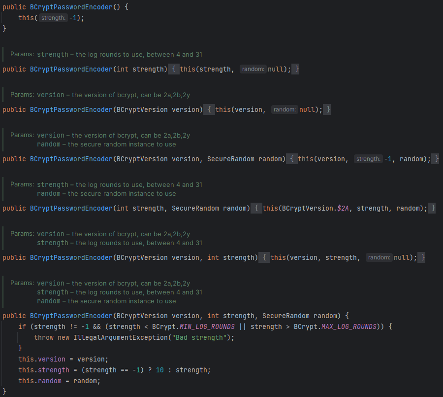
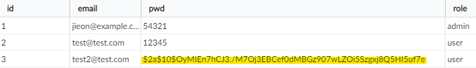
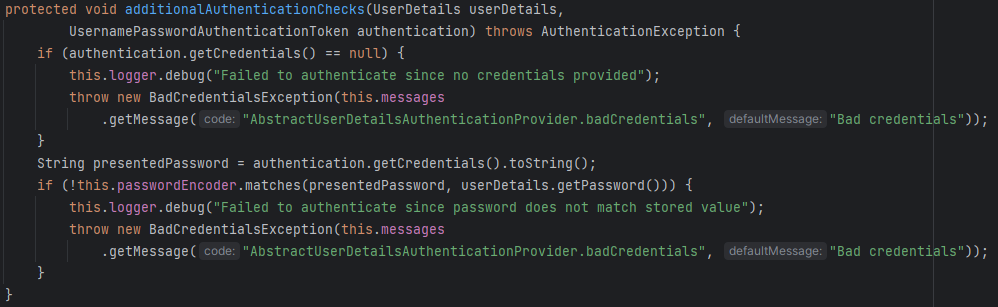
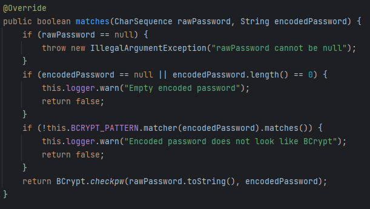

BCryptPasswordEncoder를 사용하기 위해서는 Spring Security 설정 파일에서 다음과 같이 `PasswordEncoder`를 반환하는 메서드를 Bean으로 등록한다.

```java
@Configuration
public class ProjectSecurityConfig {

    @Bean
    SecurityFilterChain defaultSecurityFilterChain(HttpSecurity http) throws Exception {
        http.csrf(AbstractHttpConfigurer::disable)
                .authorizeHttpRequests((requests) -> requests
                        .requestMatchers("/myAccount", "/myBalance", "/myLoans", "/myCards").authenticated()
                        .requestMatchers("/notices", "/contact", "/register").permitAll()
                )
                .formLogin(withDefaults())
                .httpBasic(withDefaults());
        return http.build();
    }

    @Bean
    public PasswordEncoder passwordEncoder() {
		    // BCrypt 알고리즘을 사용하겠다는 것을 의미
        return new BCryptPasswordEncoder();
    }
}
```



BCryptPasswordEncoder 클래스를 확인해보면 여러 생성자를 지원하는데, 이 생성자들을 통해서, BCrypt의 버전이나 라운드 수 등을 지정할 수 있다. 

5번 째 생성자를 보면 Spring Security는 default로 BCrypt의 $2A 버전을 사용하고 있는 것을 확인할 수 있다. 

# 회원가입에서의 BCrypt 해싱

> 비밀번호 해싱이 가장 먼저 일어나는 곳은 회원가입 절차가 이루어지는 곳이다. 때문에 해당 API가 존재하는 Controller에서 받아온 비밀번호를 해싱해 DB에 넣는 과정이 필요하다.
> 

```java
@RestController
@RequiredArgsConstructor
public class LoginController {

    private final CustomerRepository customerRepository;
    private final PasswordEncoder passwordEncoder; // Here

    @PostMapping("/register")
    public ResponseEntity<String> registerUser(@RequestBody Customer customer) {
        Customer savedCustomer = null;
        ResponseEntity response = null;
        try {
		        // Here
            String hashPwd = passwordEncoder.encode(customer.getPwd());
            customer.setPwd(hashPwd);

            savedCustomer = customerRepository.save(customer);
            if (savedCustomer.getId() > 0) {
                response = ResponseEntity
                        .status(HttpStatus.CREATED)
                        .body("Given user details are successfully registered");
            }
        } catch (Exception e) {
            response = ResponseEntity
                    .status(HttpStatus.INTERNAL_SERVER_ERROR)
                    .body("An exception occured due to " + e.getMessage());
        }

        return response;
    }
}
```

Postman 등을 통해 실제 회원가입을 진행해보면 아래와 같이 비밀번호가 해시되어 저장된 것을 확인 할 수 있다.



⇒ 맨 앞의 “$2a”는 BCrypt의 버전을 알려준다. 뒤의 “$10”은 해싱 알고리즘에 설정한 라운드 수를 알려주는데, Spring Security의 기본 설정이 10이다. 수동으로 설정 가능하다.

# 로그인에서의 BCrypt 해싱

실질적인 비밀번호 비교는 `DaoAuthenticationProvider` 내부의 `additionalAuthenticationChecks` 메서드에서 일어난다. 



위에서 사용되는 passwordEncoder는 우리가 설정한 `BCryptPasswordEncoder`가 된다.

디버그 모드로 실행해보면 `BCryptPasswordEncoder` 안의 `matches` 메서드가 실행되는 것을 확인할 수 있다.

