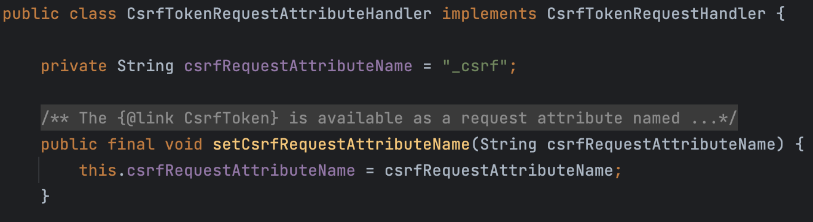
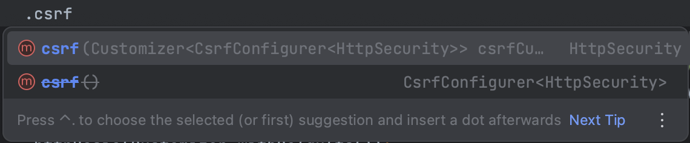
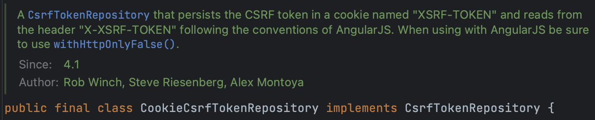
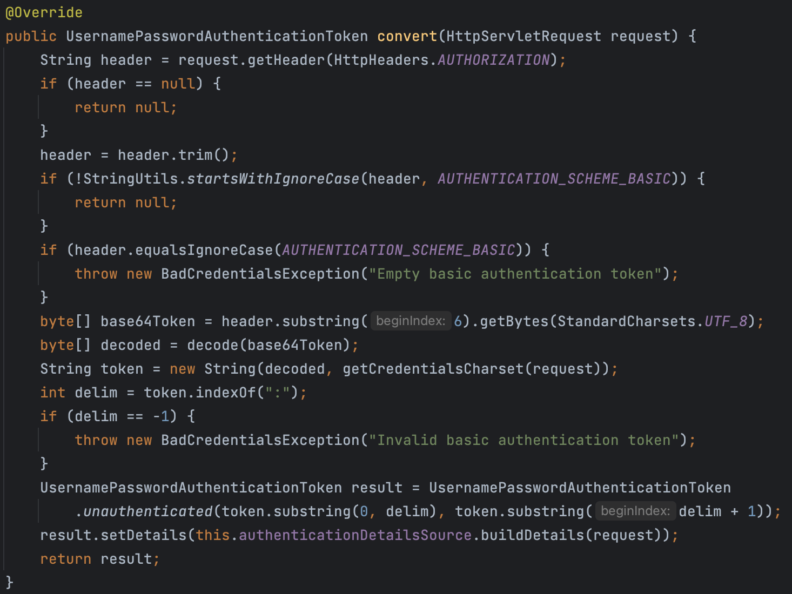

# CSRF

> Cross-Stie Request Forgery의 약어로, 사용자가 자신의 의지와 무관하게 공격자가 의도한 행동을 해서 특정 웹페이지를 보안에 취약하게 한다거나 수정, 삭제 등의 작업을 하게 만드는 공격 방법
> 
- 보호 정책이 아닌 **보안 공격**에 해당한다.
- 데이터를 **수정하거나 추가하는 상황**에서 발생할 수 있는 보안 공격
- 브라우저는 할당된 오리지널 도메인에만 쿠키를 공유하도록 설계가 되어있다.

### 시나리오

예시 상황을 들어보자.

1. 영화를 보기위해 넷플릭스에 접속해 로그인을 시도한다.
2. 정상적으로 로그인을 하고, 원하는 작업(영화 보기 등)을 수행한 뒤, 같은 브라우저에서 다른 창으로 해커가 만들어 놓은 다른 사이트(e.g. evil.com)를 방문한다(물론, 사용자는 모를 것이다).
3. 해당 사이트에서 “아이폰 90% 할인”과 같은 링크를 클릭하게 되면, 아래와 같은 코드가 실행되게 된다.

```html
<form action="https://netflix.com/changeEmail"
	method="POST" id="form">
		<input type="hidden" name="email" value="user@evil.com">
</form>

<script>
	document.getElementById('form').submit()
</script>
```

1. 위와 같은 코드를 통해 넷플릭스에서 이메일을 바꾸도록 한다. POST 요청이 netflix로 가는 것이기 때문에 자동으로 netflix와 관련된 쿠키 정보를 보내주게 된다.
2. 만약, netflix가 CSRF 공격을 제대로 다루지 못하는 상황이라면, 해당 요청이 실제 netflix 웹 사이트에서 오는 것인지 다른 사이트(여기서는 evil.com)에서 오는 것인지를 구분할 수 없게 된다. 결국, 요청을 받아드리고 이메일을 변경시켜 계정을 통제할 수 없는 상태가 될 것이다. 

# CSRF 공격을 처리하는 솔루션

> CSRF 공격을 대처하기 위해서는 백엔드 애플리케이션(서버)이 들어오는 HTTP 요청이 정당한(유효한) 사용자에게서 오고 있는지 구분할 수 있어야 한다.
> 
- 위의 시나리오와 같은 상황에서는 두 요청 모두 유효한 쿠키와 인증을 가지고 있기 때문에 구분할 수 없다.

⇒ ***CSRF 토큰***을 이용해 해결한다.

## CSRF Token

> 사용자의 세션마다 고유하게 할당되는 토큰으로, 랜덤으로 큰 값을 지정해 사용한다.
> 
- 보통 서버에서 CSRF 토큰을 쿠키 자체에 넣어서 전송하는 방식을 사용한다.
    - 인증 관련 쿠키, CSRF 관련 쿠키와 같이 2개의 쿠키를 전달하는 방식을 사용하기도 한다.

⇒ 위 방식을 사용하면 CSRF 토큰이 들어오지 않는 이상 브라우저는 요청을 수락하지 않을 것이다.

# 공개 API에 대한 CSRF 보호 무시

회원가입이나 문의 게시판 … 등과 같은 경우, 누구든 REST API를 통해 접근이 가능한 공공 API는 민감한 정보가 없기 때문에 CSRF 공격을 다룰 필요가 없다. 따라서, 기본 CSRF 보호를 적용시키지 말아야 한다. 

### ignoringRequestMatchers

> 특정 API에 대해 CSRF 보호를 적용시키지 않기 위해 사용하는 메서드로, Spring Security 설정 파일 안의 **SecurityFilterChain**에서 `http.csrf()`와 함께 사용한다.
> 

```java
@Bean
SecurityFilterChain defaultSecurityFilterChain(HttpSecurity http) throws Exception {
    http.cors(corsCustomizer -> corsCustomizer.configurationSource(new CorsConfigurationSource() {
            @Override
            public CorsConfiguration getCorsConfiguration(HttpServletRequest request) {
                CorsConfiguration config = new CorsConfiguration();
                config.setAllowedOrigins(Collections.singletonList("http://localhost:4200"));
                config.setAllowedMethods(Collections.singletonList("*"));
                config.setAllowCredentials(true);
                config.setAllowedHeaders(Collections.singletonList("*"));
                config.setMaxAge(3600L);
                return config;
            }
          }))
          .csrf(csrf -> csrf.ignoringRequestMatchers("/contact", "/register"))
          .authorizeHttpRequests((requests) -> requests
                  .requestMatchers("/myAccount", "/myBalance", "/myLoans", "/myCards", "/user").authenticated()
                  .requestMatchers("/notices", "/contact", "/register").permitAll())
          .formLogin(withDefaults())
          .httpBasic(withDefaults());
    return http.build();
}
```

⇒ “/notices”가 빠진 이유는, notices는 공지사항 API로 GET 요청에 해당한다. CSRF 공격의 경우 데이터의 수정, 추가와 같은 상황에서 일어나는 보안 공격이기 때문에, 단순히 데이터를 조회하는 GET 요청에 대해서는 처리를 해줄 필요가 없다.

# CSRF Token 솔루션

먼저, 다음 코드를 통해 **CSRF Token 객체**를 만들어준다.

```java
CsrfTokenRequestAttributeHandler requestHandler = new CsrfTokenRequestAttributeHandler();
requestHandler.setCsrfRequestAttributeName("_csrf");
```

`CsrfTokenRequestAttributeHandler`는 **CsrfTokenRequestHandler**를 구현하기 위한 클래스이다.



> Spring Security가 CSRF 토큰값을 생성하고 값이 처리되거나 FE에게 헤더 또는 쿠기 값을 전달하기 위해서는 `CsrfTokenRequestAttributeHandler` 클래스의 도움을 받아야 한다.
> 

⇒ 위 그림과 같이 default로 csrfRequestAttributeName에 “_csrf”가 들어가지만, 가독성을 위해 설정 파일에서 선언할 때, 같이 명시해준 것이다. 즉, 굳이 선언하지 않아도 무방하다.

이 CSRF Token을 사용하기 위해 설정 파일에서 `CsrfConfigurer` 타입의 매개변수를 받는 csrf 메서드를 사용한다. 



⇒ 이 메서드에 ***모든 CSRF 설정들을 전달***하게 된다. 

```java
htttp.csrf(csrf -> 
	csrf.csrfTokenRequestHandler(requestHandler)
			.ignoringRequestMatchers("/contact", "/register")
      .csrfTokenRepository(CookieCsrfTokenRepository.withHttpOnlyFalse()))
```

- csrfTokenRequestHandler 메서드를 불러와 위에서 선언한 requestHandler를 넣어준다.
- ignoringRequestMatchers 메서드를 사용해 누구나 접근 가능한 공공 API에 대해서는 CSRF 보호를 해제한다.
- csrfTokenRepository 메서드에는 `CookieCsrfTokenRepository.withHttpOnlyFalse()` 를 전달한다.

## CookieCsrfTokenRepository

> CSRF 토큰을 쿠키(Cookie)로 유지하기 위한 클래스
> 



- **“XSRF-TOKEN”**이라는 쿠키로, Header에서 “**X-XSRF-TOKEN**”의 이름으로 찾게 된다.

### withHttpOnlyFalse

> CSRF 토큰이 포함된 쿠키의 `HttpOnly` 속성을 비활성화하는 역할
> 

기본적으로, CookieCsrfTokenRepository는 HttpOnly 속성이 설정된 쿠키를 사용해 CSRF 토큰을 저장한다. 하지만, 이 옵션을 통해서 생성되는 쿠키의 HttpOnly 속성을 제거하여 JavaScript에서 CSRF 토큰에 접근이 가능하도록 설정할 수 있다. 

하지만, XSS와 같은 공격에 노출될 수 있다는 위험이 있다. 

---

# CSRF Filter

마지막 단계로, 백엔드 애플리케이션에서 첫 로그인 후에 UI 애플리케이션(FE)에게 헤더와 쿠키값을 보내야 한다. 이 과정이 없으면 클라이언트는 CSRF 토큰값을 알 수가 없다. 

⇒ Spring Security가 UI 애플리케이션의 반응으로 생성된 토큰 값을 보내야 하는 이유

따라서, CSRF 토큰을 보내려면 클라이언트로 보내게 될 모든 응답들에 Filter 클래스를 생성해야 한다. 

## OncePerRequestFilter

OncePerRequestFilter를 상속받는 CSRF Filter를 하나 생성한다. 

```java
public class CsrfCookieFilter extends OncePerRequestFilter {
  @Override
  protected void doFilterInternal(HttpServletRequest request, HttpServletResponse response, FilterChain filterChain)
          throws ServletException, IOException {
      CsrfToken csrfToken = (CsrfToken) request.getAttribute(CsrfToken.class.getName());
      if(null != csrfToken.getHeaderName()){
          response.setHeader(csrfToken.getHeaderName(), csrfToken.getToken());
      }
      filterChain.doFilter(request, response);
  }
}
```

1. 먼저, **HttpServletRequest** 안에서 가능한 **CsrfToken**을 읽을 수 있도록 한다. 
2. CSRF Token 객체를 사용해서 객체 안에 Header 이름이 있는지 확인한다. 
    - null이 아닌 경우, 프레임워크가 CSRF 토큰을 생성했다는 뜻이다.
3. Header 안에 CSRF Token 값을 넣는다. 
4. FilterChain 안에 있는 다음 Filter에게 전달하게 된다. 

⇒ 클라이언트에게 응답을 보내는 것이지만, CSRF 토큰 값은 헤더 안에 있게 된다. 

이와 같이 생성한 CSRF Filter를 Spring Security에 적용시키기 위해서, Spring Security 설정 파일에서 Filter를 사용하는 코드를 추가해준다. 

```java
http.csrf(csrf -> 
	csrf.csrfTokenRequestHandler(requestHandler)
			.ignoringRequestMatchers("/contact", "/register")
      .csrfTokenRepository(CookieCsrfTokenRepository.withHttpOnlyFalse()))
      .addFilterAfter(new CsrfCookieFilter(), BasicAuthenticationFilter.class)
```

addFilterAfter 부분을 확인해보면, ***BasicAuthenticationFilter를 실행 한 뒤에 CsrfCookieFilter를 사용하라***고 명시한 것을 확인할 수 있다. 

⇒ `BasicAuthenticationFilter` 후에만 로그인 동작이 완료될 수 있고, 로그인 동작이 완료되고 나면 CSRF 토큰이 생성된다. 이 생성된 CSRF 토큰을 `CsrfCookieFilter`를 통해 헤더에 값을 넣게 되는 것이다. 

## BasicAuthenticationFilter

로그인을 시도하면, BasicAuthenticationFilter 내부의 `doFilterInternal` 메서드가 실행되는데 해당 메서드의 코드는 다음과 같다.

```java
@Override
protected void doFilterInternal(HttpServletRequest request, HttpServletResponse response, FilterChain chain)
		throws IOException, ServletException {
	try {
		Authentication authRequest = this.authenticationConverter.convert(request);
		if (authRequest == null) {
			this.logger.trace("Did not process authentication request since failed to find "
					+ "username and password in Basic Authorization header");
			chain.doFilter(request, response);
			return;
		}
		String username = authRequest.getName();
		this.logger.trace(LogMessage.format("Found username '%s' in Basic Authorization header", username));
		if (authenticationIsRequired(username)) {
			Authentication authResult = this.authenticationManager.authenticate(authRequest);
			SecurityContext context = this.securityContextHolderStrategy.createEmptyContext();
			context.setAuthentication(authResult);
			this.securityContextHolderStrategy.setContext(context);
			if (this.logger.isDebugEnabled()) {
				this.logger.debug(LogMessage.format("Set SecurityContextHolder to %s", authResult));
			}
			this.rememberMeServices.loginSuccess(request, response, authResult);
			this.securityContextRepository.saveContext(context, request, response);
			onSuccessfulAuthentication(request, response, authResult);
		}
	}
	catch (AuthenticationException ex) {
		this.securityContextHolderStrategy.clearContext();
		this.logger.debug("Failed to process authentication request", ex);
		this.rememberMeServices.loginFail(request, response);
		onUnsuccessfulAuthentication(request, response, ex);
		if (this.ignoreFailure) {
			chain.doFilter(request, response);
		}
		else {
			this.authenticationEntryPoint.commence(request, response, ex);
		}
		return;
	}

	chain.doFilter(request, response);
}
```

Authentication authRequest = this.authenticationConverter.convert(request);
에서 **HTTP 요청을 변환**하고 `Authentication` 객체로 보내준다.

**`convert` 메서드**를 확인해보면 다음과 같다.



1. AUTHORIZATION 헤더가 있는지 확인한다. 
2. 존재한다면, Header 값은 “Basic”이고 username과 password가 인코딩된 값이다. 
3. 중간 코드를 통해 parsing하고 decoding하여 username과 password를 추출한다. 
4. 이 인증 정보를 읽고 변환해서 Spring Security의 Authentication 객체로 넘겨(반환)준다.

### 추가 설정 사항

CSRF와는 관련이 없지만, http에 아래와 같은 속성을 추가해준다. 

```java
http.securityContext((context) -> context.requireExplicitSave(false))
	  .sessionManagement(session -> session.sessionCreationPolicy(SessionCreationPolicy.ALWAYS))
```

> 첫 로그인이 성공하면, 항상 JSESSIONID를 생성하도록 하는 코드이다.
> 

⇒ 위 코드를 통해, 로그인 성공 후에, 보안된 API에 접근할 때마다 자격 증명(로그인)을 할 필요없이 접근을 할 수 있게 되는 것이다.  

---

# 클라이언트에서 CSRF Token 값 받기

프론트엔드에서는 다음과 같은 방식을 통해 쿠키를 가져와, **sessionStorage** 등에 저장하여 사용할 수 있다.

```tsx
...
let xsrf = getCookie('XSRF-TOKEN')!;
window.sessionStorage.setItem('XSRF-TOKEN', xsrf);
...
```

그리고, 클라이언트에서 서버로 요청을 보낼 때마다, ***항상 이 CSRF 토큰 값을 같이 보내***야한다. 

따라서, **interceptor**를 사용해 처리한다. 

프론트엔드에서 interceptor를 설정하는 코드 안에 다음과 같은 코드를 추가함으로써, 헤더에 토큰 값을 넣어 요청과 함께 전달할 수 있다.

```tsx
...
let xsrf = sessionStorage.getItem('XSRF-TOKEN');
if(xsrf) {
	httpHeaders = httpHeaders.append('X-XSRF-TOKEN', xsrf);
}
...
```