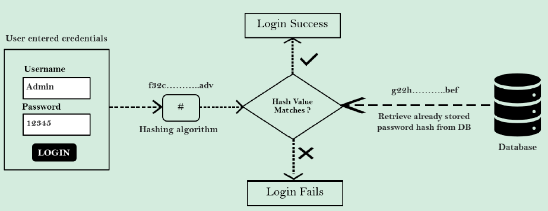
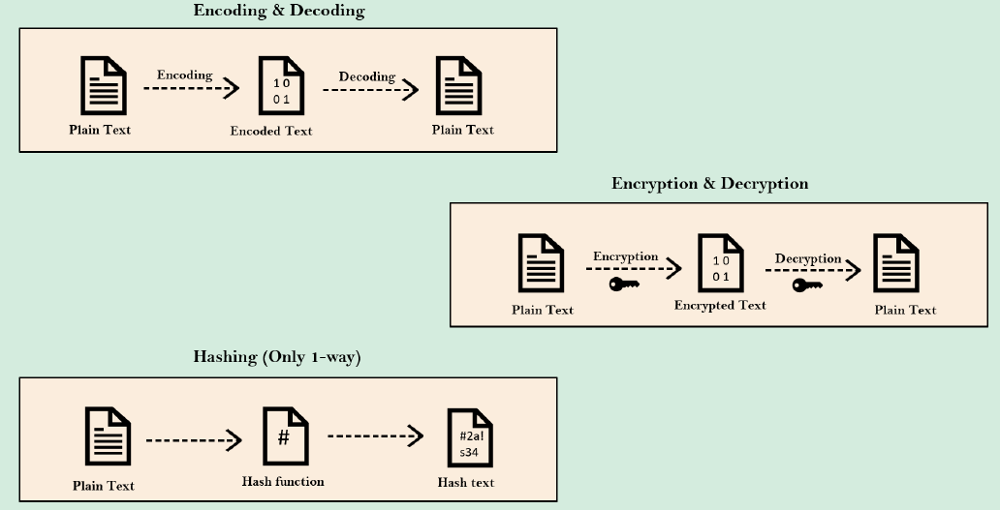

비밀번호를 일반 텍스트롤 저장하는 것은 보안적으로 위험이 매우 크기 때문에, 비밀번호를 저장하는 다양한 방식이 생겨났다. 하나씩 살펴보자.

# Encoding(인코딩)

> 데이터를 한 형식에서 다른 형식으로 변환하는 과정
> 
- 어떠한 기밀성도 포함하지 않는다.
⇒ 특정 텍스트를 인코딩 값으로 변환한다면, 그 누구라도 해당 인코딩 값을 가져다가 디코딩 과정을 거칠 수 있다는 의미

결국, ***비밀번호 관리에는 적합하지 않다.***

# Encyrption(암호화)

> 기밀성을 보장하는 방법으로, 일반 데이터를 암호화 할 때마다 특정 알고리즘을 따르고 이 암호화 알고리즘에 **비밀키(Secret Key)**를 제공하는 방식
> 
- 복호화를 통해 비밀번호를 확인한다. 
⇒ 이때, 암호화 과정에서 사용된 동일한 알고리즘과 동일한 키를 사용해야 한다.

하지만, 이 방법도 개발자와 같이 특정 권한을 가진 사람이라면 해당 알고리즘이나 변수들을 손쉽게 활용해 암호화 값을 복호화할 수 있기 때문에 ***비밀번호 관리 방법으로 추천하지 않는다.***

# Hashing(해싱)

> 데이터를 해싱을 통해 해시값으로 변환시키는 방식
> 
- 한 번 해시를 적용시키면 원복이 불가능하다. 
⇒ 누군가에게 해시값을 주더라도 해싱 과정에서 사용된 비밀번호를 알아내는 것은 불가능하다.
- 비밀번호를 저장하기 위한 표준이 되었다.

로그인에 사용된 비밀번호에 기반한 해시값과 DB에 저장되어 있는 사용자의 비밀번호 해시값을 비교하는 방식을 이용한다. 

### 작동 방식

1. 사용자가 비밀번호를 입력하면, `PasswordEncoder`의 도움을 받아 사용자의 비밀번호를 해시한다. 
2. Spring Security는 기존에 사용자에 의해 등록된 DB의 비밀번호 해시값을 가져와 `UserDetailsObject`에 보관한다.
3. 이 두 문자열의 해시값이 동일하다면 로그인에 성공하게 된다. 

대표적인 방식으로 **Bcrypt**가 있다.

# 각 방식 비교 그림

