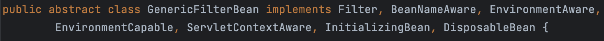

# GenericFilterBean

> 필터 구현을 단순화하기 위한 추상 클래스
> 

`GenericFilterBean` 또한 `Filter`를 구현하고 있는 것을 볼 수 있다.  

# OncePerRequestFilter

> 특정 필터가 각 요청 당 한 번만 실행되도록 보장하며, 필터가 여러 번 실행되는 것을 방지하여 불필요한 중복 작업을 피하는 데 유용하다.
> 

⇒ 내부적으로 `doFilterInternal` 메서드를 통해 필터 로직을 처리한다.