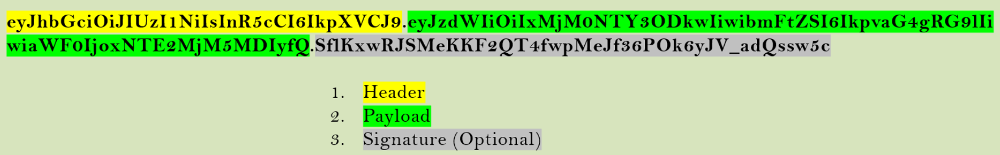
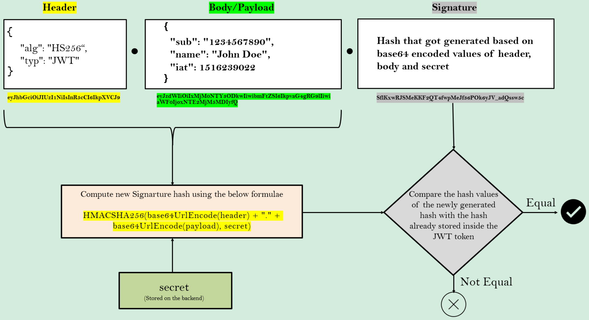

# JWT란?

> Json Web Token의 약어로, 내부적으로 **JSON 형식으로 데이터를 유지하고 있는 토큰**이다.
> 
- 웹 요청에 사용되며, 클라이언트와 서버 간의 통신에 사용되어 REST API의 도움으로 JSON 형식으로 통신하기 위해 설계되었다.
- 토큰 내부에 **사용자와 관련된 데이터를 저장 및 공유** 할 수 있도록 도와준다.

# JWT의 구조

JWT는 크게 3 부분으로 나누어지며 마침표(`.`)로 구분된다. 

1. Header
2. Payload
3. Signature(Optional)



## Header

> JWT의 타입, 해싱 알고리즘과 같은 **JWT에 대한 메타데이터**가 저장되어 있다.
> 

```json
{
	"alg": "HS256",
	"typ": "JWT"
}
```

⇒ JWT 속 메타데이터는 평문 형식으로 보내지지 않고, **Base64로 인코딩하여 전송**한다. 

## Payload

> 저장을 원하는 사용자에 대한 모든 정보를 저장할 수 있다.
> 
- Claim(클레임) := 토큰에 대한 정보를 표현하는 키-값 쌍

```json
{
  "sub": "1234567890",
  "name": "John Doe",
  "admin": true
}
```

⇒ Payload도 마찬가지로, **Base64로 인코딩하여 전송**된다.

## Signature

> JWT의 Header와 Payload를 암호화하여 생성되고, 토큰의 **무결성과 신뢰성을 보장하기 위해 사용**된다.
> 
- 생성된 JWT를 애플리케이션과 공유할 때마다 선택적으로 포함할 수 있다.

주로, SHA256 해싱 알고리즘을 사용해 아래와 같이 생성된다.

```
HMACSHA256(
  base64UrlEncode(header) + "." +
  base64UrlEncode(payload),
  secret
)
```

`secret`은 JWT를 발행하는 백엔드 애플리케이션만 알고 있는 값이다. 해당 알고리즘의 *결과값*은 **전달한 데이터를 기반으로 한 무작위 해시 문자열**이다.

위 토큰을 클라이언트에게 다시 보내고, 클라이언트는 같은 토큰을 보내야 한다. 

# JWT 검증 과정

