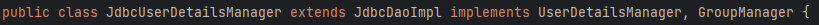
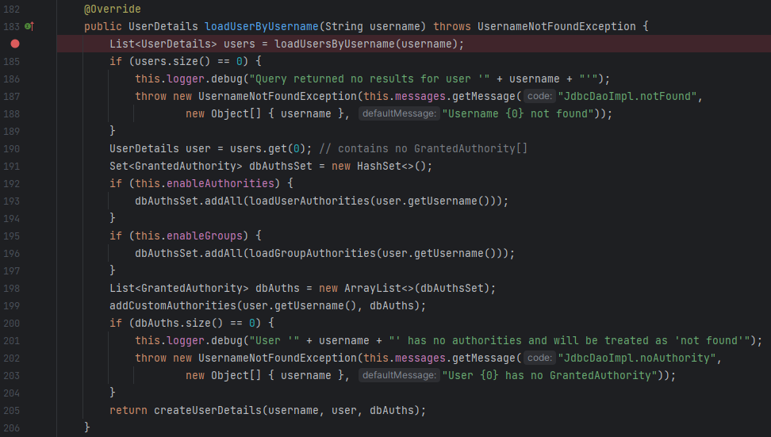
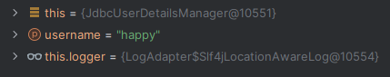

MySql에 테이블을 생성할 때, `JdbcUserDetailsManager`를 사용하기 때문에 Spring Security의 테이블 명명 규칙을 따라야 한다. 

Sqlectron을 사용했다.

아래는 Spring Security에서 제공하는 `users.ddl`이다. [여기서](https://docs.spring.io/spring-security/reference/servlet/authentication/passwords/jdbc.html) 확인할 수 있다.

```sql
create table users (
	username varchar_ignorecase(50) not null primary key,
	password varchar_ignorecase(500) not null,
	enabled boolean not null
);

create table authorities (
	username varchar_ignorecase(50) not null,
	authority varchar_ignorecase(50) not null,
	constraint fk_authorities_users foreign key(username) references users(username)
);

create unique index ix_auth_username on authorities (username,authority);
```

⇒ 위의 varchar_ignorecase와 같이 MySql에서는 지원하지 않는 형식이 존재하기 때문에, 수정이 필요하다. 명명 규칙에 따라 이름만 맞춰주면 된다.

```sql
CREATE TABLE `users` (
	`id` INT NOT NULL AUTO_INCREMENT,
	`username` VARCHAR(45) NOT NULL,
	`password` VARCHAR(45) NOT NULL,
	`enabled` INT NOT NULL,
	PRIMARY KEY(`id`)
);

CREATE TABLE `authorities` (
	`id` INT NOT NULL AUTO_INCREMENT,
	`username` VARCHAR(45) NOT NULL,
	`authority` VARCHAR(45) NOT NULL,
	PRIMARY KEY(`id`)
);
```

테스트를 위해 더미 데이터를 넣어놓자.

```sql
INSERT IGNORE INTO `users` VALUES (NULL, 'happy', '12345', '1');
INSERT IGNORE INTO `authorities` VALUES (NULL, 'happy', 'write');
```

또한, `JdbcUserDetailsManager`를 사용하기 위해 아래 dependency를 추가하자.

```java
implementation 'org.springframework.boot:spring-boot-starter-data-jpa'
implementation 'org.springframework.boot:spring-boot-starter-jdbc'
runtimeOnly 'com.mysql:mysql-connector-j'
```

MySql 서버와 연결을 위해, `application.yml` 파일에 MySql 서버 정보도 넣어준다.

```yaml
spring:
  datasource:
    url: MYSQL 서버 주소
    username: username
    password: password
  
  jpa:
    show-sql: true
    properties:
      hibernate:
        format_sql: true 
```

# JdbcUserDetailsManager

`@Configuration`을 통해 구성한 Security 설정 파일에 `JdbcUserDetailsManager` 타입의 Bean을 선언해준다.

```java
@Bean
public UserDetailsService userDetailsService(DataSource dataSource) {
    return new JdbcUserDetailsManager(dataSource);
}
```

위 메서드를 통해 Spring Security는 개발자가 ***Jdbc 인증 방식***을 사용하려 한다는 것을 확인할 수 있다. 또한, `DataSource`를 파라미터로 받음으로써, DB 정보를 통해 검색할 수 있다.

> Spring Security에게는 항상 비밀번호를 어떤 방식(일반 텍스트 or 해싱 … )으로 저장할지 알려줘야 하기 때문에, passwordEncoder 메서드는 항상 필요하다.
> 

```java
@Bean
public PasswordEncoder passwordEncoder() {
    return NoOpPasswordEncoder.getInstance();
}
```

### 전체 설정 파일

```java
@Configuration
public class ProjectSecurityConfig {

    @Bean
    SecurityFilterChain defaultSecurityFilterChain(HttpSecurity http) throws Exception {
        http.authorizeHttpRequests((requests) -> requests
                        .requestMatchers("/myAccount", "/myBalance", "/myLoans", "/myCards").authenticated()
                        .requestMatchers("/notices", "/contact").permitAll()
                )
                .formLogin(withDefaults())
                .httpBasic(withDefaults());
        return http.build();
    }
    
    @Bean
    public UserDetailsService userDetailsService(DataSource dataSource) {
        return new JdbcUserDetailsManager(dataSource);
    }

    @Bean
    public PasswordEncoder passwordEncoder() {
        return NoOpPasswordEncoder.getInstance();
    }
}
```

위 설정파일을 토대로 애플리케이션을 디버그 모드로 실행해보자. 실제 코드를 확인해보기 위해 종단점을 찍는다. 

우선, `JdbcUserDetailsManager`는 아래와 같이 `JdbcDaoImpl`을 상속받고 있다.



`JdbcDaoImpl` 클래스 내부의 `loadUserByUsername`메서드에 종단점을 찍고 확인해보자.



> JdbcDaoImpl을 상속받고 있기 때문에 JdbcUserDetailsManager에서 loadUserByUsername 메서드를 사용할 수 있다.
> 

앞서 넣어둔 사용자 데이터를 활용해 username과 password를 입력하면, breakpoint에 걸리면서, 실제로 Spring Security가 JdbcUserDetailsManager를 사용하고 있는 것을 확인할 수 있다.

