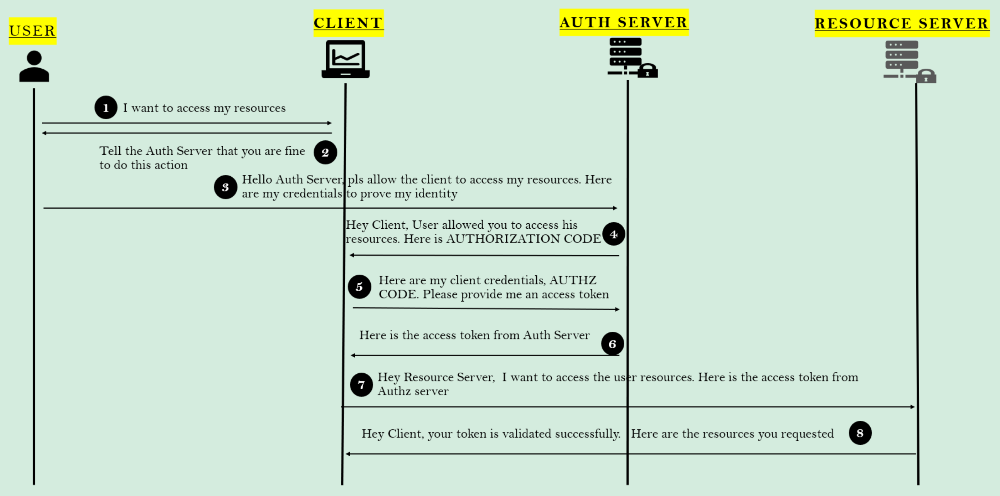
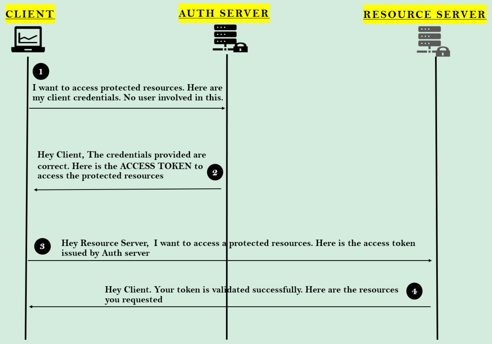
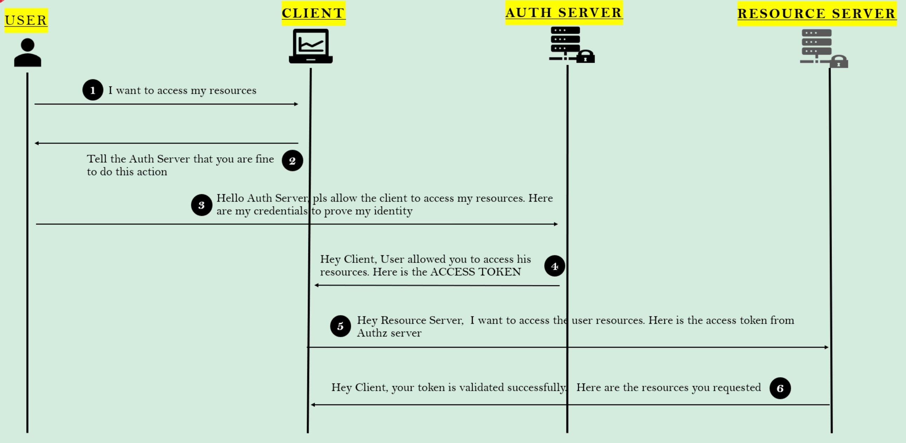
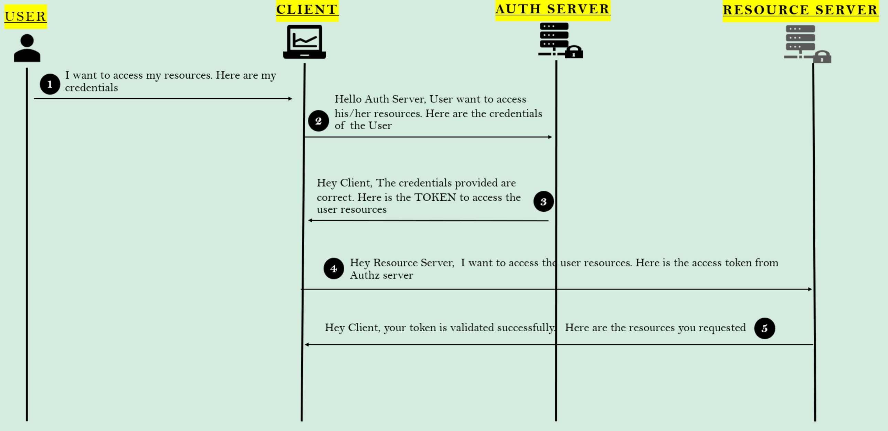
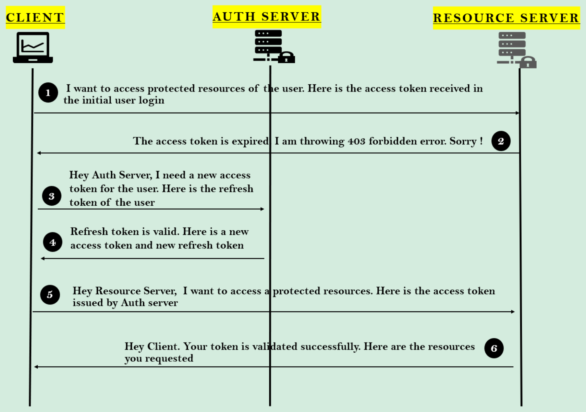

# OAuth

> 한 애플리케이션이 다른 애플리케이션 내부에 있는 **사용자의 데이터에 접속할 권한을 부여**하는 보안 기준 규격
> 

# OAuth 용어

## Resource owner

> 사용자(= End User)를 뜻한다.
> 

⇒ End user의 리소스들이 대부분 보안된 웹사이트들에 있기 때문이다. 

## Client

> 제 3의 웹 애플리케이션 or 다른 애플리케이션
> 

## Authorization Server

> 리소스 소유자에 대해 알고 있는 서버
> 
- 클라이언트 애플리케이션이 **접근 토큰(access token)을 요청하고 발급받는 과정을 처리**
- 사용자의 **자격 증명을 확인**하고, 사용자가 리소스에 **접근할 수 있는 권한을 부여**하는 역할을 한다.

## Resource Server

> OAuth 2.0 프로토콜에서 보호된 리소스를 호스팅하고, Authorization Server가 발급한 Access Token을 사용하여 클라이언트 애플리케이션의 요청을 검증하는 서버
> 

## Scope

> 클라이언트가 Access Token을 통해 어떤 리소스에 접근할 수 있는지, 그리고 그 접근의 범위가 무엇인지를 정의하는 파라미터
> 

⇒ Access Token에 스코프(Scope) 정보가 포함되어, 리소스 서버가 이를 통해 접근 권한을 검증한다.

## Access Token

> 사용자의 **리소스에 접근할 수 있는 권한**을 클라이언트 애플리케이션에게 **부여**하는 보안 토큰
> 

⇒ 제 3의 애플리케이션이 어떤 행위를 취할 수 있는지, 어떤 권한이 있는지, 어떤 허가를 내릴 수 있는지를 결정하는 토큰

# OAuth 내 권한 코드 부여 유형 : 인증 방식 종류

OAuth에는 다양한 인증 유형이 존재한다. 개발하고자 하는 애플리케이션의 시나리오를 바탕으로 적절한 인증 유형을 선택하기 위해 각 인증 유형 간의 차이점에 대해 살펴보자.

## 1. Authorization Code : 인가 코드

사용자가 연관되어 있거나, 두 개의 다른 애플리케이션이 서로 교류(통신)하고자 할 때 사용되는 Flow이다. 



1. 사용자(Resource Owner)가 클라이언트 애플리케이션에 리소스에 접근하고 싶다는 의사를 밝힌다.
2. 클라이언트는 사용자에게 인증 서버(Authorization Server)의 인증(허가)을 받아야 한다고 알린다. 
    1. 사용자가 접근하고자 하는 리소스는 리소스 서버(Resource Server) 내에 보관되어 있으며, 이를 위해 인증 서버를 거쳐 Access Token을 발급받아야 하기 때문이다. 
3. 사용자는 인증 서버의 로그인 페이지로 redirect되어 이동하게 되고, 클라이언트가 리소스에 접근하는 것을 허가해달라고 요청할 것이다. 
4. 인증 서버가 인증서를 받고 사용자가 신원을 증명(로그인)하면 인증 서버는 클라이언트에게 **인가 코드(Authorization Code)**를 발급한다. 
    1. 이때, 인가 코드는 유효기간이 매우 짧게 발행된다.
5. 클라이언트는 이 인가 코드를 통해 인증 서버(Authorization Code)에게 **Access Token**을 요청한다.
    1. 이때, 인증 서버는 **클라이언트의 Client ID, Client Key 등을 함께 요**구한다.
6. 인증 서버는 위 정보들을 토대로 클라이언트에게 Access Token을 발급한다.
7. 클라이언트는 발급된 Access Token과 Scope 등을 토대로 리소스 서버에 접근해 사용자의 보호된 리소스에 접근할 수 있게 된다. 

### Authorization Code 발급

인가 코드를 발급 받기 위해 클라이언트는 다음과 같은 정보들을 인가 서버에 제공한다.

- **client_id** := 인가 서버에 등록된 클라이언트 ID
- **redirect_url** := 인증에 성공한 후 인증 서버가 리다이렉션해야 할 URL
- **scope** := 클라이언트가 요청하는 접근 수준(e.g. READ, WRITE … )
- **state** := CSRF 공격을 방지하기 위한 CSRF 토큰
- **response_type** := 클라이언트가 인증 서버에 어떤 유형의 응답을 기대하는지를 지정. '**code**'라는 값을 가진다.

### Access Token 발급

인가 코드를 토대로, Access Token을 요청 받기 위해 다음과 같은 정보를 전달해야 한다.

- **code** := 위 단계에서 전달받은 인가 코드(Authorization Code)
- **client_id** & **client_secret** := 인증 서버에 등록된 **클라이언트 자격 증명**
- **grant_type** := 클라이언트 애플리케이션이 사용하는 인증 방식.
    - "authorization_code"는 인가 코드 grant를 사용하고 있음을 나타낸다.
- **redirect_url** := 인증 서버가 Access Token과 함께 응답을 전달할 URL

## 2. Client Credentials Grant Type

> 클라이언트 애플리케이션이 자체 자격 증명을 사용하여 액세스 토큰을 요청하는 방식
> 

⇒ 주로 **서버 대 서버 간의 통신**에서 사용된다. 

- 사용자가 개입하지 않고 클라이언트 애플리케이션이 직접 인증을 수행할 수 있게 한다.



1. 클라이언트 애플리케이션은 자신의 자격 증명(client_id 및 client_secret)을 사용하여 인증 서버에 보호된 리소스에 접근하기 위한 **Access Token**을 요청한다.
2. 인증 서버는 클라이언트 자격 증명의 유효성을 확인하고, 유효한 경우 클라이언트에게 **Access Token**을 발급한다.
3. 클라이언트 애플리케이션은 받은 **Access Token**을 사용하여 리소스 서버에 보호된 리소스에 접근을 요청한다.
4. 리소스 서버는 **Access Token**의 유효성을 검증하고, 유효한 경우 요청된 리소스를 클라이언트 애플리케이션에 제공한다.

## 3. Implicit Grant Flow

> OAuth 2.1에서 삭제될 예정이고, 보안상의 이유로 사용하는 것을 추천하지 않는 방식이다.
> 



위에서 설명한 인가 코드(Authorization Code)를 발급 받는 방식과 비교해보면, 해당 방식에서는 인가 코드를 발급받는 과정 없이 바로 Access Token을 요청하는 과정을 수행하는 것을 확인할 수 있다. 

## 4.  Resource Owner Credentials Grant Type(Password Grant)

> 사용자의 자격 증명을 직접 클라이언트 애플리케이션에 제공하여 액세스 토큰을 발급받는 방식
> 



1. 사용자가 자신의 리소스에 접근하기 위해 클라이언트 애플리케이션에 자신의 자격 증명(사용자 이름 및 비밀번호)을 제공한다.
2. 클라이언트 애플리케이션은 사용자 자격 증명을 가지고 **인증 서버에 Access Token을 요청**한다. 
3. 인증 서버는 제공된 자격 증명이 유효한지 확인한 후, 클라이언트 애플리케이션에 액세스 토큰을 발급한다.
4. 클라이언트 애플리케이션은 받은 Access Token을 사용하여 리소스 서버에 사용자 리소스에 접근을 요청한다.
5. 리소스 서버는 Access Token의 유효성을 검증하고, 유효한 토큰이면 요청된 리소스를 클라이언트 애플리케이션에 제공한다.

위 방식의 **가장 큰 문제점**은 사용자(Resource Owner)의 실제 인증서를 클라이언트와 공유한다는 것이다.

## 5. Refresh Token Grant Type

인증 서버에서 전달 받은 Access Token은 대부분 다음과 같은 형태로 응답받게 된다. 

```json
{
  "token_type": "Bearer",
  "expires_in": 86400,
  "access_token": "4NJZGCOHgd_lOHdo_QfF0xYc4rNyjz5trk__O3fvdv_qPgzj3M4WEZmNNhRbIhOd8FJXOc33",
  "scope": "photo offline_access",
  "refresh_token": "TefrvWNqNabfzTXMzcmMlNYi"
}
```

access token과 refresh token, 두 가지 토큰을 받는 것을 확인할 수 있다.

expires_in 필드를 통해, access token의 유효 기간이 24시간이라는 것을 확인할 수 있다. 만약, Access Token의 유효 기간이 끝나게 된다면, Refresh Token을 활용해 인증 서버와 함께 또 다른 인증 유형 Flow를 진행할 수 있다. 이때, Refresh Token이 유효하다면, 인증 서버는 새로운 유효 기간을 가진 Access Token을 발행해주게 된다. 



> Refresh Token 인증 유형의 경우, 사용자가 관련되지 않는다.
> 
1. 클라이언트 애플리케이션이 초기 사용자 로그인 시 받은 Access Token을 사용하여 리소스 서버에 보호된 리소스를 요청한다.
2. 리소스 서버는 Access Token이 만료되었음을 확인하고, **403 Forbidden** 오류를 반환한다.
3. 클라이언트 애플리케이션은 사용자로부터 받은 **Refresh Token**을 사용하여 인증 서버에 새로운 Access Token을 요청한다.
4. 인증 서버는 **Refresh Token**이 유효함을 확인하고, **새로운 Access Token**과 새로운 **Refresh Token**을 클라이언트에게 발급한다.
5. 클라이언트 애플리케이션은 새로운 Access Token을 사용하여 다시 리소스 서버에 보호된 리소스를 요청한다.
6. 리소스 서버는 새로운 Access Token의 유효성을 확인하고, 유효한 경우 요청된 리소스를 클라이언트 애플리케이션에 제공한다.