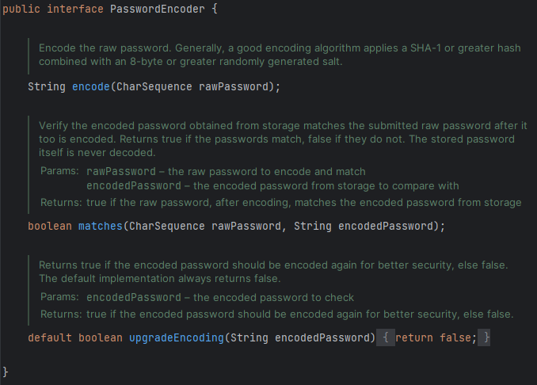
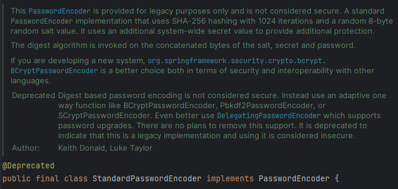

# PasswordEncoder

`PasswordEncoder`는 인터페이스이며, 두 개의 추상메서드와 한 개의 default 메서드가 있다.

## encode 메서드

> 사용자의 회원가입 절차에서 활용할 수 있다.
> 

⇒ 사용자가 회원가입 절차에서 입력한 rawPassword를 ***개발자가 사용하는 PasswordEncoder에 기반***해 해시 문자열 또는 암호화된 값으로 변환한다. 

## matches 메서드

> 로그인 과정에서 사용자가 입력한 비밀번호와 DB에 저장되어 있는 비밀번호를 비교한다.
> 

## upgradeEncoding 메서드

> 기본적으로는 false를 반환하지만, true를 반환한다면 encode를 여러 번 수행하게 된다.
> 

---

`PasswordEncoder`를 구현한 클래스에는 다음과 같은 것들이 존재한다.

1. **NoOpPasswordEncoder**
2. **StandardPasswordEncoder**
3. **Pbkdf2PasswordEncoder**
4. **BCryptPasswordEncoder**
5. **SCryptPasswordEncoder**
6. **Argon2PasswordEncoder**

하나씩 살펴봅시다.

# NoOpPasswordEncoder

> 해싱, 암호화, 인코딩의 개념이 없고 사용자의 비밀번호를 ***일반 텍스트로 취급***한다.
> 

⇒ 운영 환경에서는 권장하지 않는 방식

# **StandardPasswordEncoder**

> 비밀번호를 단순히 암호화 하는 방식을 사용한다.
> 

실제로 deprecated 된 것을 확인할 수 있고, legacy 목적을 위해 제공한다고 명시되어 있다.

⇒ 운영 환경에서는 권장하지 않는 방식

# **Pbkdf2PasswordEncoder**

> [PBKDF2](https://ko.wikipedia.org/wiki/PBKDF2) 알고리즘을 이용한 암호화 방식을 사용한다.
> 

⇒ CPU와 GPU의 발전으로 현재에는 추천되지 않는 방식

# **BCryptPasswordEncoder**

> BCrypt 해싱 알고리즘을 사용하는 방식
> 

# **SCryptPasswordEncoder**

> **BCryptPasswordEncoder**의 고급 버전으로, 개발자가 적용한 설정에 따라 고의적으로 일부 메모리 할당을 요구하는 방식으로 보안을 강화하는 방식
> 

⇒ 대량의 메모리를 필요로 하여 대규모 맞춤형 하드웨어 공격을 수행하는 데 비용이 많이 들도록 설계된 SCrypt 알고리즘을 이용하는 방식

# **Argon2PasswordEncoder**

> Argon2 해싱 알고리즘을 사용하는 방식
> 

⇒ [Argon2](https://ko.wikipedia.org/wiki/Argon2) 알고리즘은 다중 스레드도 요구하기 때문에 공격이 더욱 힘들다.

결국 애플리케이션의 성능 문제때문에 **BCryptPasswordEncoder**를 가장 많이 사용한다.