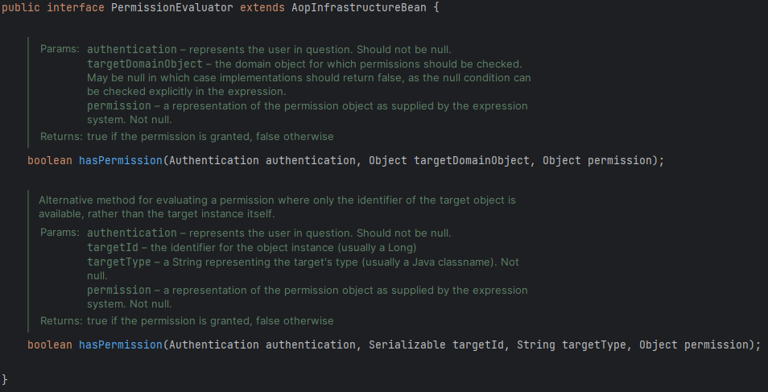

지금까지는 Spring Security의 도움으로 API 경로 혹은 URL 위에 인가를 적용했다.

# 메서드 레벨 보안

하지만, API 경로를 보호하는 것 이외에도 Spring Security는 ***메서드의 보호***도 제공한다. 따라서, controller, service, repository layer 등 어디에 있는 비즈니스 로직(메서드)에도 인가를 적용시킬 수 있다. 

이러한 메서드 레벨의 보안을 적용하기 위해 **@EnableMethodSecurity** 어노테이션을 사용한다.

## @EnableMethodSecurity

> 메인 클래스 혹은 설정 클래스에 사용하는 어노테이션으로, 메서드 레벨 보안을 사용함을 의미한다.
> 

⇒ 애플리케이션의 특정 메서드에 대해 접근 권한을 제어하는 기능을 제공

```java
@SpringBootApplication
@EnableMethodSecurity(prePostEnabled = true, securedEnabled = true, jsr250Enabled = true)
public class DemoApplication {
		public static void main(String[] args) {
				SpringApplication.run(DemoApplication.class, args);
		}
}
```

- **prePostEnabled** := `@PreAuthorize`와 `@PostAuthorize` 어노테이션 활성화를 결정
- **securedEnabled** := `@Secured` 어노테이션 활성화를 결정
- **jsr250Enabled** := JSR-250 표준 어노테이션인 `@RolesAllowed` 어노테이션 활성화를 결정

# @PreAuthorize

> 명시된 권한에 관한 규칙이나 보안에 관한 요구 사항이 충족되어야지만 해당 메서드가 호출되도록 하는 어노테이션
> 

## 사용 방법

```java
@Service
public class LoansService {
	
	@PreAuthorize("hasAuthority('VIEWLOANS')")
	@PreAuthorize("hasRole('ADMIN')")
	@PreAuthorize("hasAnyRole('ADMIN', 'USER')")
	@PreAuthorize("# username == authentication.principal.username") // SpEL
	public Loan getLoanDetails(String username) {
		return loansRepository.loadLoanDetailsByUserName(username);
	}
}
```

위 메서드는 사용자의 이름을 기반으로 대출 정보를 가져오는 역할을 한다. 이때, 해당 사용자가 가지고 있는 권한과 역할을 확인하기 위해 `@PreAuthorize`를 사용할 수 있다. 

위에서 확인할 수 있듯, 다양한 방법으로 권한 혹은 역할을 확인할 수 있다.

# @PostAuthorize

> 메서드가 실행된 후에 접근 제어 검사를 수행하며, 메서드의 반환 값을 검사하기 위한 어노테이션
> 
- `@PreAuthorize`와 다르게 메서드의 호출을 막지 않는다.

```java
@Service
public class LoansService {
	
	@PostAuthorize("hasPermission(returnObject, 'ADMIN')")
	@PostAuthorize("returnObject.username == authentication.principal.username") // SpEL
	public Loan getLoanDetails(String username) {
		return loansRepository.loadLoanDetailsByUserName(username);
	}
}
```

# PermissionEvaluator 인터페이스

만약, 요구 사항이 매우 복잡하여 위와 같은 어노테이션을 사용하는 것만으로는 권한을 확인하기 어려운 경우(복잡한 경우), `PermissionEvaluator` 인터페이스를 직접 구현해 사용할 수 있다.



`hasPermission` 메서드를 오버라이드하여 사용할 수 있다. 

### 파라미터

- `authentication` := 로그인된 사용자에 대한 정보
- `targetDomainObject` := 사용자에게 반환하고자 하는 객체 or 사용자로부터 받은 객체
- `permission` := 검사하고자 하는 표현식