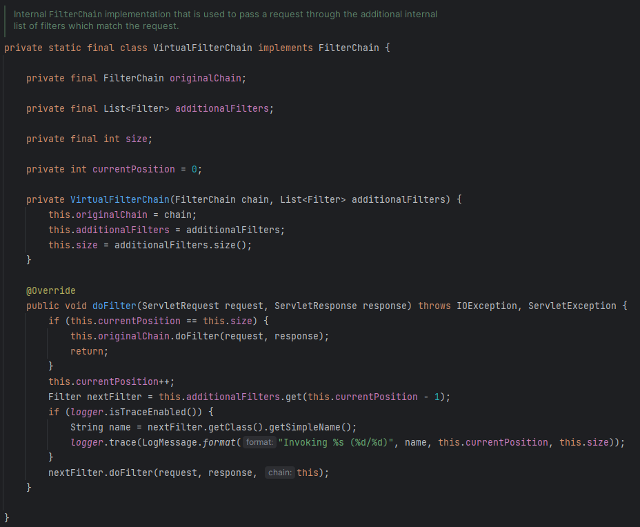

# Filter

Filter(필터)란, 

> 웹 애플리케이션 내의 모든 요청이나 응답을 차단해 실제 비즈니스 로직 전에 실행되기를 바라는 사전 로직을 구성한 것이다.
> 

⇒ 따라서, Spring Security Filter는 인증 및 인가 흐름에서 매우 중요한 역할을 한다.

# 왜 커스텀 필터를 사용할까?

1. 인증 전에 몇 가지의 입력 위반을 차단하고 싶은 경우
2. 인증 전에 입력 데이터의 암호화 혹은 복호화를 수행하려는 경우
3. 인증 프로세스 중에 시스템에 들어가려고 하는 사용자의 일부 세부 정보를 로그에 기록하고 싶은 경우
4. IP 주소, 국가 세부 정보 등을 기록하고 싶은 경우
5. OTP를 사용한 다중 인증을 강제하고 싶은 경우

등과 같은 경우, Spring Security에 등록되어 있는 Filter로는 요구사항을 만족할 수 없는 상황에 사용할 수 있다.

# Spring Security 내장 Filter

## 추가 설정

우선, 실행되는 Filter를 직접 확인하기 위해서는 애플리케이션 내에서 추가적인 설정이 필요하다.

1. 애플리케이션의 Main 클래스에 `@EnableWebSecurity(debug =  true)` 어노테이션 추가
2. application.yml 파일에 다음 설정 추가
    
    ```yaml
    logging:
      level:
        'org.springframework.security.web.FilterChainProxy': DEBUG
    ```
    

### FilterChainProxy

> Spring Security 내부에서 **내장 필터를 연결하는 데 사용되는 로직**을 가지고 있다.
> 

⇒ 실제 운영 단계에서는 권장하지 않는다. SESSION ID 등과 같은 민감한 정보가 로그에 기록되기 때문이다.

### VirtualFilterChain

> FilterChainProxy 클래스에 내장되어 있는 static 클래스로, 필터 체인(Filter Chain)을 구성하고 관리하는 데 사용된다.
> 



- **여러 보안 Filter들을 한 줄로 연결해 일련의 보안 검사를 수행**한다.

⇒ 동적 필터 체인 구성을 관리한다.

- `doFilter` 메서드에서 Spring Security 필터 체인 내에서 사용 가능한 모든 필터를 반복한다.