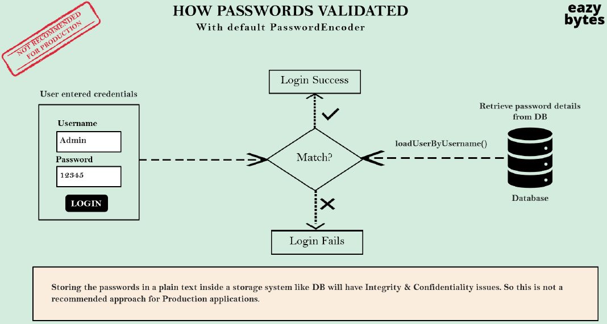
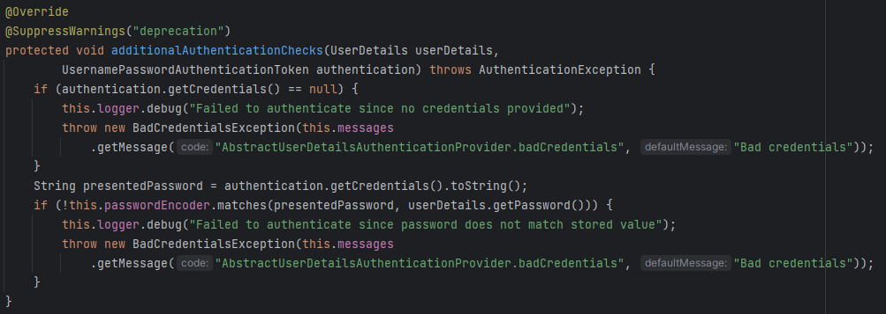

# 비밀번호가 인증되는 과정

## 잘못된 방법



1. 사용자가 username과 password를 입력한다.
2. Spring Security는 인증 제공자(Authentication Provider) 내부의 모든 로직을 실행하고 `UserDetailsManager` 구현 클래스 내부에 있는 `loadUserByUsername` 메서드의 도움으로 DB에 있는 모든 정보를 불러온다.
3. 사용자 정보를 불러온 뒤, Spring Security는 입력된 비밀번호와 DB에서 불러온 비밀번호를 비교한다.
4. 비밀번호가 일치한다면 로그인, 그렇지 않다면 실패하게 된다. 

> 하지만 위의 방법의 경우, 사용자의 비밀번호를 일반 텍스트로 저장한다는 큰 문제점이 있다. 따라서, 절대 권장하지 않는 방법이다.
> 

# 비밀번호 검증이 일어나는 위치

비밀번호 처리를 알아보기 전에, Spring Security 내부의 어디에서 비밀번호 검증이 일어나는지 먼저 알아보자.

## DaoAuthenticationProvider

비밀번호의 실질적인 검증은 `DaoAuthenticationProvider` 클래스에서 일어나는데, 해당 클래스는 `AbstractUserDetailsAuthenticationProvider`를 상속받고 있고, 이 클래스의 `authenticate` 메서드에서 검증을 수행한다.

```java
@Override
public Authentication authenticate(Authentication authentication) throws AuthenticationException {
	Assert.isInstanceOf(UsernamePasswordAuthenticationToken.class, authentication,
			() -> this.messages.getMessage("AbstractUserDetailsAuthenticationProvider.onlySupports",
					"Only UsernamePasswordAuthenticationToken is supported"));
	String username = determineUsername(authentication);
	boolean cacheWasUsed = true;
	UserDetails user = this.userCache.getUserFromCache(username);
	if (user == null) {
		cacheWasUsed = false;
		try {
			user = retrieveUser(username, (UsernamePasswordAuthenticationToken) authentication);
		}
		catch (UsernameNotFoundException ex) {
			this.logger.debug("Failed to find user '" + username + "'");
			if (!this.hideUserNotFoundExceptions) {
				throw ex;
			}
			throw new BadCredentialsException(this.messages
				.getMessage("AbstractUserDetailsAuthenticationProvider.badCredentials", "Bad credentials"));
		}
		Assert.notNull(user, "retrieveUser returned null - a violation of the interface contract");
	}
	try {
		this.preAuthenticationChecks.check(user);
		additionalAuthenticationChecks(user, (UsernamePasswordAuthenticationToken) authentication);
	}
	catch (AuthenticationException ex) {
		if (!cacheWasUsed) {
			throw ex;
		}
		// There was a problem, so try again after checking
		// we're using latest data (i.e. not from the cache)
		cacheWasUsed = false;
		user = retrieveUser(username, (UsernamePasswordAuthenticationToken) authentication);
		this.preAuthenticationChecks.check(user);
		additionalAuthenticationChecks(user, (UsernamePasswordAuthenticationToken) authentication);
	}
	this.postAuthenticationChecks.check(user);
	if (!cacheWasUsed) {
		this.userCache.putUserInCache(user);
	}
	Object principalToReturn = user;
	if (this.forcePrincipalAsString) {
		principalToReturn = user.getUsername();
	}
	return createSuccessAuthentication(principalToReturn, authentication, user);
}
```

간단히 설명하자면 다음과 같은 로직을 따른다. 

1. DB에서 사용자 정보를 불러온다. 
2. `preAuthenticationChecks` 메서드를 호출한다. 
    1. 이 메서드에서 Spring Security는 사용자의 계정이 만료되었는지, 잠겼는지, 비활성화 상태인지 등을 확인한다. 
3. 위 과정이 모두 성공적으로 확인되었다면, `additionalAuthenticationChecks` 메서드를 호출한다.
    1. 해당 메서드는 추상 메서드로, `DaoAuthenticationProvider`에 구현되어 있다.

## additionalAuthenticationChecks



위 메서드의 로직은 다음과 같다.

1. 인증 객체(**authentication**) 내부에 자격 증명(**credentials**)이 존재하는지 확인한다. 
2. 존재한다면, `presentedPassword`로 자격 증명 문자열이 할당된다. 결국, 인증 객체로부터 받는 비밀번호가 바로 사용자가 입력한 비밀번호가 되는 것이다. 
3. `passwordEncoder`의 `matches` 메서드를 통해 이 비밀번호와 DB에서 불러온 비밀번호를 비교한다.

> 결국 이 passwordEncoder가 중요한 역할을 하고 있는 것을 확인할 수 있다.
>