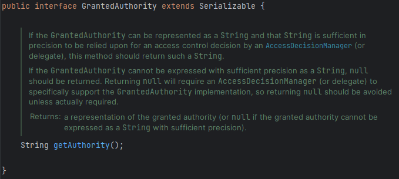
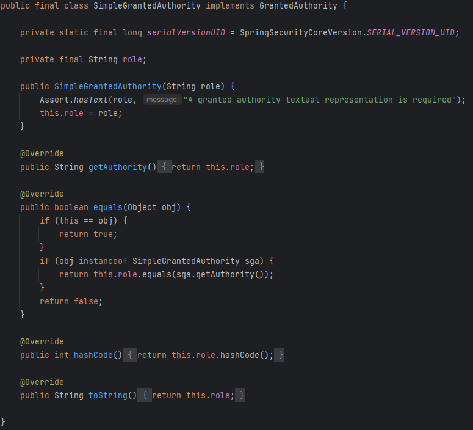

Spring Security에서 **권한 정보**가 정확히 어디에 저장되는지 살펴보자.

Spring Security에서는 이러한 권한 또는 특권을 두 가지 용어로 부른다.

1. **Authorities**
2. **Roles**

# Authorities

> “**권한**”이라는 용어 자체를 의미한다.
> 

## GrantedAuthority 인터페이스

## SimpleGrantedAuthority 클래스

> Spring Security에서 제공하는 `GrantedAuthority` 인터페이스의 구현 클래스
> 

⇒ 이 클래스의 생성자를 통해 **역할과 권한을 만들 수 있다**.

이를 통해 저장된 권한을 `getAuthority()`메서드를 통해 받아 올 수 있다.

실제로, 이전에 학습하며 작성했던 **AuthenticationProvider** 부분에서 위 클래스를 사용하는 것을 확인할 수 있다.

