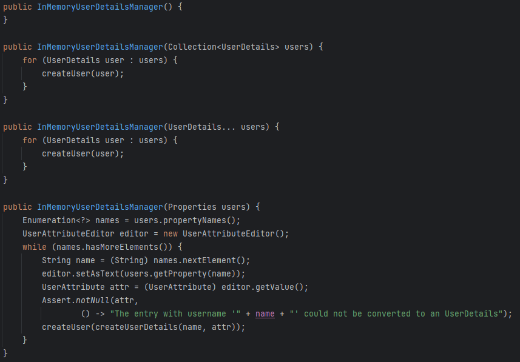
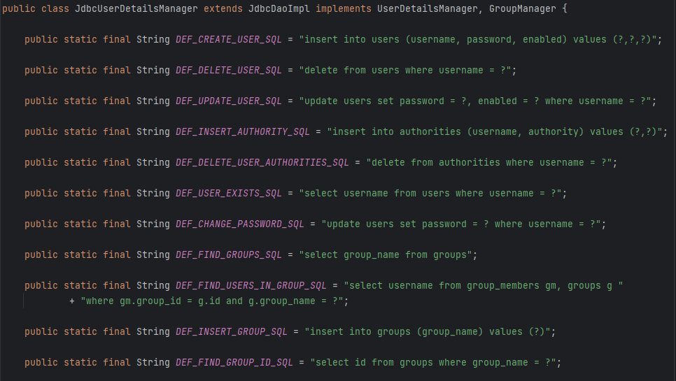

# UserDetailsService

> 사용자의 특정 데이터를 불러오는 데 사용되도록 설계된 인터페이스
> 
- 사용자가 입력한 username을 전달하기만 하면, 해당 username을 기반으로 DB에서 사용자 세부 정보를 가져와 **`loadUserByUsername`의 구현 클래스에서 반환**된다.
    - 주의할 점은 보안을 위해 ***username만을 전달***하며, password는 함께 전달하지 않는다!

# UserDetailsManager

> 새로운 사용자를 생성하거나 기존 사용자를 수정, 삭제할 수 있는 기능을 제공하는 인터페이스
> 
- `UserDetailsService`를 상속받은 인터페이스

⇒ 만약, `UserDetailsService`와 `UserDetailsManagers` 를 따르지 않고 단순히 자체 로직을 사용하려면, 자체 `AuthenticationProvider`를 정의하고 해당 커스텀 `AuthenticationProvider` 내에서 원하는 모든 로직을 작성할 수 있다. 

---

# UserDetailsManager 구현 클래스

## InMemoryUserDetailsManager

> **InMemory** 환경에서 사용자 정보를 관리하는 클래스
> 

### createUser 메서드

```java
@Override
public void createUser(UserDetails user) {
	Assert.isTrue(!userExists(user.getUsername()), "user should not exist");
	this.users.put(user.getUsername().toLowerCase(), new MutableUser(user));
}
```

- 해당 클래스를 호출할 때마다 호출된다.
    
    
    
    위와 같이 모든 생성자 안에 `createUser` 메서드가 포함된 것을 확인할 수 있다.
    
- `users`라는 Map 변수에 **사용자에 대한 정보를 채워나간다**(초기에는 비어있다).

### deleteUser 메서드

```java
@Override
public void deleteUser(String username) {
	this.users.remove(username.toLowerCase());
}
```

- username을 Key 값으로 전달해 HashMap에서 특정 사용자를 삭제한다.

### updateUser 메서드

```java
@Override
public void updateUser(UserDetails user) {
	Assert.isTrue(userExists(user.getUsername()), "user should exist");
	this.users.put(user.getUsername().toLowerCase(), new MutableUser(user));
}
```

- user의 정보를 받아 값을 업데이트한다.

### userExists 메서드

```java
@Override
public boolean userExists(String username) {
	return this.users.containsKey(username.toLowerCase());
}
```

- username을 받아 해당 이름을 가진 사용자가 존재하면 `true`를 반환한다.

### changePassword 메서드

```java
@Override
public void changePassword(String oldPassword, String newPassword) {
	Authentication currentUser = this.securityContextHolderStrategy.getContext().getAuthentication();
	if (currentUser == null) {
		// This would indicate bad coding somewhere
		throw new AccessDeniedException(
				"Can't change password as no Authentication object found in context " + "for current user.");
	}
	String username = currentUser.getName();
	this.logger.debug(LogMessage.format("Changing password for user '%s'", username));
	// If an authentication manager has been set, re-authenticate the user with the
	// supplied password.
	if (this.authenticationManager != null) {
		this.logger.debug(LogMessage.format("Reauthenticating user '%s' for password change request.", username));
		this.authenticationManager
			.authenticate(UsernamePasswordAuthenticationToken.unauthenticated(username, oldPassword));
	}
	else {
		this.logger.debug("No authentication manager set. Password won't be re-checked.");
	}
	MutableUserDetails user = this.users.get(username);
	Assert.state(user != null, "Current user doesn't exist in database.");
	user.setPassword(newPassword);
}
```

- 사용자의 비밀번호를 변경한다.

### loadUserByUsername 메서드

```java
@Override
public UserDetails loadUserByUsername(String username) throws UsernameNotFoundException {
	UserDetails user = this.users.get(username.toLowerCase());
	if (user == null) {
		throw new UsernameNotFoundException(username);
	}
	return new User(user.getUsername(), user.getPassword(), user.isEnabled(), user.isAccountNonExpired(),
			user.isCredentialsNonExpired(), user.isAccountNonLocked(), user.getAuthorities());
}
```

- username을 통해 사용자 세부 정보를 가져온다.

## JdbcUserDetailsManager

> DB에서 사용자 인증을 수행할 때 사용하는 클래스
> 



위와 같이 기본적으로 Spring Security가 DB 구조, 테이블 구조, 열 등 모든 구조를 설계해 놓았다.

- 위 코드에서 확인할 수 있드시, 테이블 이름은 `users`, 필드 이름은 `username`, `password` … 등과 같이 정해진 것을 사용해야 한다.

아래는 Spring Security에서 제공하는 **users.ddl**이다.

```sql
create table users (
	username varchar_ignorecase(50) not null primary key,
	password varchar_ignorecase(500) not null,
	enabled boolean not null
);

create table authorities (
	username varchar_ignorecase(50) not null,
	authority varchar_ignorecase(50) not null,
	constraint fk_authorities_users foreign key(username) references users(username)
);

create unique index ix_auth_username on authorities (username,authority);
```

## LdapUserDetailsManager

먼저, 해당 구현 클래스를 살펴보기 전에 의존성을 추가한다.

```java
implementation 'org.springframework.ldap:spring-ldap-core'
implementation 'org.springframework.security:spring-security-ldap'
```

⇒ 잘 사용하지 않는다.