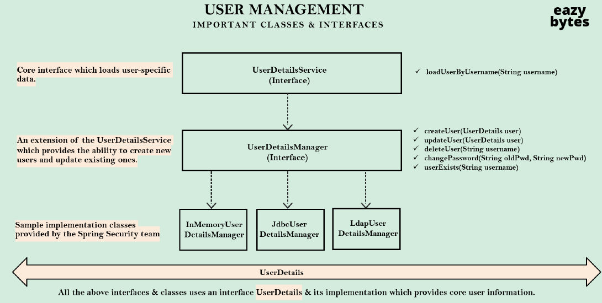
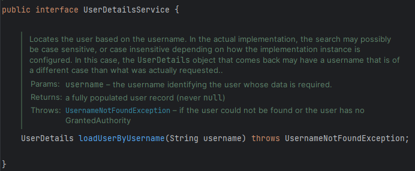
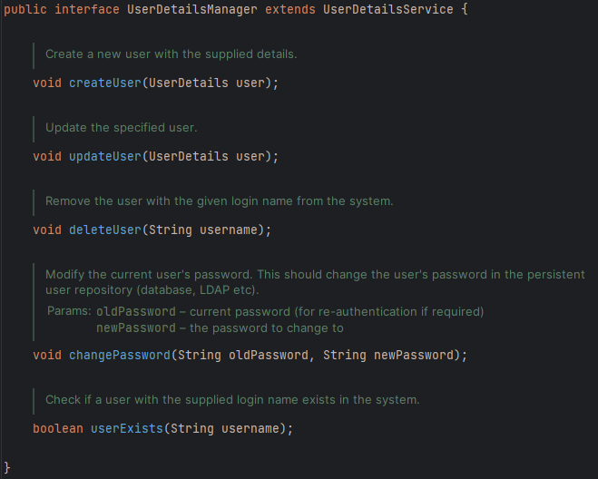
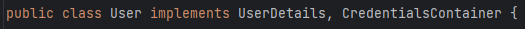
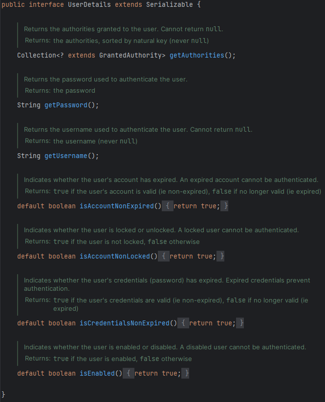
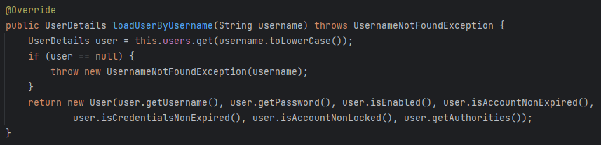
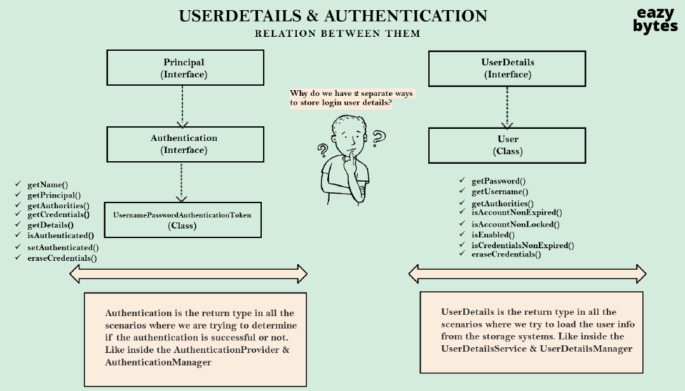
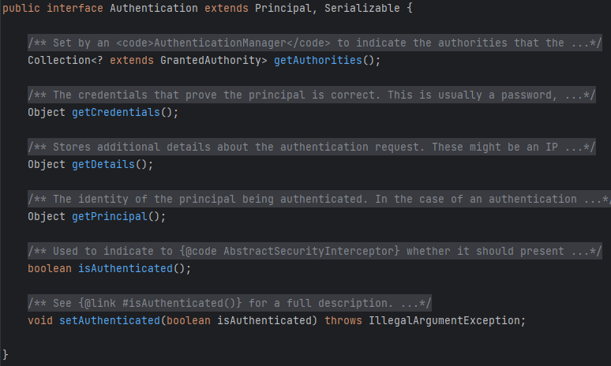

# UserDatailsService

> **사용자의 정보를 가져오는** 핵심적인 인터페이스
> 
- `loadUserByUsername`이라는 단일 메서드가 존재한다.



### Q. 왜 username과 password 둘 다 사용하지 않고, username만 사용할까?

💡 **비밀번호를 불필요하게 네트워크로 전송해서는 안되기 때문이다.** <br>
⇒ 나중에 password를 비교하는 로직을 추가할 수 있고, 그에 따라 인증이 성공했는지 여부에 따라 조치를 취할 수 있다.


# UserDetailsManager

> 사용자 세부 정보를 관리하는 인터페이스
> 



⇒ DB나 저장 시스템에서 세부 정보를 가져오는 것 외에도 새로운 유저를 생성하거나, 업데이트, 삭제하는 메서드도 포함하고 있다. 

이를 Spring Security 자체에서 세부적으로 구현해 놓은 것이 다음과 같은 3가지이다.

1. `InMemoryUserDetailsManger`
2. `JdbcUserDetailsManager`
3. `LdapUserDetailsManager`

⇒ Spring Security에서 제공하는 세 가지 **구현 클래스**


💡 만약, 자체 인증 로직이 존재하거나 모든 것을 직접 작성하려는 경우에는 자체 `AuthenticationProvider`를 정의해서 사용하면 된다. 이 안에서 자체 로직을 작성할 수 있다.  
하지만, 현재는 `DaoAuthenticationProvider`라는 기본 `AuthenticationProvider`를 사용하고 있기 때문에 Spring Security에서 제공하는 구현 클래스를 사용한다.


# UserDetails

> **사용자의 세부 정보**를 나타내는 ***인터페이스***
> 



⇒ 인터페이스이기 때문에 `User` 라는 **구현 클래스**를 제공한다.



### getAuthorities

> 사용자에게 부여된 모든 권한을 반환
> 
- 사용자의 권한 또는 역할 목록을 보유하고 있다.

⇒ 이를 사용해 **인가** or **역할 기반 접근 메커니즘을 구현**할 수 있다.

### getPassword

> 사용자를 인증하는데 사용된 비밀번호를 반환
> 

### getUsername

> 사용자의 이름을 반환
> 

### isAccountNonExpired

> 사용자 **계정**이 유효하며 만료되지 않았을 경우, `true`를 반환
> 

### isAccountNonLocked

> 사용자 계정이 잠기지 않았을 경우, `true`를 반환
> 

### isCredentialsNonExpired

> 사용자의 Credential(인증정보, 비밀번호 …)이 만료되지 않았을 경우, `true`를 반환
> 

### isEnabled

> 사용자의 가능 여부를 반환
> 

# User

> `UserDetails`의 구현 클래스
> 
- `UserDetails` 의 모든 클래스가 Override 되어 있다.

# loadUserByUsername

아래는 `InMemoryUserDetailsManager` 클래스 안에 있는 `loadUserByUsername` 메서드이다.



- `UserDetails`를 반환한다.
- `UserDetailsService` 인터페이스에 의해 Override 되었다.

```java
private final Map<String, MutableUserDetails> users = new HashMap<>();
```

위와 같은 형태로 `users`가 Map으로 구성되어 있고, `username`을 **Key 값**으로 찾아오는 과정을 수행한다.

---



### UserDetails & User

> `UserDetails`와 `User`는 사용자의 세부 정보를 DB 등의 저장 시스템에서 로드하려고 할 때 사용된다.
> 

⇒ 특히 `UserDetailsService`와 `UserDetailsManager`인터페이스 및 구현 클래스 내에서 사용된다.

이 세부 정보들은 `AuthenticationProvider`에 전달된다. `AuthenticationProvider` 내에서 인증이 성공하면, 모든 정보와 함께 성공적인 인증 세부 정보를 인증 객체 데이터 유형으로 변환한다. 

### Authentication



- `Principal`클래스를 상속받고 있다.
- `isAuthenticated` 메서드를 통해서 **사용자가 성공적으로 인증되었는지 여부를 확인**할 수 있다.