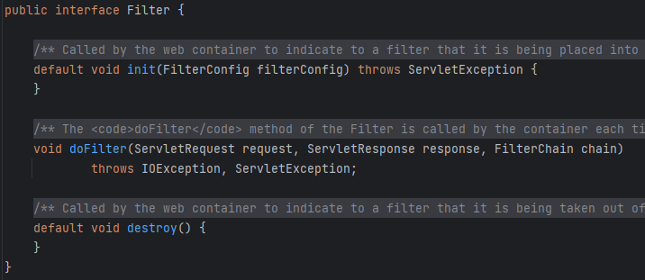
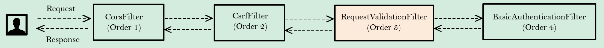
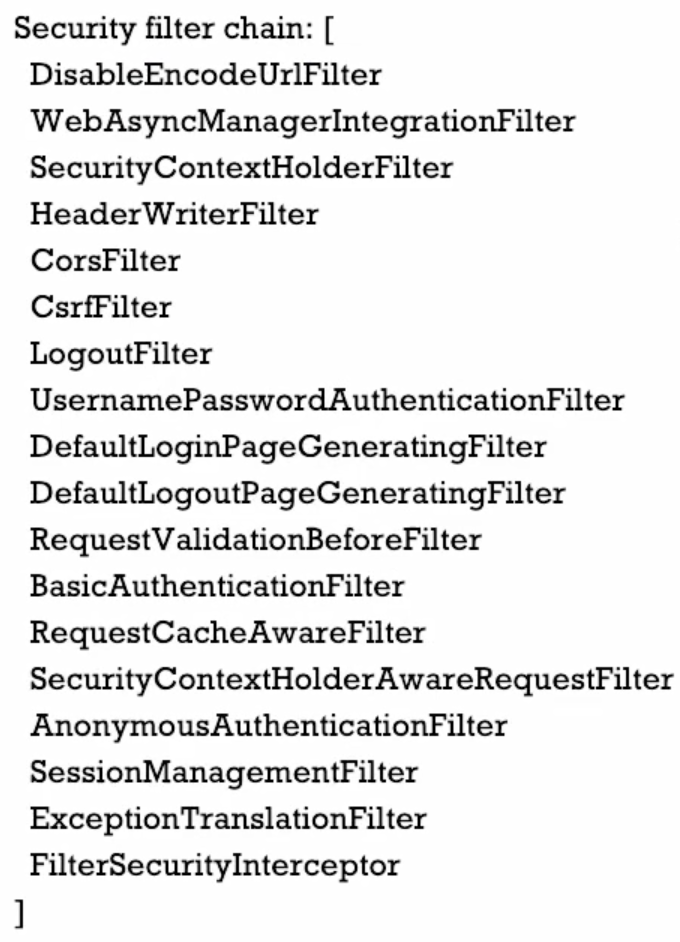
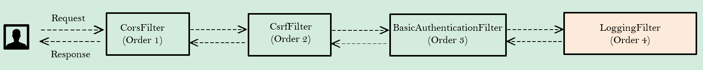
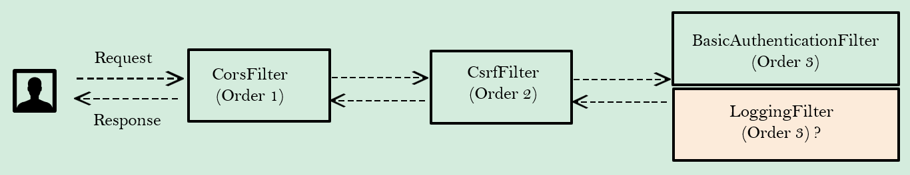

# 사용자 정의 필터 생성법

사용자 정의 Filter를 생성하기 위해서는

> **jakarta.servle**t 패키지 안에 있는 `Filter` 인터페이스를 구현하면 된다.
> 
- Filter 인터페이스를 구현한 후, **`doFilter` 메서드 내에 실행하고 싶은 로직을 작성**하면 된다.

## Filter Interface



`init` 및 `destroy` 내부에 비즈니스 로직을 작성할 수 있다. 따라서, 기본적으로 이 Filter를 생성할 때, `init`에 작성한 로직이 실행된다. 마찬가지로 `destroy`에 작성했다면 이 특정 Filter를 Servlet Container에서 destroy 될 때 작성한 로직이 실행된다.

### doFilter

`doFilter` 메서드는 3가지 파라미터를 받는다.

1. `ServletRequest` := 사용자로부터 오는 HTTP 요청
2. `ServletResponse` := 사용자나 클라이언트에게 다시 보낼 HTTP 응답
3. `FilterChain` := 정의된 순서대로 실행되는 Filter들의 집합
    1. 해당 Filter의 실행이 끝나면, FilterChain 내의 다음으로 가능한 Filter를 불러오는 데 사용된다.

# 사용자 정의 필터 FilterChain에 주입하기

Spring Security에서 이를 위해 3가지 메서드를 제공한다. 이 메서드들은 공통적으로 다음과 같은 파라미터를 가진다.

- `filter` := 작성한 사용자 정의 필터 클래스 객체
- `class` := Spring Boot 내부에 저장되어 있는(빌트인) 필터 클래스
    - 이것을 기준으로 그보다 앞(**Before**)에 놓거나 뒤(**After**)에 놓거나 혹은 동일한 위치(**At**)에 놓을 수 있다.

## addFilterBefore(filter, class)



만약 요구사항이 인증 전에 몇 가지 로직을 수행하는 것이라면 위와 같이 RequestValidationFilter라는 커스텀 필터를 만들고 이를 `BasicAuthenticationFilter` 바로 전에 구성해주면 된다. 

> `BasicAuthenticationFilter` 내에서 자격 증명을 추출하고 이를 기반으로 사용자의 실제 인증이 일어나기 때문이다.
> 

예를 들어, 사용자가 “test”가 포함된 username으로 로그인을 시도하면 유효하지 않은 요청이라는 오류를 반환하기 위한 `RequestValidationFilter`를 작성해보자.

### RequestValidationFilter

```java
import static org.springframework.http.HttpHeaders.AUTHORIZATION;

public class RequestValidationBeforeFilter implements Filter {

    public static final String AUTHENTICATION_SCHEME_BASIC = "Basic";
    private Charset credentialsCharset = StandardCharsets.UTF_8;

    @Override
    public void doFilter(ServletRequest request, ServletResponse response, FilterChain chain)
            throws IOException, ServletException {
        HttpServletRequest req = (HttpServletRequest) request;
        HttpServletResponse res = (HttpServletResponse) response;
        String header = req.getHeader(AUTHORIZATION);
        if (header != null) {
            header = header.trim();
            if (StringUtils.startsWithIgnoreCase(header, AUTHENTICATION_SCHEME_BASIC)) {
                byte[] base64Token = header.substring(6).getBytes(StandardCharsets.UTF_8);
                byte[] decoded;
                try {
                    decoded = Base64.getDecoder().decode(base64Token);
                    String token = new String(decoded, credentialsCharset);
                    int delim = token.indexOf(":");
                    if (delim == -1) {
                        throw new BadCredentialsException("Invalid basic authentication token");
                    }
                    String email = token.substring(0, delim);
                    if (email.toLowerCase().contains("test")) {
                        res.setStatus(HttpServletResponse.SC_BAD_REQUEST);
                        return;
                    }
                } catch (IllegalArgumentException e) {
                    throw new BadCredentialsException("Failed to decode basic authentication token");
                }
            }
        }
        chain.doFilter(request, response);
    }
}

```

우선, `Filter` 인터페이스의 `doFilter` 메서드를 구현해야 한다. 

1. 파라미터로 받은 request와 response를 각각 `HttpServletRequest`, `HttpServletResponse`로 형변환 시킨다.
2. 변환한 req에서 **AUTHORIZATION**을 받는다. 
3. 이 **AUTHORIZATION** 값을 공백 제거, “basic” 제거, 디코딩 … 등을 통해 문자열을 추출한다.
4. 추출한 문자열을 요구 사항에 맞게 확인한다. 
5. 문제(오류)가 없다면, 파라마터로 받은 FilterChain 내의 다음 필터를 호출한다. 

이렇게 완성된 필터를 등록하자.

Spring Security 설정 파일에서 `addFilterBefore`를 통해 필터를 등록할 수 있다.

```java
http.addFilterBefore(new RequestValidationBeforeFilter(), BasicAuthenticationFilter.class)
```

설정을 마치고 Debug 모드로 실제 코드를 실행해보면, 콘솔창에서 다음과 같이 실행된 Filter들을 확인할 수 있다. 



`BasicAuthenticationFilter` 직전에 커스텀 필터인 `RequestValidationBeforeFilter`가 실행된 것을 확인할 수 있다. 

## addFilterAfter(filter, class)



인증이 마무리 되면 몇 가지 로직을 수행해야 하는 경우를 생각해보자. 여기 들어갈 내용은 인증 후, 로거를 추가하는 것으로, 어떤 사용자 인증이 성공적이고 그 사용자가 어떠한 권한을 가졌다는 것을 보여주는 것이다. 이를 통해 인증이 완료되었다고, 메세지나 이메일 등을 전송할 수 있다. 

### AuthoritiesLoggingAfterFilter

```java
public class AuthoritiesLoggingAfterFilter implements Filter {

    private final Logger LOG =
            Logger.getLogger(AuthoritiesLoggingAfterFilter.class.getName());

    @Override
    public void doFilter(ServletRequest request, ServletResponse response, FilterChain chain)
            throws IOException, ServletException {

        Authentication authentication = SecurityContextHolder.getContext().getAuthentication();
        if (null != authentication) {
            LOG.info("User " + authentication.getName() + " is successfully authenticated and "
                    + "has the authorities " + authentication.getAuthorities().toString());
        }
        chain.doFilter(request, response);
    }

}
```

이 필터 클래스 또한 Filter 인터페이스의 `doFilter`를 구현한다.

인증이 성공적으로 완료되면 인증된 사용자의 세부정보는 SecurityContext에 저장된다. 따라서, 현재 인증된 사용자의 세부 정보를 인증 객체(Authentication)의 형태로 얻기 위해 `SecurityContextHolder.getContext().getAuthentication()`를 사용한다. 

마찬가지로, 필터를 구현했다면, Spring Security 설정 파일에서 필터를 등록하면 된다.

```java
http.addFilterAfter(new AuthoritiesLoggingAfterFilter(), BasicAuthenticationFilter.class)
```

## addFilterAt(filter, class)



위 메서드를 사용하면

> Spring Security 필터 중 하나인 위치와 정확히 같은 위치에 커스텀 필터를 구성할 수 있다.
> 

⇒ 이때 두 필터의 **실행 순서는 무작위**이다. 

### AuthoritiesLoggingAtFilter

```java
public class AuthoritiesLoggingAtFilter implements Filter {

    private final Logger LOG =
            Logger.getLogger(AuthoritiesLoggingAtFilter.class.getName());

    @Override
    public void doFilter(ServletRequest request, ServletResponse response, FilterChain chain)
            throws IOException, ServletException {
        LOG.info("Authentication Validation is in progress");
        chain.doFilter(request, response);
    }
}
```

⇒ 인증이 진행 중이라는 로그를 띄우는 코드

마찬가지로, Spring Security 설정 파일에 적용시키자.

```java
http.addFilterAt(new AuthoritiesLoggingAtFilter(), BasicAuthenticationFilter.class)
```

# 전체 Spring Security 설정 파일

```java
@Configuration
public class ProjectSecurityConfig {

    @Bean
    SecurityFilterChain defaultSecurityFilterChain(HttpSecurity http) throws Exception {
        CsrfTokenRequestAttributeHandler requestHandler = new CsrfTokenRequestAttributeHandler();
        requestHandler.setCsrfRequestAttributeName("_csrf");
        http.securityContext((context) -> context.requireExplicitSave(false))
                .sessionManagement(session -> session.sessionCreationPolicy(SessionCreationPolicy.ALWAYS))
                .cors(corsCustomizer -> corsCustomizer.configurationSource(new CorsConfigurationSource() {
            @Override
            public CorsConfiguration getCorsConfiguration(HttpServletRequest request) {
                CorsConfiguration config = new CorsConfiguration();
                config.setAllowedOrigins(Collections.singletonList("http://localhost:4200"));
                config.setAllowedMethods(Collections.singletonList("*"));
                config.setAllowCredentials(true);
                config.setAllowedHeaders(Collections.singletonList("*"));
                config.setMaxAge(3600L);
                return config;
            }
                })).csrf((csrf) -> csrf.csrfTokenRequestHandler(requestHandler).ignoringRequestMatchers("/contact","/register")
                        .csrfTokenRepository(CookieCsrfTokenRepository.withHttpOnlyFalse()))
                        .addFilterAfter(new CsrfCookieFilter(), BasicAuthenticationFilter.class)
                        .addFilterBefore(new RequestValidationBeforeFilter(), BasicAuthenticationFilter.class)
                         .addFilterAt(new AuthoritiesLoggingAtFilter(), BasicAuthenticationFilter.class)
                        .addFilterAfter(new AuthoritiesLoggingAfterFilter(), BasicAuthenticationFilter.class)
                .authorizeHttpRequests((requests)->requests
                        .requestMatchers("/myAccount").hasRole("USER")
                        .requestMatchers("/myBalance").hasAnyRole("USER","ADMIN")
                        .requestMatchers("/myLoans").hasRole("USER")
                        .requestMatchers("/myCards").hasRole("USER")
                        .requestMatchers("/user").authenticated()
                        .requestMatchers("/notices","/contact","/register").permitAll())
                .formLogin(Customizer.withDefaults())
                .httpBasic(Customizer.withDefaults());
        return http.build();
    }

    @Bean
    public PasswordEncoder passwordEncoder() {
        return new BCryptPasswordEncoder();
    }
}
```