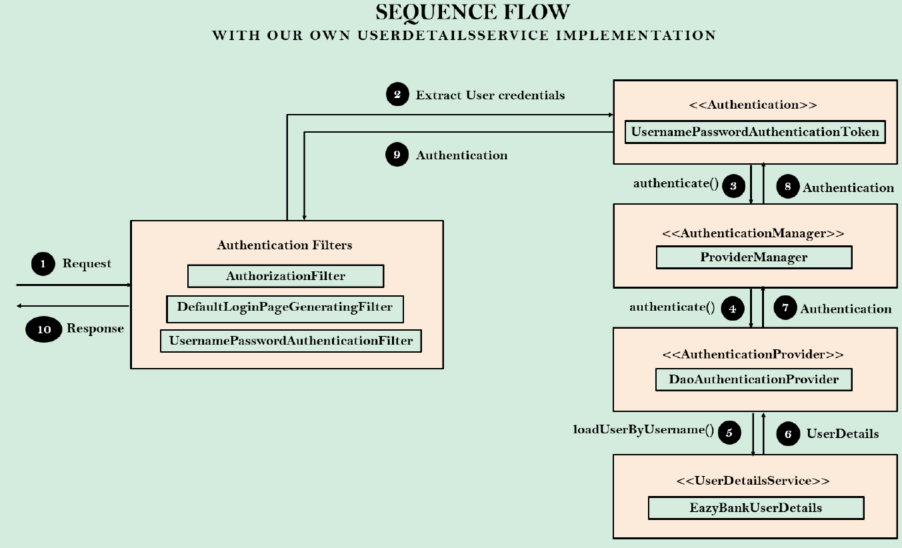

새로운 사용자를 등록하고, 인증 단계까지 거치는 과정을 확인해보자.

이를 위해 우선 사용자를 등록하는 Controller를 작성한다.

```java
@RestController
@RequiredArgsConstructor
public class LoginController {

    private final CustomerRepository customerRepository;

    @PostMapping("/register")
    public ResponseEntity<String> registerUser(@RequestBody Customer customer) {
        Customer savedCustomer = null;
        ResponseEntity response = null;
        try {
            savedCustomer = customerRepository.save(customer);
            if (savedCustomer.getId() > 0) {
                response = ResponseEntity
                        .status(HttpStatus.CREATED)
                        .body("Given user details are successfully registered");
            }
        } catch (Exception e) {
            response = ResponseEntity
                    .status(HttpStatus.INTERNAL_SERVER_ERROR)
                    .body("An exception occured due to " + e.getMessage());
        }

        return response;
    }
}
```

또한, 해당 경로는 누구든 접근이 가능해야 하기 때문에, Security 설정 클래스에서 위 경로에 대한 모든 접근을 허가해 준다. 추가로, 테스트를 위한 것이기 때문에 CSRF 보안도 해제시킨다.

```java
@Bean
SecurityFilterChain defaultSecurityFilterChain(HttpSecurity http) throws Exception {
    http.csrf(AbstractHttpConfigurer::disable)
        .authorizeHttpRequests((requests) -> requests
                .requestMatchers("/myAccount", "/myBalance", "/myLoans", "/myCards").authenticated()
                .requestMatchers("/notices", "/contact", "/register").permitAll()
        )
        .formLogin(withDefaults())
        .httpBasic(withDefaults());
    return http.build();
}
```

Postman 등을 통해 사용자의 정보를 등록하고 이를 바탕으로 로그인을 시도하면 정상적으로 동작하는 것을 확인할 수 있다.



위아 같은 Flow로 인증이 진행되는 것을 알 수 있다.