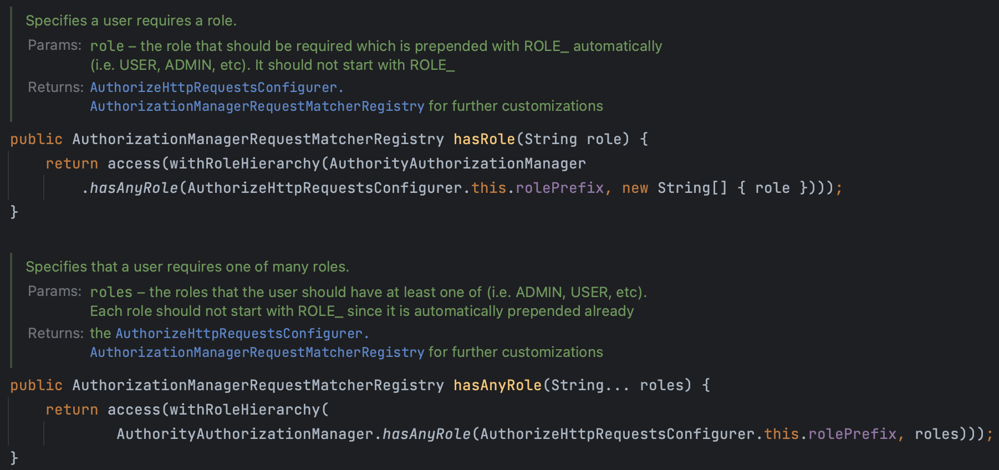

이전에 생성했던, `authorities` 테이블의 데이터를 지우고, 아래와 같은 데이터를 다시 삽입하자.

```sql
DELETE FROM `authorities`;

INSERT INTO `authorities` (`customer_id`, `name`)
VALUES (1, 'ROLE_USER');

INSERT INTO `authorities` (`customer_id`, `name`)
VALUES (1, 'ROLE_ADMIN');
```

권한(Authority)을 설정했던 것과 마찬가지로, 역할(Role)을 설정해 인가를 강제하기 위한 메서드도 크게 3가지가 존재한다.

1. `hasRole()`
2. `hasAnyRole()`
3. `access()`

# ROLE_ 접두사

> Spring Security에서는 DB에 저장할 때 일반적으로 역할 이름 앞에 **ROLE_** 접두사를 붙이는 관례가 있다. 하지만, `hasRole()`혹은 `hasAnyRole()` 메서드 안에서 역할 이름을 사용할 경우에는 ***ROLE_ 접두사를 붙이면 안된다!***
> 

⇒ Spring Security가 해당 메서드를 호출할 때, 자동으로 “ROLE_” 접두사를 추가해 확인한다.



실제 구현된 `hasRole`과 `hasAnyRole` 메서드의 주석 부분을 확인해보면 알 수 있다. 

# hasRole()

> 하나의 역할을 받아 인가를 확인한다.
> 
- 해당 역할을 가진 최종 사용자만이 `hasRole()` 메서드를 사용하는 API에 대한 접근이 허가된다.

# hasAnyRole()

> 여러 역할 중 하나라도 해당하는 역할을 가진 사용자인지 확인한다.
> 

## 사용 방법

위 메서드를 사용하는 방식에는 권한과 마찬가지로 크게 2가지가 존재한다. 

### 1. Spring Security 설정 파일에서 사용하기

> Spring Security의 설정 파일 안의 Bean으로 등록되는 메서드 안에서 설정할 수 있다.
> 

```java
@Bean
SecurityFilterChain defaultSecurityFilterChain(HttpSecurity http) throws Exception {
  CsrfTokenRequestAttributeHandler requestHandler = new CsrfTokenRequestAttributeHandler();
  requestHandler.setCsrfRequestAttributeName("_csrf");
  http.securityContext((context) -> context.requireExplicitSave(false))
          .sessionManagement(session -> session.sessionCreationPolicy(SessionCreationPolicy.ALWAYS))
          .cors(corsCustomizer -> corsCustomizer.configurationSource(new CorsConfigurationSource() {
              @Override
              public CorsConfiguration getCorsConfiguration(HttpServletRequest request) {
                  CorsConfiguration config = new CorsConfiguration();
                  config.setAllowedOrigins(Collections.singletonList("http://localhost:4200"));
                  config.setAllowedMethods(Collections.singletonList("*"));
                  config.setAllowCredentials(true);
                  config.setAllowedHeaders(Collections.singletonList("*"));
                  config.setMaxAge(3600L);
                  return config;
              }
          })).csrf((csrf) -> csrf.csrfTokenRequestHandler(requestHandler).ignoringRequestMatchers("/contact","/register")
           .csrfTokenRepository(CookieCsrfTokenRepository.withHttpOnlyFalse()))
          .addFilterAfter(new CsrfCookieFilter(), BasicAuthenticationFilter.class)
          .authorizeHttpRequests((requests)->requests
                  .requestMatchers("/myAccount").hasRole("USER")
                  .requestMatchers("/myBalance").hasAnyRole("USER","ADMIN")
                  .requestMatchers("/myLoans").hasRole("USER")
                  .requestMatchers("/myCards").hasRole("USER")
                  .requestMatchers("/user").authenticated()
                  .requestMatchers("/notices","/contact","/register").permitAll())
          .formLogin(Customizer.withDefaults())
          .httpBasic(Customizer.withDefaults());
  return http.build();
}
```

⇒ 위 코드와 같이 `hasRole()`를 사용해서 특정 역할을 가진 사용자만 특정 API에 접근하도록 설정할 수도 있고, `hasAnyRole()` 를 사용해 여러 역할 중 하나만 만족하더라도 특정 API에 접근하도록 설정할 수 있다. 만약, 이를 사용하지 않고, `authenticated()` 를 사용한다면, 로그인을 완료한 사용자라면 누구라도 해당 API에 접근 가능하다.

### 2. API에 직접 명시하기

> Controller layer의 API 메서드에서 `@PreAuthority` 혹은 `@PostAuthority`어노테이션을 이용해 사용할 수 있다.
> 

```java
@RestController
public class MyController {
    @PreAuthorize("hasRole('ADMIN')")
    @GetMapping("/admin")
    public String adminAccess() {
        return "Admin Content";
    }

    @PreAuthorize("hasAnyRole('USER', 'ADMIN')")
    @GetMapping("/user")
    public String userOrAdminAccess() {
        return "User or Admin Content";
    }

    @PreAuthorize("access('hasRole('USER') and hasAuthority('SPECIAL_PRIVILEGE')')")
    @GetMapping("/special")
    public String specialAccess() {
        return "Special Content for Users with Special Privilege";
    }
}
```

# access()

> Spring Expression Language (SpEL)를 사용하여 복잡한 접근 제어 규칙을 정의할 수 있게 해준다.
> 

⇒ 이를 통해 보다 유연하고 세밀한 접근 제어가 가능하다.