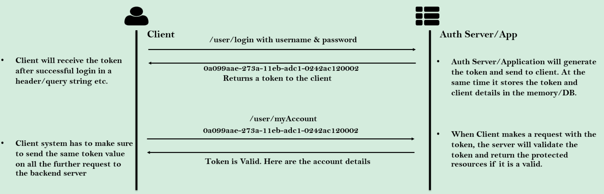

# 토큰(Token)이란?

Token은

> **다양한 보안 목적으로 사용되는 문자열**로, 주로 인증 및 권한 부여에 사용된다.
> 
- UUID(범용 고유 식별자) 형식의 일반 문자열 또는 JWT(Json Web Token) 토큰의 한 종류일 수 있다.
- 위와 같은 토큰들은 일반적으로 사용자의 인증이 완료 되자마자 로그인 작업 중 처음으로 생성된다.
- 로그인 중 토큰이 생성된 후로는 해당 토큰이 클라이언트에 의해 보호된 자료를 접근할 때마다 백엔드 시스템으로 보낼 수 있도록 사용된다. ⇒ 해당 토큰이 유효하면 백엔드 서버는 올바른 반응을 수행한다.

## 수행 과정

1. 클라이언트가 ID와 Password를 사용해 로그인을 시도한다. 
2. ID & Password가 유효하다면, 백엔드 서버가 토큰을 생성하고 클라이언트에 전달한다.
3. 이후, 클라이언트가 “/user/myAccount”와 같은 보호(보안)된 API 중 하나를 접속할 때는 반드시 같은 토큰을 백엔드 서버에 함께 전송해야 한다. 
4. 해당 토큰이 유효하다면, 백엔드 서버는 올바른 작업을 수행할 것이다.

# 토큰의 장점

### 1. 자격 증명을 공유하지 않는다.

> 토큰을 사용하면 매 요청마다 사용자 자격 증명(예: 사용자 이름과 비밀번호)을 전송할 필요가 없다.
> 
- 네트워크를 통해 자격 증명을 빈번하게 전송하는 것은 보안 위험을 초래할 수 있다.
- 토큰을 사용함으로써 이러한 위험을 줄일 수 있다.

### 2. 토큰 무효화 기능

> 의심스러운 활동이 발생할 경우 사용자 자격 증명을 무효화하지 않고도 토큰을 무효화할 수 있다.
> 
- 특정 토큰만 무효화할 수 있어 보안성을 높이고, 전체 사용자 자격 증명을 변경할 필요 없이 문제를 해결할 수 있다.

### 3. **짧은 수명의 토큰 생성 가능**

> 토큰은 짧은 수명으로 생성될 수 있다.
> 
- 토큰의 유효 기간이 짧아지면, 토큰이 도난당하더라도 짧은 시간 내에 무효화되어 보안성이 향상된다.

### 4. **사용자 관련 정보 저장 가능**

> 토큰에는 사용자 관련 정보(예: 역할/권한 등)를 저장할 수 있다.
> 
- 사용자 정보가 토큰에 포함되어 있어 요청 시마다 서버에서 사용자 정보를 조회할 필요가 없다.

### 5. 재사용성

> 여러 서버에서 동일한 토큰을 사용하여 사용자 인증을 수행할 수 있다.
> 
- 다양한 플랫폼과 도메인에서 동일한 토큰을 재사용하여 효율적으로 인증을 관리할 수 있다.

### **6. 무상태성(Stateless)**

> 토큰은 사용자를 식별하기 위한 모든 정보를 포함하고 있어 세션 상태를 유지할 필요가 없다.
> 
- 세션 상태를 유지할 필요가 없으므로 애플리케이션을 확장하기 쉽다.
- 로드 밸런서를 사용할 때, 사용자를 특정 서버에 묶어두지 않고 어떤 서버로도 요청을 전달할 수 있다.

### **7. 다양한 형태의 토큰 사용**

> CSRF 및 JSESSIONID와 같은 다양한 형태의 토큰을 사용할 수 있습니다.
> 
- CSRF 토큰은 CSRF 공격으로부터 애플리케이션을 보호하며, JSESSIONID는 Spring Security에서 기본적으로 생성되어 자격 증명을 공유하지 않고도 백엔드와 통신할 수 있게 해준다.