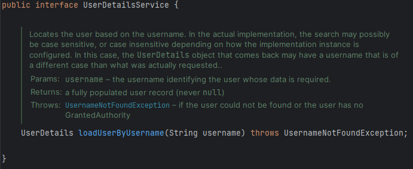
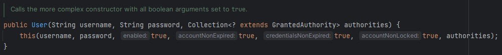

앞서, Spring Security에서 제공하는 테이블 명명 규칙을 사용해야 한다고 했었다. 하지만, 개발하는 애플리케이션이 이 명명 규칙을 따르지 못할 경우, 혹은 새로운 테이블을 사용하고 싶은 경우에는 어떤 식으로 개발해야 할까?

위와 같은 경우에는 `JdbcUserDetailsManager`를 사용할 수 없고, `UserDetailsService`나 `UserDetailsManager` 를 재정의해서 사용해야 한다. 

아래와 같은 새로운 사용자 테이블이 있다고 생각해보자.

```sql
create table `customer` (
  `id` INT NOT NULL AUTO_INCREMENT,
  `email` VARCHAR(45) NOT NULL,
  `pwd` VARCHAR(200) NOT NULL,
  `role` VARCHAR(45) NOT NULL,
  PRIMARY KEY(`id`)
);

INSERT INTO `customer`(`email`, `pwd`, `role`) 
VALUES ('jieon@example.com', '54321', 'admin');
```

⇒ 위와 같이 Spring Security의 테이블 명명 규칙을 따르지 않는 경우에는 `JdbcUserDetailsManager`를 사용할 수 없다. 

위 Entity를 위한 클래스와 Repository를 만들어준다. Spring Data JPA를 통해서 데이터를 가져오도록 만들어 주기 위함이다. 

```java
@Entity
@Getter
@Setter
public class Customer {
    @Id
    @GeneratedValue(strategy = GenerationType.IDENTITY)
    private int id;
    private String email;
    private String pwd;
    private String role;
}
```

```java
@Repository
public interface CustomerRepository extends CrudRepository<Customer, Long> {
    List<Customer> findByEmail(String email);
}
```

# 맞춤형 UserDetailsService 구현

이제 `UserDetailsService`를 재정의하기 위해, 이 인터페이스의 `loadUserByUsername`메서드를 **Override**하여 직접 작성해야 한다.



> 이 메서드 내부에서 ***인증이 가능하게 하기 위해*** DB로부터 정보를 가져와 `UserDetails`객체로 변환하여 돌려보내야 한다.
> 

`UserDetailsService` 구현을 위해 클래스를 하나 만들자.

```java
@Service
public class EazyBankUserDetails implements UserDetailsService {

    @Autowired
    CustomerRepository customerRepository;

    @Override
    public UserDetails loadUserByUsername(String username) throws UsernameNotFoundException {
        String userName, password = null;
        List<GrantedAuthority> authorities = null;
        List<Customer> customer = customerRepository.findByEmail(username);

        if (customer.size() == 0) {
            throw new UsernameNotFoundException("User details not found for the user : " + username);
        } else {
            userName = customer.get(0).getEmail();
            password = customer.get(0).getPwd();
            authorities = new ArrayList<>();
            authorities.add(new SimpleGrantedAuthority(customer.get(0).getRole()));
        }

        return new User(username, password, authorities);
    }
}
```

⇒ @Service를 사용한 이유는 해당 클래스 내부에서 비즈니스 로직을 사용했기 때문에 service layer로 기능을 하기 때문이다. 

`User` 클래스에서는 아래와 같이 권한 정보를 `GrantedAuthority` 형태로 받고 있다.



따라서, GrantedAuthority 인터페이스를 구현한 `SimpleGrantedAuthority` 클래스를 사용했다.

위 과정을 거치면, User 객체는 Spring Security로 돌려보내지고 프레임워크 내부에서 실제 인증이 일어나게 된다. Spring Security는 인증을 진행하려 할 때마다 인증 요청을 `DaoAuthenticationProvider`에 전달하고 `UserDetailsService`의 구현 클래스를 찾아 인증을 시도한다.