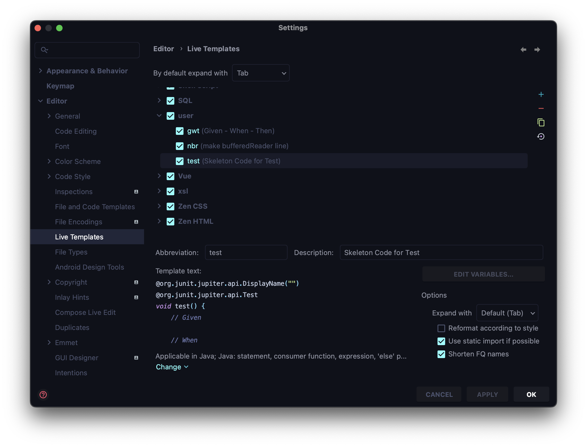

# BDD란?

**Behavior Driven Development**의 약어로, 

> 함수 단위의 테스트에 집중하기보다, 시나리오에 기반한 **테스트케이스(TC)** 자체에 집중해 테스트하는 방법
> 
- TDD에서 파생된 개발 방법
- 개발자가 아닌 사람이 봐도 이해할 수 있을 정도의 추상화 수준(레벨)을 권장

# Given / When / Then

### Given

> 시나리오 진행에 필요한 모든 준비 과정
> 
- 객체, 값, 상태 등…

### When

> 시나리오 행동 진행
> 

### Then

> 시나리오 진행에 대한 결과 명시 및 검증
> 

어떤 환경에서(Given)
어떤 행동을 진행했을 때(When),
어떤 상태 변화가 일어난다(Then).

⇒ **DisplayName**에 명확하게 작성할 수 있다.

```java
@Test
@DisplayName("주문 목록에 담긴 상품들의 총 금액을 계산할 수 있다.")
void calculateTotalPrice() {
	// Given : 테스트를 위한 준비 단계
	CafeKiosk cafeKiosk = new CafeKiosk();
	Americano americano = new Americano();
	Latte latte = new Latte();

	cafeKiosk.add(americano);
	cafeKiosk.add(latte);

	// When : 수행 단계
	int totalPrice = cafeKiosk.calculateTotalPrice();

	// Then : 검증 단계
	assertThat(totalPrice).isEqualTo(8500);
}
```

### Tip!



IntelliJ의 Live Template을 이용할 수 있다.